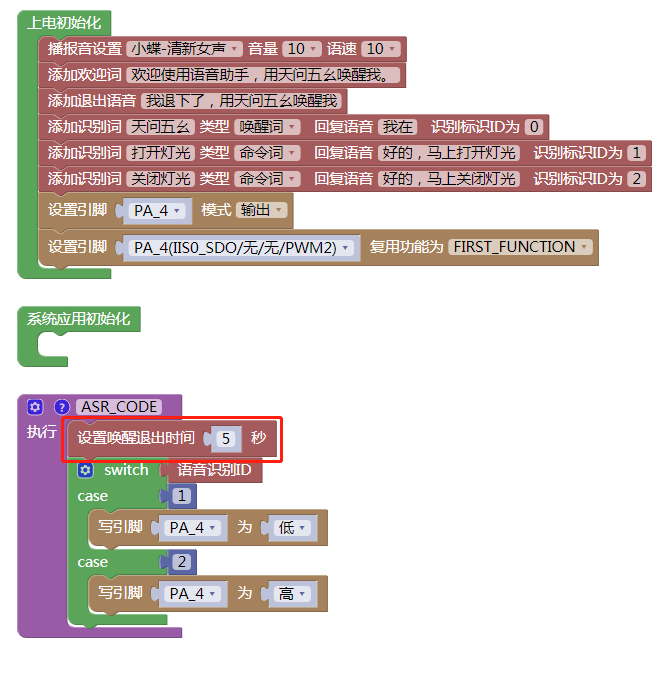
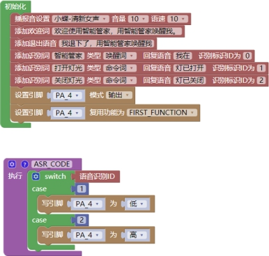
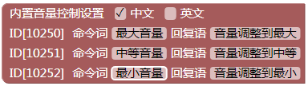

### 专业模式编程说明<!-- {docsify-ignore} -->

> 在专业模式下可实现语音识别控制多任务多线程同时运行，支持字符编程可满足开发者需求，随心所欲进行创作。也可以选择入门模式和标准模式进行快速使用。
>

### 语音识别<!-- {docsify-ignore} -->

####  播报音设置

 

 

> 用于设置语音播报的音色、音量和语速，数值越高，音量越高、语速越快，下拉菜单可进行选择。语音模块的播报音支持 18 种人声，包含 14 种中文，4 种英文，音量和语速都支持10级可调范围。当你选择不同的播报音时，软件会播放试听语音，方便你选择。上述两种播报音仅音色不同，功能相同，仅选择其中一个使用即可。

#### 欢迎词

 

> 欢迎词是芯片上电后自动播放的一段声音。

#### 退出语音

 

> 退出语音是芯片进入待机模式时播放的一段声音。

#### 添加命令词或唤醒词

 

> 可添加命令词或唤醒词，设置回复语音和标识 ID。
>
> 专业模式下的 ID 号需要自己设置，设置范围为 0-499，500 开始的 ID 为系统自动生成使用，一般用户不要去设置。

#### 添加播报音

 

> 添加语音播报并设置播报音ID。

> 播报音ID不在Excel表格中生成，使用时需要使用变量接收ID值。

 

#### 语音识别ID

 

> 可调用语音识别的 ID。

#### 设置唤醒退出时间

 

> 设置唤醒退出时间，通过修改参数调整大小。
>
> **注意：要放在asrcode里才能生效，不能放在初始化里。**

使用示例：

 

 

#### 马上唤醒退出时间设置

 

> 马上唤醒设置好时间退出。

#### 马上退出

 

> 马上退出，不能用在中断里。

#### 播放播报音

 

> 根据播报音的ID值播放播报音

#### 设置音量

 

> 设置音量：通过参数修改可调节音量大小。这条指令设置的音量是整体音量，不同于播报音中设置的音量。播报音设置的音量是文
件本身的音量。使用这条指令可以设置整体音量，取值范围在1-7，1为最小音量，5为中等音量，7为最大音量。这个音量断电后也会保存，不会改变。

> 语音控制 LED 灯范例：
>

 

 

> 所有的 ID 识别判断都在 ASR_CODE 函数里完成，ASR_CODE 为语音识别事件的一个回调函数。其它的外设操作都在其他线程里去完成，线程之间通讯用消息传递。 
>

#### 内置音量控制设置

 

动态控制音量需要在程序中添加音量控制模块，可以自定义命令词和回复语，支持中文和英文两种模式。

**扩展**：芯片重新上电音量会重置，可以通过将播报音量设置为变量，修改音量后通过重新赋值实现音量不变，可以参考范例：[语音控制音量](http://www.twen51.com/C51/asr_pro.php?id=61913)

#### 获取休眠状态

 

> 休眠状态返回 0,唤醒状态返回1。

#### 退出设置

 

> 这条指令在唤醒词唤醒模式下有效。可以在这条指令内部放入一些退出时想要做的指令。