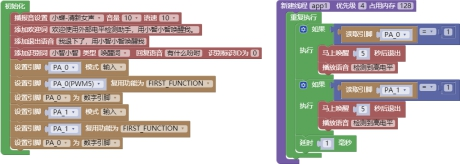

### GPIO模块<!-- {docsify-ignore} -->

 

#### 设置引脚的模式，输入、输出

 

> 设置引脚的模式，输入和输出，通过下拉菜单可改变引脚。

 

#### 设置引脚的复用功能

 

 

> 设置引脚的复用功能，通过下拉菜单可选择功能。

 

#### 读引脚的电平状态

 

 

> 读引脚的电平状态，引脚电平如果为高电平，返回 1；低电平，返回 0。

 

#### 写引脚的电平状态

 

 

> 写引脚的电平状态，1 为高电平；0 为低电平。

#### 设置引脚，数字、模拟引脚

 

> 设置引脚为数字或是模拟引脚，通过下拉菜单调整。PA0、PA1 默认为晶振引脚，输入模式，PC1、PC2、PC3、PC4 默认为 ADC 引脚，输入模式，这些引脚要作为数字引脚功能使用，就需要设置为数字引脚模式。

#### 设置引脚，上拉、下拉、上下拉无效

 

> 设置引脚为上拉、下拉、上下拉无效。

 

#### 设置开漏是否有效

 

> 开漏模式既可读外部状态也可对外输出（高电平或低电平）。

 

#### 设置引脚驱动

 

> 设置引脚驱动，有 5、10、15、20ma 输出四个规格。

 

#### 设置引脚为某个触发中断事件

 

 

> 当引脚设置为某个触发中断事件，共有高电平、低电平、上升沿、下降沿、双边沿触发五个条件。

#### 判断引脚是否有中断

 

 

> 判断引脚是否有中断。

 

#### 清除中断引脚

 

 

> 清除中断引脚。

 

> 电平触发播报语音范例：
>

 
