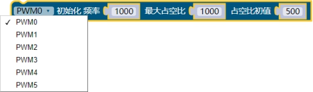
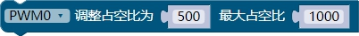
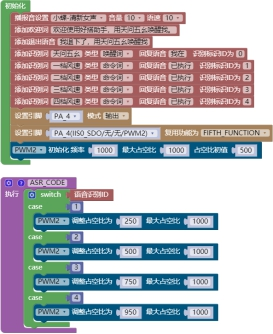

### PWM模块<!-- {docsify-ignore} -->

#### PWM初始化

 

> 初始化设置引脚 PWM 频率、占空比和占空比初值。可以通过下拉菜单选择，共 6 个通道。
>

#### PWM调整占空比值

 

> PWM 调整占空比值，一般用在程序运行过程中需要动态改变占空比输出时。

> 语音控制 PWM 进行调速范例： 注意要设置对应引脚的输出模式。

 

