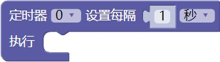

### 定时器模块<!-- {docsify-ignore} -->

 

#### 定时器设置和回调函数

 

> 定时器设置和回调函数，每隔一段时间执行，通过下拉菜单可修改为 0-4 的定时器。

 

#### 更新定时器时间

 

> 更新定时器时间。

 

#### 关闭定时器

 

> 关闭对应的定时器。

 

#### 启用定时器

 

>  启用对应的定时器。
>
