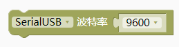
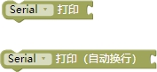
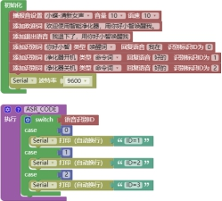

### 串口模块<!-- {docsify-ignore} -->

1. #### 串口波特率设置

 

 

 

> 支持多路串口和波特率设置，图形化模块下拉框没有需要的波特率，可以自己添加数字模块后修改。
>

2. #### 设置串口超时时间

 

> 设置串口超时时间。

3. #### 串口原始输出

 

> 串口原始输出。

 

4. #### 串口打印

 

> 串口打印，支持不换行与换行。

 

> 打印 16 进制数自动换行。

 

5. #### 判断串口是否有可读取数据

 

> 判断串口上是否有可读取的数据。有数据返回1，没有返回0。

 

6. #### 读取字符串数据

 

> 读取字符串数据。

 

> 从设备接收到的数据读取信息。读取到的数据信息以字符串形式返回。当函数读取到终止字符后会立即停止函数执行。
>

7. #### 调用串口函数

 

> read() 函数可用于从设备接收到数据中读取一个字节的数据。一般和 write 配套使用。 设备接收到数据时，返回值为接收到的数据流中的 1 个字符。

> peek()函数可用于从设备接收到的数据中读取一个字节的数据。但是与read 函数不同的是，使用 peek()函数读取数据后，被读取的数据不会从数据流中消除。这就导致每一次调用 peek 函数，只能读取数据流中的第一个字符。然而每一次调用 read 函数读取数据 时，被读取的数据都会从数据流中删除。

> parseInt()函数可用于从设备接收到的数据中寻找整数数值。

> parseFloat()函数可用于从设备 接收到的数据中寻找浮点数值。

8. #### 清空缓存区数据

 

> flush 函数可让开发板在所有待发数据发送完毕前，保持等待状态。注意：很多人误认为 flush 函数具有清除开发板接收缓存区的功能。事实上此函数是没有此\n功能的。翻译名称为“清空缓存”，不是把缓存里的数据删除，而是等待缓存里的数据发送完毕。本函数属于 Stream 类。该函数可被 Stream 类的子类所使用，如（Serial, WiFiClient, File\n等）。为了更好的理解 flush 函数的作用，我们在这里用 Serial.flush()作为示例讲解。当我们通过 Serial.print 或 Serial.println 来发送数据时，被发送的字符数据将会存储于开发板的“发送缓存”中。这么做的原因是开发板串行通讯速率不是很高，如果发送数据较多，发送时间会比较长。在没有使用 flush 函数的情况下，开发板不会等待所有“发送缓存”中数据都发送完毕再执行后续的程序内容。也就是说，开发板是在后台发送缓存中的数据。程序运行不受影响。相反的，在使用了 flush 函数的情况下，开发板是会等待所有“发送缓存”中数据都发送完毕以后，再执行后续的程序内容。

> 语音控制串口输出使用范例：
>

 

