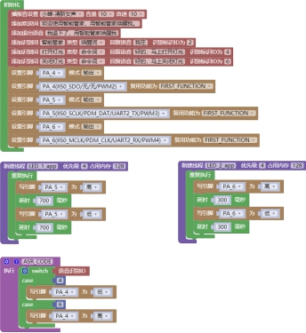
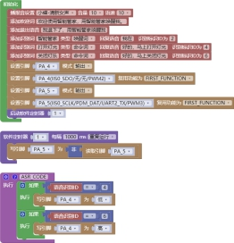

### 多线程模块<!-- {docsify-ignore} -->

####  新建线程

 

> 使用多线程可以让多个任务在操作系统的调度下分时并行执行。可以在模块内修改线程名、优先级、占用内存，优先级数字越大级别越高，占用内存最高 512，需要根据程序整体合理分配。建议先设置最大，再慢慢减小，查看运行情况是否正常来确定最终大小。
>

#### 新建队列消息

 

> 新建队列消息，可修改消息名、消息长度单位为字节、最多消息数。
>

 

#### 向消息队列发送指针

 

> 向消息队列发送指针，指针类型可以时变量、数组、结构，等待时间即为发送消息到队列的时间。
>

#### 接收消息存入指针并设置等待时间

 

> 在消息队列接收的数据存入到指针中，并可设置等待时间。

####  中断内部发送消息

 

> 中断内部发送消息。

> 多线程使用 LED 演示范例：
>

 

 

#### 软件定时器设置

 

> 软件定时器每隔一段时间运行触发事件，可设置单次运行和重复运行。

 

#### 启动和停止软件定时器

 

> 启动和停止软件定时器。

 

#### 临界保护

 

> 让操作系统的任务调度时不会打断，不会打断里面程序的执行。

 

> 软件定时器的使用范例：
>

 

