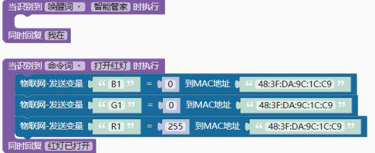
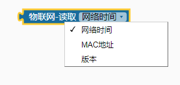

### 物联网<!-- {docsify-ignore} -->

 

> 以下物联网功能仅支持好好搭搭的 Wi-Fi 模块，普通的 ESP8266 模块，请查看相应的扩展库。

#### 设置Wi-Fi的名称和密码

 

> 设置 Wi-Fi 的名称和密码，根据实际情况修改。

 

#### 物联网消息检测

 

> 判断是否检测到物联网中的消息。

 

#### 物联网消息读取

 

> 读取消息

 

#### 物联网从消息读取数字

 

> 从消息读取数字

 

#### 物联网从消息读取变量值

 

> 从消息读取变量值

 

#### 物联网发送指定字符串到MAC地址

 

物联网发送指定字符串到 MAC 地址

 

#### 物联网发送指定数值到MAC地址

 

> 物联网发送指定数值到 MAC 地址
>

#### 物联网发送变量到MAC地址

 

> 物联网发送变量到 MAC 地址

> 物联网控制灯光范例：
>

 

#### 物联网读取需求信息

 

 

> 读取网络时间

