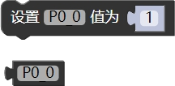

### 读写寄存器模块<!-- {docsify-ignore} -->

 

> 平台图形化模块只是提供了常用的功能，一些特殊外设和寄存器没有提供，如果还是想用图形化编程，可以使用如下模块，可以自己设置寄存器，也可以嵌入 C 语言代码或者直接嵌入汇编。
>

 

#### 读写寄存器

 

> 一些特殊寄存器，没做对应的图形块，可以用这个模块手动添加。

 

#### 宏定义设置

 

> 宏定义
>

#### 嵌入代码

 

> 嵌入代码