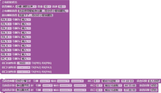

#### 入门模式编程说明 <!-- {docsify-ignore} -->

> 入门模式非常适合初学者，会打字就可以学会编程。

 

#### 上电初始状态 <!-- {docsify-ignore} -->

 

 

> 可设置语音播放人音色，通过下拉菜单可选择 18 种不同的音色，包含 14 种中文，4种英文。音量可从下拉菜单选择 2-20 范围内的音量大小，语音播放的快慢也可通过下拉菜单调整。
>
> 可设置 PA0-PC4 10 个引脚的状态，分别为输入、输出低电平、输出高电平。可以设置 3 个串口波特率，需要注意对应的引脚。
>
> 上电播报语音为上电时 ASRPRO 自动播放的语音，可在输入框内自由修改文字内容， 输入内容要保持全是中文或全是英文，使用英文版可参考专业模式下的案例，输入的文字内容不能包含汉字。
>
> 退出播报语音为 ASRPRO 退出识别模式，进入待机状态播放的语音，可在输入框内自由修改文字内容，输入内容要保持全是中文或全是英文，使用英文版可参考专业模式下的案例，输入的文字内容不能包含汉字。

 

#### 唤醒词和命令词识别事件指令 <!-- {docsify-ignore} -->

                                                                                  

 

> 唤醒词是指将产品从待机状态切换到工作状态的词语，可以有效防止误触发。唤醒词最多 5 个。
>
> 命令词是指用户对语音互动产品发出一定的指令，以此与其进行沟通的词语。根据芯片容量的不同，最大可以设置 300 个。
>
> 用户和语音芯片交互过程：先通过唤醒词唤醒设备，再通过命令词控制设备动作，同时回复对应的回复语。
>
> 唤醒词和命令词建议使用四个不同字，ABCD 格式的，识别效果最优，AABB、ABAB 格式的容易产生误识别。更多设置注意事项请查看第八、九章节的“唤醒与命令词设置建议”。
>
> 执行内容或语音回复可以为空。
>
> 当识别到唤醒词或者命令词后，可以通过上述指令实现引脚的高低电平控制、PWM 输出、脉冲输出、串口输出。下面将通过几个范例详细说明。

 

> 范例 1-智能语音对话范例

 

> 执行内容为空，只有语音交互，回复语音不像唤醒词和命令词一样，属于 TTS 合成语音，长度可以很长，也可以加标点符号。

> 范例 2-控制引脚输出高低电平

> 控制引脚输出高低电平，注意要在上电初始状态里设置引脚的输出模式

 

 

> 范例 3-语音控制 PWM 输出

> 在输出下拉框里可以对应的 PWM 频率和占空比，注意要在上电初始状态里设置引脚的输出模式。如果这四个 PWM 频率不满足项目需求，请切换到高级模式。

 

 

> 注意事项：芯片总共有 6 路 PWM 通道，通过引脚映射复用功能实现复用在多个引脚上，但同一时间，同一通道只能在一个引脚上，如下图所示就会冲突，所以要合理分配。
>

 

 

> 范例 4-语音控制脉冲
>

> 通过语音控制输出高脉冲或者低脉冲，脉冲间隔时间可以通过下拉框选择。使用的时候要注意初始电平的设置。
>

 

 

 

> 范例 5-语音控制四路继电器
>

 

> 注意设置 PA0-PA3 为输出低电平。 
>

> 相同的命令词多个输出指令会合并到一起执行，比如上述案例中的“打开所有灯”、“关闭所有灯”各自有四种输出状态，我们通过切换并载入到高级模式里可以看到对应的代码全部 在一个条件里去执行。
>

 

> 范例 6-语音控制串口输出
>

> 共有 3 个串口，串口波特率在上电初始状态里设置，可以看到对应的串口引脚。串口0 为程序下载接口，默认已经连接到 USB 口，一般用作调试和烧写程序使用。串口输出支持十六进制和字符串两种模式输出。
>

 

> 上图为字符串输出，下载程序后，通过语音控制可以看到串口接收到不同的数据。
>

 

> 上图为十六进制输出，十六进制数据不需要写“0x”前缀，每个之间用空格隔开。下载程序后，通过语音控制可以看到串口接收到不同的数据。
>

#### 引脚高低电平触发事件指令 <!-- {docsify-ignore} -->

  

> 可自动检测相应的引脚输入电平状态，触发条件成立时，执行相应的 IO 口、串口、回复语。
>

 

> 注意事项：1. 此条语句会自动唤醒。2.上电初始状态要设置相应引脚为输入。

> 范例 1-检测 PA0、PA1 两路电平状态后回复语音

 

 

#### 串口接收触发事件指令 <!-- {docsify-ignore} -->

> 串口接收到数据后自动比对，如果一样就会执行相应的 IO 口、串口、回复语。支持十六进制和字符串两种模式的比对。
>
> 注意事项：1. 此条语句会自动唤醒。2.上电初始状态要波特率。

> 范例 1-串口触发播报语音

 

 串口监视器里发送字符串 one，会自动播报语音“一”，同时输出 OK

