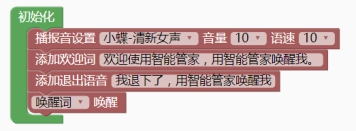

### 标准模式编程说明<!-- {docsify-ignore} -->

> 标准模式下的编程特点在于事件驱动来执行程序，比如当识别到命令词或唤醒词，当端口为高低电平时，当串口接收到数据时的事件，支持同一事件控制多设备。在标准模式同样也可使用入门模式的指令。
>

 

### 语音设置<!-- {docsify-ignore} -->

> 初始化设置
>

 

> 语音模块的播报音支持 18 种人声，包含 14 种中文，4 种英文，音量和语速都支持 10级可调范围。当你选择不同的播报音时，软件会播放试听语音，方便你选择。
>
> 欢迎词是芯片上电后自动播放的一段声音。
>
> 退出语音是芯片进入待机模式时播放的一段声音。
>

 

> 唤醒方式，支持唤醒词唤醒和永远唤醒两种模式。
>
> 唤醒词唤醒模式，需要用户先喊唤醒词唤醒模块，让模块进入唤醒状态，只要模块进入唤醒状态时，喊对应的命令词，模块都会识别。
>
> 永远唤醒模式，为模块一直处于唤醒状态，随时喊命令词都能识别。

> 设置音量：通过参数修改可调节音量大小。
>

 

> 语音 ID 
>
> 可调用语音识别的 ID。
>

 
