### 事件触发<!-- {docsify-ignore} -->

#### 1.唤醒词识别回复事件

 

 

> 事件框里可以放执行模块，如下例：
>

 

 

#### 2.命令词识别回复事件

 

> 事件框里可以放执行模块，如下例：
>

 

 

> 智能对话范例：
>

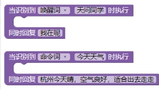 

 

> 语音控制串口输出范例：
>

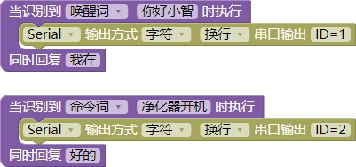 

 

#### 3.引脚电平触发事件

> 程序会自动判断对应引脚的电平，条件成立时会自动触发执行框里面的程序模块。使用范例如下：
>

 

 

> 也可以通过逻辑模块来同时判断多个引脚的状态。使用范例如下：
>

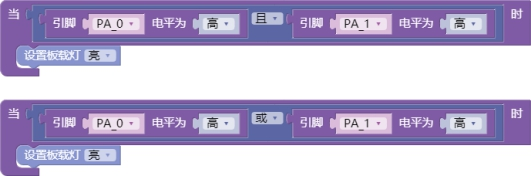 

 

#### 4.引脚模拟量比较触发事件

 

> 程序会自动判断对应引脚的 ADC 的模拟量读取值，范围为 0-4095，条件成立时会自动触发执行框里面的程序模块。使用范例如下：
>

 

 

> 也可以通过逻辑模块、比较模块来判断多重条件。使用范例如下：
>

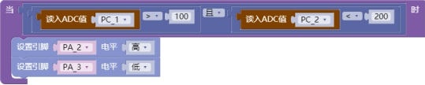 

#### 5.退出设置

 

> 这条指令在唤醒词唤醒模式下有效。可以在这条指令内部放入一些退出时想要做的指令。

#### 6.串口接收字符串比对事件

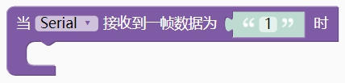 

 

> 串口接收程序会自动比对接收到的字符，如果一致，则自动触发执行框里面的程序模块。
>

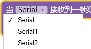 

> ASR 芯片支持三路串口，Serial 为串口 0，引脚为 PB5(TX)、PB6(RX)；Serial1 为串口1，引脚为 PA2(TX)、PA3(RX)；Serial2 为串口 2,引脚为 PA5(TX)、PA6(RX)。
>
> 串口 0 为程序下载接口，默认已经连接到 USB 口，一般用作调试和烧写程序使用。串口参数默认为：波特率 9600 8N1。修改波特率可以在初始化程序块里添加串口波特率设置模块。如下图所示：
>

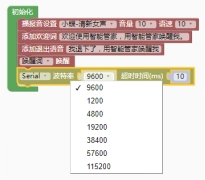 

 

> 范例 1-字符串模式串口控制板载 LED 灯（PA4）
>

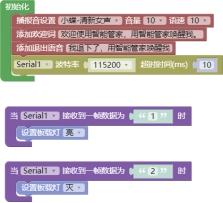 

 

#### 7.串口接收十六进制比对事件

 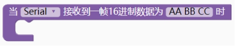

> 串口接收程序会自动比对接收到的十六进制格式的数据，如果一致，则自动触发执行框里面的程序模块。
>
> 支持多个数据同时比对，用空格隔开。
>

 

> 范例 1-十六进制模式串口控制板载 LED 灯（PA4）
>

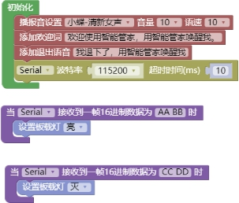 

 
#### 8.返回一帧16进制数据第几个字节的值

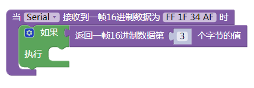 

#### 9.设置软件定时器

 

#### 10.启动软件定时器

 

#### 11.停止软件定时器

 