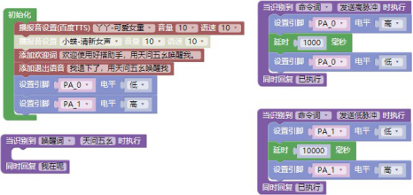
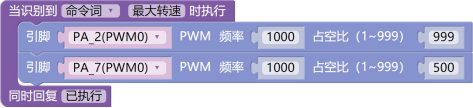
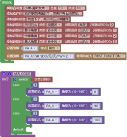
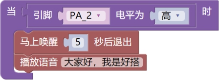
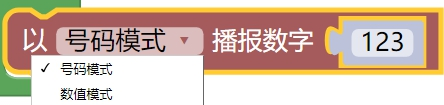
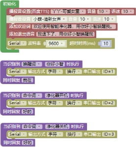

### 执行动作<!-- {docsify-ignore} -->

#### 1.设置板载 LED灯

 

> ASRPRO 板载一颗 LED 灯，连接在 PA4 引脚，图形块支持灯的亮灭。如需要更多效果，可以自己通过设置 PWM 模块或者设置引脚电平模块来单独控制 PA4 引脚。

 

> ASR-ONE 板载一颗共阴 RGB 灯，对应的引脚分别为 P14(B)、P15(R)、 P16(G)。图形块支持红灯、绿灯、蓝灯、白灯共 4 种灯的亮灭。如需要更多效 果，可以自己通过设置 PWM 模块或者设置引脚电平模块来单独控制 RGB 引脚。

#### 2.设置引脚电平

 

> 设置对应引脚的电平状态，包含高、低两种状态。共支持 28 个引脚。语音控制脉冲范例：
>

 

#### 3.设置引脚脉冲

 

> 设置引脚输出高脉冲或低脉冲及单个脉冲时间和脉冲次数。

#### 4.设置引脚PWM输出

 

 

> 引脚输出 PWM，一般应用建议设置在 2M 以下，2M 以上需要修改底层驱动，不然会不准。
>
> 占空比范围为 1 到 999。
>
> 要注意芯片总共有 6 路 PWM 通道，可以分配到不同引脚，如下设置
>

> 实际占空比为 50%，以最后一条语句为准。所以要做好 PWM 通道和引脚的合理分配，不要造成冲突。

#### 5.设置舵机

 

> 设置舵机转动角度，使用的时候需要注意舵机的供电问题，舵机电源需要单独供电。语音控制舵机范例：

 

#### 6.语音播报

 

 

> 使用的时候要在唤醒状态才会执行，也可以在前面添加唤醒模块来实现自动唤醒播报，范例如下：

 

 

#### 7.数字播报

 

 

> 支持号码和数字两种模式，支持 2 位小数，支持最大整数为 9 千亿，支持负数。号码模式一般为个位数的播放，如数字“0-9”，数值模式则为有计数单位的数值，比如 100 播放为一百。
>

#### 8.设置串口波特率

 

 

 

> 设置对应串口的波特率，其中超时时间为用来判断数据是否接收完毕，默认 10ms。
>

 

 

> 串口输出支持 16 进制和字符两种输出方式，支持换行和不换行输出。其中多个 16 进制数据，用空格隔开。
>

> 语音控制串口输出范例：

 