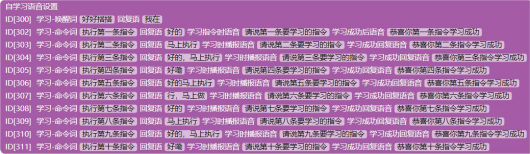
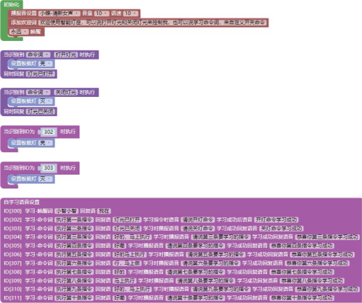

## 自学习设置 <!-- {docsify-ignore} -->

### 自学习设置指令

 

 

 

> 自学习语音设置可以通过自学习功能设置自定义唤醒词和命令词，不需要再次编译下载程序。
>
> 自学习的 ID 从 300 开始到 311，总共可以自定义 1 个唤醒词，10 个命令词。
>

 

 

> 识别到 ID 后就会执行相应的程序。范例程序如下：
>

 

 

> 通过自学习模块可自行添加回复播报的语音，通过多个命令词或唤醒词来执行指令。注意使用自学习语音时要注意在每个输入框都要有文字，否则模型生成会处理失败。学习唤醒词时听到提示后即可说出唤醒词，具体可参考学习功能。
>

> 执行内容或回复词可以为空。

**[更多ASRPRO自学习资料](https://haohaodada.com/new/bbs/forum.php?mod=viewthread&tid=1099)**

### 自学习学习流程

 

#### 1.学习唤醒词

 

> 首先用默认的唤醒词唤醒语音助手，然后说出“学习唤醒词”，根据提示来学习唤醒词提示：学习状态中，保持安静
>
> 学习的唤醒词为：小智小智
>

 

> 提示：学习成功，请再说一次！ 需学习的唤醒词：小智小智
>
> 提示：学习成功，请再说一次！ 需学习的唤醒词：小智小智
>
> 提示：指令学习成功（语音提示会跳转到第二条指令） 就可以使用学习过的唤醒词来唤醒语音助手！
>

 

#### 2.学习命令词

 

> 用唤醒词（默认或已学习的）唤醒语音助手，然后说出“学习命令词”，根据提示来学习命令词
>
> 学习状态中，保持安静，在自学习状态下学习指令时语音会提示：请说开灯命令学习的唤醒词为：开灯命令
>
> 提示：学习成功，请再说一次！
>
> 需学习的命令词：开灯命令
>
> 提示：学习成功，请再说一次！ 需学习的命令词：开灯命令
>
> 提示：恭喜你第一条指令学习成功，请说出第二条要学习的指令
>
> ………… (继续学习即可)
>
> 或者使用“退出学习”来退出当前的学习状态。
>
> 学习结束后会自动生成一个 ID，通过这个 ID 编写程序来控制即可。
>

 

#### 3.删除唤醒词和命令词

 

> 用唤醒词（默认或已学习的）唤醒语音助手，然后说出“我要删除”，根据提示来学习命令词
>
> 提示：请问需要删除的是学习的唤醒词还是命令词删除命令词：删除学习过的命令词
>
> 删除唤醒词：删除学习过的唤醒词
>
> 全部删除：删除学习过的唤醒词和命令词退出删除
>
