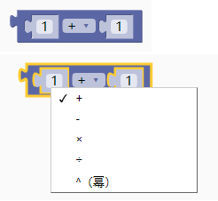
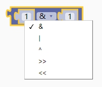
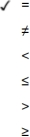
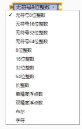
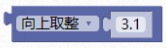
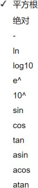
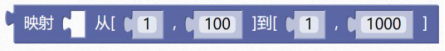

### 数学与逻辑模块<!-- {docsify-ignore} -->


#### 1.数字模块

 

数值大小里面可以自己填写。


 

 

#### 2.常用数学运算

 

> 包含加、减、乘、除、幂，两个输入框放入变量输出块或者直接修改数字，运算结果会返回给输入块。通过下拉菜单可修改运算符。
>


 


> 示例 1： 变量 a+1。
>

 

 

> 示例 2：变量 x+y。
>

 

 

#### 3.位操作


 


> 包含与、或、异或、右移、左移。 通过下拉菜单可修改。
>


 


> 变量 a>>1 右移 1 位。
>

 

 

#### 4.位取反


 


> 示例：变量 a 按位取反。
>


 


#### 5.数字比较

 

> 包含等于、不等于、小于、小于等于、大于、大于等于。
>


 


 

 

> 示例 1：比较变量 x 和 y 是否相等。
>


 


> 示例 2：比较变量 x 是否等于 0。
>


 


#### 6.逻辑比较

 

 

> 包含逻辑且（&&）、或（||）。
>


> 示例 1：当 a>0 并且 a<5 时，条件才成立返回真，否则返回假。(a>0) && (a<5)	
>


 


#### 7.逻辑非


 

 

> 变量 a，逻辑取反。!a	
>


 

 


#### 8.强制类型转换

 

> 把常量与变量进行强制类型转换，通过下拉菜单改变数据类型。
>


 


 

 

> 示例 1：将变量 a 强制转换为无符号的 8 位数
>


 

 

#### 9.初始化随机数种子

 

> 通过随机数方式设定随机数的集合，使用时随机数的出现顺序也会随机变化。一般会结合 ADC 采用悬空引脚来使用，做到每次开机后随机数的出现顺序是不一样的。
>


  

 


#### 10.随机数

>  获取指定区间内的随机数。
>


 


```c
//返回指定区间内的随机数，不包含区间最大值。
random(1, 101) //返回 1------100 之间的随机数。
```


#### 11.取余数（%）


 

 

> 示例 1：返回变量除于 2 的余数，只有 0，1 两种，可以用来判断奇偶数。
>


 


#### 12.取舍取整函数

> 包含四舍五入、向上取整，向下取整。


 


```c
round(x);//四舍五入
```


> 返回四舍五入后的数。

 

```c
ceil(float x);
```


> 示例 1:ceil(-3.14) = -3；ceil(4.56) = 5;
>


 

```c
floor(float x);
```


> 示例 1:floor(-3.14) = -4；floor(4.56) = 4;
>

 

#### 13.复杂数学运算

 

> 包含平方根、绝对值、负数、对数、幂、三角函数。
>


 

 

 

 

#### 14.映射

 

> 返回指定比例系数和范围的数据。常用在给数据的范围等比例放大或者缩小。
>


 

 

```c
map(long x, long in_min, long in_max, long out_min, long out_max)	
```


```c
long map(long x, long in_min, long in_max, long out_min, long out_max)
{
	return (x - in_min) * (out_max - out_min) / (in_max - in_min) + out_m in;
}
```


> 内部实现代码
>


> 示例 1：变量 a 的初始范围为 1 到 100，等比例放大 10 倍。 即 a=1，返回 1； a=50， 返回 500；a=100，返回 1000；
>

 

 
