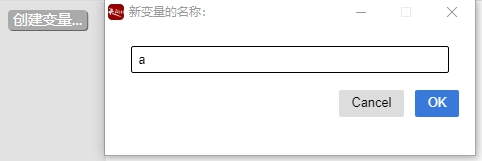
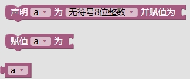
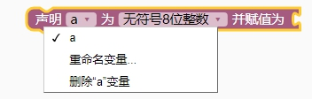
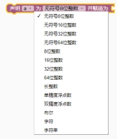
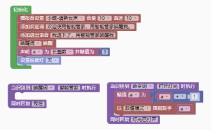

### 变量模块 <!-- {docsify-ignore} -->

 

#### 1.创建变量

>  图形化模块支持变量名为中文，系统会自动转义为英文，但是可读性差，一般不建议用中文。变量栏目默认没有变量，需要点击灰色按钮创建。
>

 

 

> 在弹出框中输入变量名，点击确定。再次打开变量栏目出现如下图形块：
>

 

 

#### 2.变量声明

 

> 第一个选型里，可以再次重命名或者删除变量。
>

 

 

> 通过下拉菜单，选择变量的类型。
>

 

 

#### 3.变量赋值

 

 

#### 4.获取变量值

 

 

> 通过调用变量播放语音范例如下：
>

 

 

 