### 控制模块<!-- {docsify-ignore} -->

#### 延时指令

 

> 图形化模块提供了常用几种微秒级的延时函数，微秒级的延迟不是十分精确，使用的时候要注意。
>
> 延时 1/5/10/50/100 微秒

 

 

> 毫秒级延迟函数。

 


#### 空指令

 

> 执行一个指令需要的时间，由系统频率确定，用在需要精确时间的场合里，比如前面的微秒级的延时函数内部，就是由 nop 组成。

 


#### 条件判断指令

 

> 如果条件判断成立，则执行里面的代码，否则不执行。


```c
if(0){

}
```

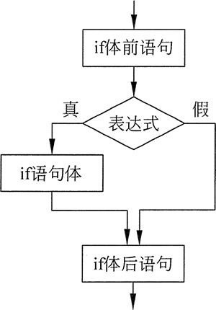 

 

> 还可以通过点击蓝色小齿轮，添加多个判断语句。如下为如果否则判断分支语句：
>
> 如果条件判断成立，则执行如果里面的代码，否则执行否则里的代码。

 

```c
if(0)
{
/* code */
}
else
{
/* code */
}
```

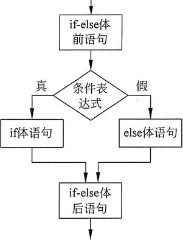 

 

> 还可以添加多个否则如果，执行多个判断，如果对应的条件成立，则执行里面的代码。

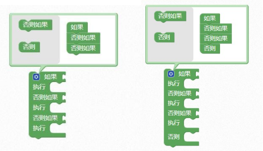 


```c
if(0){

}
else if(0){

}
else if(0){

}
```


#### 重复循环语句


> i 默认为 8 位无符号，最大值为 255，如果循环次数大于 255，请自己添加变量声明模块，修改变量类型。

 


 

```c
uint8 i;

for (i = 0; i < 9; i = i + 1) {
    
}
```


> for (表达式 1;表达式 2;表达式 3)
>
> {
>
> 循环语句
>
> }
>
> 表达式 1 给循环变量赋初值
>
> 表达式 2 为循环条件
>
> 表达式 3 用来修改循环变量的值，称为循环步长。


> for 语句的执行流程：


 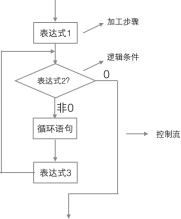 


#### 重复当执行模块


  


> 重复当执行模块中的语句执行时需要满足条件，通过下拉菜单可以选择重复直到执行，其语句执行为不满足条件，换而言之直到条件满足则跳出循环。


 

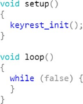 

 

> 示例 1：

> 将 a 设定初始值为 5，当 a 大于 0 时就执行程序。


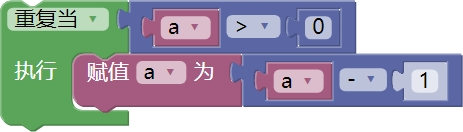 


 

 


```c
while (false)
{

}
```

 

 

> 示例 2：

> 将 a 设定初始值为 5，当 a 小于 0 时就停止执行程序。


 

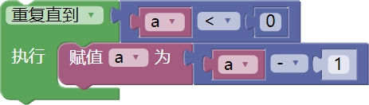 

 

 

#### 多个条件判断模块


> 功能和对个如果否则判断模块一样，有一些微小区别，我们一般用 switch case 用来判断多个常量时使用，语法简洁明了，执行效率比较高。可以通过点击蓝色小齿轮，添加多个判断语句。


 

 

 

 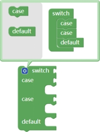 


```
switch (NULL) { 
	case NULL: 
		break;
	case NULL: 
		break; 
	default:
 		break;
}
```

 

> 判断学号，匹配姓名范例如下：

 

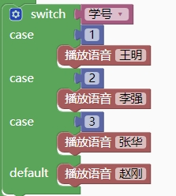 


####  中断循环


> 如果循环中需要中断循环，可以用中断循环模块。


 


范例如下：

 


#### 计时器模块

 

 

> 计时器在 ASRPRO 上电后开始计时，通常可使用变量进行存储通过调用计算两次计时差值，在断电后再上电使用即可重新计时。

 

> 将计时器的值赋值到变量中


 


> 比对差值可以判断时间间隔。


 


#### 初始化模块


 

> 里面的代码只在上电后执行一次，因此我们通常把一些变量的声明或引脚初始化等放在初始化里。


> 初始化变量

 


> 扩展模块的初始化放到系统应用初始化里

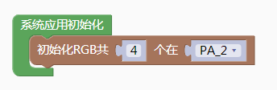 


 

#### 重复执行模块

 

> 里面的代码一直在循环往复的执行。最后一条代码执行完后回过来执行第一条代码。


 


```c
void ASR_CODE()
{
    while (1) {

    }
}
```


 

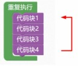 

 


