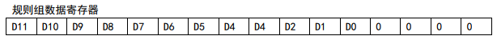
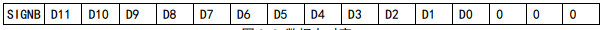
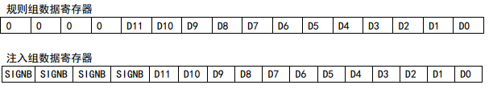

### ADC模块<!-- {docsify-ignore} -->

> ADC 模块包含 1 个 10 位的逐次逼近型的模拟数字转换器，最高 4MHz 或 6MHz 的输入时钟。支持 8 个外部通道和 2 个内部信号源采样源。可完成通道的单次转换、连续转换，通道间自动扫描模式、 间断模式、外部触发模式、双重采样、触发延迟等功能。可以通过模拟看门狗功能监测通道电压是 否在阈值范围内。 

**主要特性**  

- 10 位分辨率 
- 支持 8 个外部通道和 2 个内部信号源采样 
- 多通道的多种采样转换方式：单次、连续、扫描、触发、间断等 
- 数据对齐模式：左对齐、右对齐 l 采样时间可按通道分别编程 
- 规则转换和注入转换均支持外部触发 
- 模拟看门狗监测通道电压，自校准功能 
- ADC 通道输入范围：0≤VIN≤VDDA 
- 触发延迟

 **ADC 配置**

 **1）模块上电** 

​		ADC_CTLR2 寄存器的 ADON 位为 1 表示 ADC 模块上电。当 ADC 模块从断电模式（ADON=0）下进入 上电状态（ADON=1）后，需要延迟一段时间 tSTAB用于模块稳定时间。之后再次写入 ADON 位为 1，用 于作为软件启动 ADC 转换的启动信号。通过清除 ADON 位为 0，可以终止当前转换并将 ADC 模块置于 断电模式，这个状态下，ADC 几乎不耗电。 

**2）采样时钟** 

​		模块的寄存器操作基于 AHBCLK（AHB 总线）时钟，其转换单元的时钟基准 ADCCLK，由 RCC_CFGR0 寄存器的 ADCPRE 域配置分频，最大不能超过 4MHz 或 6MHz。 

**3）通道配置** 

​		ADC 模块提供了 10 个通道采样源，包括 8 个外部通道和 2 个内部通道。它们可以配置到两种转 CH32V003 应用手册 http://wch.cn V1.2 73 换组中：规则组和注入组。以实现任意多个通道上以任意顺序进行一系列转换构成的组转换。

​        转换组： 

​		规则组：由多达 16 个转换组成。规则通道和它们的转换顺序在 ADC_RSQRx 寄存器中设置。 规则组中转换的总数量应写入 ADC_RSQR1 寄存器的 RLEN[3:0]中。 

​		注入组：由多达 4 个转换组成。注入通道和它们的转换顺序在 ADC_ISQR 寄存器中设置。注 入组里的转换总数量应写入 ADC_ISQR 寄存器的 ILEN[1:0]中。 

注：如果 ADC_RSQRx 或 ADC_ISQR 寄存器在转换期间被更改，当前的转换被终止，一个新的启动信号 将发送到 ADC 以转换新选择的组。 

​			2 个内部通道： 

​			Vref 内部参考电压：连接 ADC_IN8 通道。 

​			Vcal 内部校准电压：连接 ADC_IN9 通道，2 档可选。 

**4）校准 ADC** 

​		有一个内置自校准模式。经过校准环节可大幅减小因内部电容器组的变化而造成的精准度 误差。在校准期间，在每个电容器上都会计算出一个误差修正码，用于消除在随后的转换中每个电 容器上产生的误差。 

​		通过写 ADC_CTLR2 寄存器的 RSTCAL 位置 1 初始化校准寄存器，等待 RSTCAL 硬件清 0 表示初始 化完成。置位 CAL 位，启动校准功能，一旦校准结束，硬件会自动清除 CAL 位，将校准码存储到 ADC_RDATAR 中。之后可以开始正常的转换功能。建议在 ADC 模块上电时执行一次 ADC 校准。 注：启动校准前，必须保证 ADC 模块处于上电状态(ADON=1)超过至少两个 ADC 时钟周期。 

**5）可编程采样时间** 

​		ADC 使用若干个 ADCCLK 周期对输入电压采样，通道的采样周期数目可以通过 ADC_SAMPTR1 和 ADC_SAMPTR2 寄存器中的 SMPx[2:0]位更改。每个通道可以分别使用不同的时间采样。 总转换时间如下计算：

 		TCONV = 采样时间 + 12.5TADCCLK 

​		ADC的规则通道转换支持DMA功能。规则通道转换的值储存在一个仅有的数据寄存器ADC_RDATAR 中，为防止连续转换多个规则通道时，没有及时取走 ADC_RDATAR 寄存器中的数据，可以开启 ADC 的 DMA 功能。硬件会在规则通道的转换结束时（EOC 置位）产生 DMA 请求，并将转换的数据从 ADC_RDATAR 寄存器传输到用户指定的目的地址。

​		 对 DMA 控制器模块的通道配置完成后，写 ADC_CTLR2 寄存器的 DMA 位置 1，开启 ADC 的 DMA 功 能。 注：注入组转换不支持 DMA 功能。 

**6）数据对齐** 

​		ADC_CTLR2 寄存器中的 ALIGN 位选择 ADC 转换后的数据存储对齐方式。12 位数据支持左对齐和 右对齐模式。 

​		规则组通道的数据寄存器 ADC_RDATAR 保存的是实际转换的 12 位数字值；而注入组通道的数据 寄存器 ADC_IDATARx 是实际转换的数据减去 ADC_IOFRx 寄存器的定义的偏移量后写入的值，会存在 正负情况，所以有符号位（SIGNB）。

-  数据左对齐

 

  

-  数据右对齐

   

1. #### ADC初始化

 

2. #### 读ADC值

 

