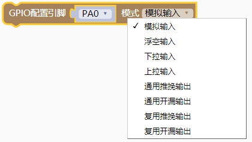
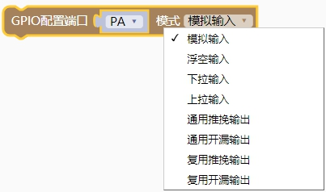
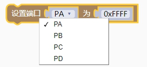
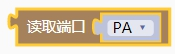
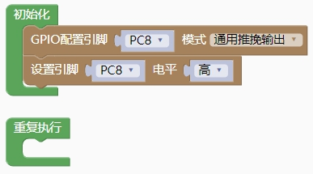
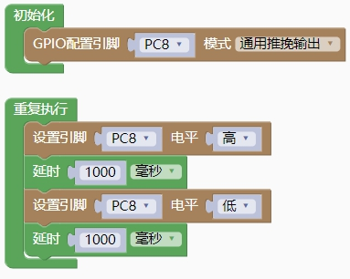
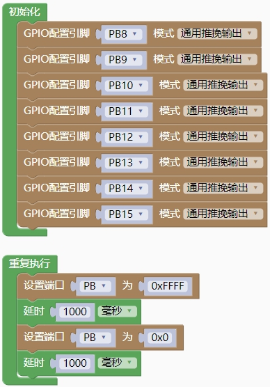
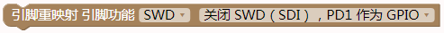

## CH32V103编程手册<!-- {docsify-ignore} -->

### GPIO模块  <!-- {docsify-ignore} -->

> GPIO 口可以配置成多种输入或者是输出模式，内置可关闭的上下拉电阻，可以配置成推挽或者是开漏功能。GPIO 口还可以复用成其他功能。

> 端口的每个引脚都可以配置成以下的多种模式之一：

-  浮空输入
- 上拉输入
- 下拉输入
- 模拟输入
- 开漏输出
- 推挽输出

> 复位后，GPIO 口运行在初始状态，这时大多数 IO 口都是运行在浮空输入状态，但也有例如 JTAG 和 HSE 等外设相关的引脚是运行在外设复用的功能上。其中：

> PA15 默认作为 JTDI 引脚处于上拉模式； 
>
> PA14 默认作为 JTCK 引脚处于下拉模式； 
>
> PA13 默认作为 JTMS 引脚置于上拉模式；
>
>  PB4 默认作为 JNTRS 引脚处于上拉模式

#### 1.配置引脚模式

 

```c++
pinMode(PA0, GPIO_Mode_AIN); 
 
GPIO_Mode_AIN                 0     //模拟输入     
GPIO_Mode_Out_PP              1     //通用推挽输出 
GPIO_Mode_IPU                 2     //上拉输入     
GPIO_Mode_IPD                 3     //下拉输入     
GPIO_Mode_IN_FLOATING         4     //浮空输入     
GPIO_Mode_Out_OD              5     //通用开漏输出 
GPIO_Mode_AF_PP               6     //复用推免输出 
GPIO_Mode_AF_OD               7     //复用开漏输出 
```

#### 2.配置端口模式

 

```c++
CH32V_GPIOX_Init(GPIOA, GPIO_Mode_AIN, GPIO_Speed_50MHz);

GPIO_Mode_AIN	        0	//模拟输入
GPIO_Mode_Out_PP	    1	//通用推挽输出
GPIO_Mode_IPU	        2	//上拉输入
GPIO_Mode_IPD	        3	//下拉输入
GPIO_Mode_IN_FLOATING	4	//浮空输入
GPIO_Mode_Out_OD	    5	//通用开漏输出
GPIO_Mode_AF_PP	        6	//复用推挽输出
GPIO_Mode_AF_OD	        7   //复用开漏输出
```
#### 3.设置引脚电平

 

```c++
digitalWrite(PA0, 1);     //高电平：1; 低电平：0
```
#### 4.读取引脚电平

 

```c++
digitalRead(PA0)         //高电平返回 1，低电平返回 0
```
#### 5.设置端口

 

```c++
GPIOA->OUTDR=0xFFFF;
```
#### 6.读取端口

 

```c++
(uint16_t)GPIOA->INDR)
```
> 示例代码 1

> 点亮板载 LED 灯


 

```c++
#include <CH32V103.h>

int main(void)
{
    CH32_Init();
    pinMode(PC8, GPIO_Mode_Out_PP); 
    digitalWrite(PC8, 1);
    while(1){

    }
    return 1;
}
```
> 示例代码 2

> 板载 LED 灯闪烁一秒亮一秒灭




```c++

#include <CH32V103.h>

int main(void)
{
    CH32_Init();
    pinMode(PC8, GPIO_Mode_Out_PP); 
    while(1){
		digitalWrite(PC8, 1);
        delay(1000);
        digitalWrite(PC8, 0);
        delay(1000);
    }
    return 1;
}
```
> 示例代码 3

> GPIOB 流水灯闪烁

 

```c++
#include <CH32V103.h>
int main(void)
{
    CH32_Init();
    pinMode(PB8, GPIO_Mode_Out_PP); 
    pinMode(PB9, GPIO_Mode_Out_PP); 
    pinMode(PB10, GPIO_Mode_Out_PP); 
    pinMode(PB11, GPIO_Mode_Out_PP); 
    pinMode(PB12, GPIO_Mode_Out_PP); 
    pinMode(PB13, GPIO_Mode_Out_PP); 
    pinMode(PB14, GPIO_Mode_Out_PP); 
    pinMode(PB15, GPIO_Mode_Out_PP); 
    while(1){
        GPIOB->OUTDR=0xFFFF;
        delay(1000); 
        GPIOB->OUTDR=0x0;
        delay(1000);
    }
    return 1;
}
```


#### 7.引脚重映射

 

> CH32V003主板引脚重映射