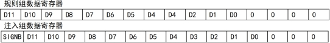
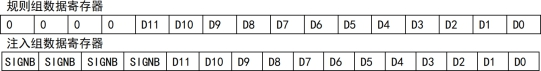
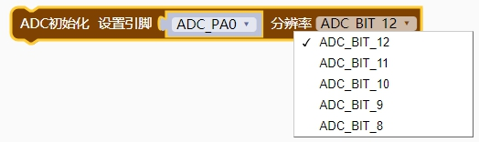
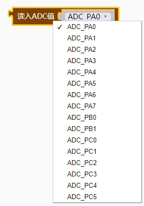
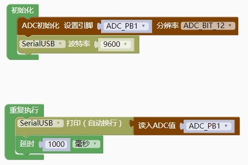
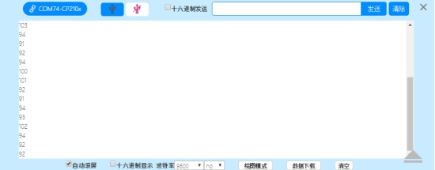

### ADC模块 <!-- {docsify-ignore} -->

> ADC 模块包含一个 12 位的逐次逼近型的模拟数字转换器，最高 14MHz 的输入时钟。支持 16 个外 部通道和 2 个内部信号源采样源。可完成通道的单次转换、连续转 换，通道间自动扫描模式、间断模式、外部触发模式等功能。可以通过模拟看门狗功能监测通道电压是否在阈值范围内。


**主要特性**

> - 12 位分辨率
> - 支持 16 个外部通道和 2 个内部信号源采样
>- 多通道的多种采样转换方式：单次、连续、扫描、触发、间断等
> - 数据对齐模式：左对齐、右对齐
>- 采样时间可按通道分别编程
> - 规则转换和注入转换均支持外部触发
>- 模拟看门狗监测通道电压，自校准功能
> - ADC 通道输入范围：0≤VIN≤VDDA
>


**ADC配置**

##### 1）模块上电
>
> ADC_CTLR2 寄存器的 ADON 位为 1 表示 ADC 模块上电。当 ADC 模块从断电模式（ADON=0）下进入 上电状态（ADON=1）后，需要延迟一段时间 tSTAB 用于模块稳定时间。之后再次写入 ADON 位为 1，用于 作为软件启动 ADC 转换的启动信号。通过清除 ADON 位为 0，可以终止当前转换并将 ADC 模块置于断 电模式，这个状态下， ADC 几乎不耗电。
>

##### 2）采样时钟
>
> 模块的寄存器操作基于 PCLK2（APB2 总线）时钟，其转换单元的时钟基准 ADCCLK 与 PCLK2 同步， 由 RCC_CFGR0 寄存器的 ADCPRE[1:0]域配置分频，最大不能超 14MHz。
>

##### 3）通道配置
>
> ADC 模块提供了 18 个通道采样源，包括 16 个外部通道和 2 个内部通道。它们可以配置到两种转 换组中：规则组和注入组。以实现任意多个通道上以任意顺序进行一系列转换构成的组转换。
>
> 转换组：
>
> - 规则组：由多达 16 个转换组成。规则通道和它们的转换顺序在 ADC_RSQRx 寄存器中设置。 规则组中转换的总数量应写入 ADC_RSQR1 寄存器的 RLEN[3:0]中。
>
> - 注入组：由多达 4 个转换组成。注入通道和它们的转换顺序在 ADC_ISQR 寄存器中设置。注 入组里的转换总数量应写入 ADC_ISQR 寄存器的 ILEN[1:0]中。
>
>
> 注：如果 ADC_RSQRx 或 ADC_ISQR 寄存器在转换期间被更改，当前的转换被终止，一个新的启动信号将发送到 ADC 以转换新选择的组。
>
> 2 个内部通道：
>
> - 温度传感器：连接 ADC_IN16 通道，用来测量器件周围的温度(TA)。
>
> - VREFINT 内部参考电压：连接 ADC_IN17 通道。
>

##### 4）校准
>
> ADC 有一个内置自校准模式。经过校准环节可大幅减小因内部电容器组的变化而造成的精准度误 差。在校准期间，在每个电容器上都会计算出一个误差修正码，用于消除在随后的转换中每个电容器上产生的误差。
>
> 通过写 ADC_CTLR2 寄存器的 RSTCAL 位置 1 初始化校准寄存器，等待 RSTCAL 硬件清 0 表示初始化完成。置位 CAL 位，启动校准功能，一旦校准结束，硬件会自动清除CAL 位，将校准码存储到 ADC_RDATAR 中。之后可以开始正常的转换功能。建议在 ADC 模块上电时执行一次 ADC 校准。
>
> 注：启动校准前，必须保证 ADC 模块处于上电状态(ADON=1)超过至少两个 ADC 时钟周期。
>

##### 5）可编程采样时间
>
> ADC 使用若干个 ADCCLK 周期对输入电压采样，通道的采样周期数目可以通过ADC_SAMPTR1 和 ADC_SAMPTR2 寄存器中的 SMPx[2:0]位更改。每个通道可以分别使用不同的时间采样。
>
> 总转换时间如下计算：
>
> TCONV = 采样时间 + 12.5TADCCLK
>
> ADC 的规则通道转换支持 DMA 功能。规则通道转换的值储存在一个仅有的数据寄存器 ADC_RDATAR 中，为防止连续转换多个规则通道时，没有及时取走 ADC_RDATAR 寄存器中的数据，可以开启 ADC 的 DMA 功能。硬件会在规则通道的转换结束时（EOC 置位）产生 DMA 请求，并将转换的数据从 ADC_RDATAR 寄存器传输到用户指定的目的地址。
>
> 对 DMA 控制器模块的通道配置完成后，写 ADC_CTLR2 寄存器的 DMA 位置 1，开启 ADC 的 DMA 功能。
>
> 注：注入组转换不支持 DMA 功能。
>

##### 6）数据对齐
>
> ADC_CTLR2 寄存器中的 ALIGN 位选择 ADC 转换后的数据存储对齐方式。12 位数据支持左对齐和右
>
> 对齐模式。
>
> 规则组通道的数据寄存器 ADC_RDATAR 保存的是实际转换的 12 位数字值；而注入组通道的数据寄存器 ADC_IDATARx 是实际转换的数据减去 ADC_IOFRx 寄存器的定义的偏移量后写入的值，会存在正负情况，所以有符号位（SIGNB）。
>

​                                                               数据左对齐
 

​                                                                数据右对齐
 


#### 1. ADC初始化设置引脚，分辨率。

 

```c++
CH32V_ADC_Init(ADC_PA0, ADC_SAMPLE_55_5, ADC_BIT_12);//ADC 初始化

//引脚参数范围：
ADC_PA0
ADC_PA1
ADC_PA2
ADC_PA3
ADC_PA4
ADC_PA5
ADC_PA6
ADC_PA7
ADC_PB0
ADC_PB1
ADC_PC0
ADC_PC1
ADC_PC2
ADC_PC3
ADC_PC4
ADC_PC5

//分辨率参数范围：
ADC_BIT_12               0 //12 位分辨率
ADC_BIT_11               1 //11 位分辨率
ADC_BIT_10               2 //10 位分辨率
ADC_BIT_9                3 //9 位分辨率
ADC_BIT_8                4 //8 位分辨率

//采样周期参数范围：
ADC_SAMPLE_1_5           //1.5 采样周期
ADC_SAMPLE_7_5           //7.5 采样周期
ADC_SAMPLE_13_5          //13.5 采样周期
ADC_SAMPLE_28_5          //28.5 采样周期
ADC_SAMPLE_41_5          //41.5 采样周期
ADC_SAMPLE_55_5          //55.5 采样周期
ADC_SAMPLE_71_5          //71.5 采样周期
ADC_SAMPLE_239_5         //239.5 采样周期
```
#### 2.读ADC值。

 

```c++
ADC_Read(ADC_PA0)
```

> 示例代码 1

> USB 虚拟串口打印板载亮度传感器值
>

 

 

