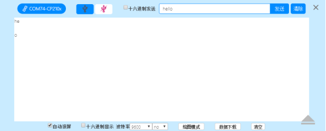

### 串口模块 <!-- {docsify-ignore} -->

> 串口模块包含两部分，一块为 USB 设备模拟的虚拟串口，另外一块为硬件串口。天问图形化端已经把两种设备简化合并在一块，方便快速开发，同时串口驱动内置环形缓存，避免数据丢失。
>

#### 1.串口初始化

 

```c++
//波特率范围 1200/4800/9600/19200/38400/57600/115200
SerialUSB.begin(9600);
Serial1.begin(9600);
Serial2.begin(9600);
Serial3.begin(9600)
```

#### 2.串口原始输出

 

> 写二进制数据到串口，数据是一个字节一个字节地发送的，若以字符形式发送数字请使用串口打印“print()”函数代替。
>

```c++
write()
SerialUSB.write(val)
SerialUSB.write(str)
SerialUSB.write(buf, len)
    
参数：
• val: 作为单个字节发送的数据
• str: 由一系列字节组成的字符串
• buf: 同一系列字节组成的数组
• len: 要发送的数组的长度
返回：
• byte
write()会返回发送的字节数，所以读取该返回值是可选的。
```

> 示例代码1

> 串口原始输出数字 10

 

```c++
#include <CH32V103.h>
#include "CDC.h"
int main(void)
{
    CH32_Init();
    SerialUSB.begin(9600);
    while (!SerialUSB);
    while(1){
    	SerialUSB.write(10);
    }
    return 1;
}
```

 

> 示例代码2

> 串口原始输出字符串
>

 

```c++
#include <CH32V103.h>
#include "CDC.h"
int main(void)
{
    CH32_Init();
    SerialUSB.begin(9600);
    while (!SerialUSB);
    while(1){
    SerialUSB.write("HELLO");
    }
    return 1;
}
```

  

#### 3.串口打印

 

> 以人类可读的 ASCII 码形式向串口发送数据，无换行，该函数有多种格式。整数的每一数位将以 ASCII 码形式发送。浮点数同样以 ASCII 码形式发送，默认保留小数点后两位。字节型数据将以单个字符形式发送。字符和字符串会以其相应的形式发送。
>

> 示例代码1

> 串口打印多种格式数据
>

 

```c++
SerialUSB.print(78) //发送 "78"
SerialUSB.print(1.23456) //发送 "1.23"
SerialUSB.print('N') //发送 "N"
SerialUSB.print("Hello world.") //发送 "Hello world."
```

> 可选的第二个参数用于指定数据的格式。允许的值为：BIN (binary 二进制), OCT (octal八进制), DEC (decimal 十进制), HEX (hexadecimal 十六进制)。对于浮点数，该参数指定小数点的位数。
>

> 示例代码2

> 串口打印指定数据的格式

 

```c++
SerialUSB.print(78, BIN) //发送 "1001110"
SerialUSB.print(78, OCT) //发送 "116"
SerialUSB.print(78, DEC) //发送 "78"
SerialUSB.print(78, HEX) //发送 "4E"
SerialUSB.print(1.23456, 0) //发送 "1"
SerialUSB.print(1.23456, 2) //发送 "1.23"
SerialUSB.print(1.23456, 4) //发送 "1.2346"
```

#### 4.串口打印(换行)

 

> 和串口打印一样功能，多了换行。
>

#### 5. 串口打印 16 进制数(换行)

 

> 和串口打印指定格式一样功能，多了换行。
>

#### 6.串口有数据可读


> 获取串口上可读取的数据的字节数该数据是指已经到达并存储在接收缓存（共有64 字节）中，如果没有数据返回-1。available()继承自 Stream 实用类。 语法：
>

```c++
SerialUSB.available()
```

#### 7.串口读取字符串

 

> 串口读取字符串数据
>

```c++
SerialUSB.readString()
```

> 示例代码1

> USB 串口输入回传

 

```c++
#include <CH32V103.h>
#include "CDC.h"
int main(void)
{
    CH32_Init();
    SerialUSB.begin(9600);
    while (!SerialUSB);
    while(1){
        if(SerialUSB.available() > 0){
            SerialUSB.println(SerialUSB.readString());
        }
    }
    return 1;
}
```

 

#### 8.串口读取字符串直到“ ”

 

> readStringUntil 函数可用于从设备接收到的数据中读取信息。读取到的数据信息将以字符串形式返回。该函数在满足以下任一条件后都会停止函数执行并返回。
>
> – 读取到指定终止字符
>
> – 达到设定时间（可使用 setTimeout 函数来设置）
>
> 当函数读取到终止字符后，会立即停止函数执行。此时函数所返回的字符串为”终止字符” 前的所有字符信息。
>

> 示例代码1

> USB 串口输入回传
>

 

```c++
#include <CH32V103.h>
#include "CDC.h"

int main(void)
{
    CH32_Init();
    SerialUSB.begin(9600);
    SerialUSB.setTimeout(5000);
    while (!SerialUSB);
    while(1){
        if(SerialUSB.available() > 0){
            SerialUSB.println(SerialUSB.readStringUntil('l'));
        }
    }
    return 1;
}
```

 

> 可以看到发送字符串“hello”后，程序检测到了‘l’字符前面的“he”，至于后面跟了一个‘o’为超时返回的数据，有关超时的说明，见 setTimeout 函数说明。
>

#### 9.串口 read 函数

 

> read() 函数可用于从设备接收到数据中读取一个字节的数据。一般和write 配套使用。设备接收到数据时，返回值为接收到的数据流中的 1 个字符。
>

> 示例代码1

> USB 串口输入回传
>

 

```c++
#include <CH32V103.h>
#include "CDC.h"
int main(void)
{
    CH32_Init();
    SerialUSB.begin(9600);
    while (!SerialUSB);
    while(1){
        if(SerialUSB.available() > 0){
        	SerialUSB.write(SerialUSB.read());
        }
    }
    return 1;
}
```

 

#### 10.串口peek()函数

 

> peek()函数可用于从设备接收到的数据中读取一个字节的数据。但是与 read 函数不同的是，使用peek()函数读取数据后，被读取的数据不会从数据流中消除。这就导致每一次调用peek 函数，只能读取数据流中的第一个字符。然而每一次调用 read 函数读取数据时，被读取的数据都会从数据流中删除。
>

#### 11.串口parseInt()函数

 

> parseInt()函数可用于从设备接收到的数据中寻找整数数值。
>

#### 12.串口parseFloat()函数

 

> parseFloat()函数可用于从设备接收到的数据中寻找浮点数值。
>

#### 13.串口清空缓存

 

> flush 函数可让开发板在所有待发数据发送完毕前，保持等待状态。
>
> 注意：很多人误认为 flush 函数具有清除开发板接收缓存区的功能。事实上此函数是没有此功能的。翻译名称为“清空缓存”，不是把缓存里的数据删除，而是等待缓存里的数据发送完毕。
>
> 本函数属于 Stream 类。该函数可被 Stream 类的子类所使用，如（Serial, WiFiClient, File
>
> 等）。
>
> 为了更好的理解 flush 函数的作用，我们在这里用 Serial.flush()作为示例讲解。
>
> 当我们通过 Serial.print 或 Serial.println 来发送数据时，被发送的字符数据将会存储于开发板的“发送缓存”中。这么做的原因是开发板串行通讯速率不是很高，如果发送数据较多， 发送时间会比较长。
>
> 在没有使用 flush 函数的情况下，开发板不会等待所有“发送缓存”中数据都发送完毕再执行后续的程序内容。也就是说，开发板是在后台发送缓存中的数据。程序运行不受影响。
>
> 相反的，在使用了 flush 函数的情况下，开发板是会等待所有“发送缓存”中数据都发送完毕以后，再执行后续的程序内容。
>

#### 14.串口setTimeout()函数

> 用于设置设备等待数据流的最大时间间隔。
>
> 当设备在接收数据时，是以字符作为单位来逐个字符执行接收任务。由于设备无法预判即将接收到的信息包含有多少字符，因此设备会设置一个等待时间。默认情况下，该等待时间是 1000 毫秒。
>
> 举例来说，假设我们要向设备发送一个字符串“ok”。那么设备在接收到第一个字符“o”以后，他会等待第二个字符的到达。假如在 1000 毫秒内，设备接收到第二个字符“k”，那么设备会重置等待时间，也就是再等待 1000 毫秒，看一看字符“k”后面还有没有字符到达。我们知道我们发给设备的字符串只有两个字符，后面没有更多字符了。但是设备并不知道这一情况。因此设备在接收到“k”以后，会等待 1000 毫秒。直到 1000 毫秒等待时间结束都没有再次接到字符。这时，设备才会很肯定地结束这一次接收工作。这里这个等待的1000 毫秒时间就是通过 setTimeout 函数来设置的。
>

#### 15.串口end()函数

> 禁用串口功能，设置串口的 TX、RX 引脚作为普通引脚使用，如需要恢复，使用begin()函数。
>

#### 16.串口readBytes(buffer,length)函数

> readBytes(buffer, length)函数可用于从设备接收的数据中读取信息。读取到的数据信息将存放在缓存变量中。该函数在读取到指定字节数的信息或者达到设定时间后都会停止函数执行并返回。该设定时间可使用  setTimeout来设置。
>

> 参数
>
> buffer: 缓存变量/数组。用于存储读取到的信息。允许使用char 或者 byte 类型的变量或数组。 
>
> length: 读取字节数量。readBytes 函数在读取到 length 所指定的字节数量后就会停止运行。允许使用int 类型。
>

> 返回值
>
> buffer(缓存变量)中存储的字节数。数据类型：size_t
>

> 示例代码1

```c++
#include <CH32V103.h>
#include "CDC.h"
const int bufferLength = 10; // 定义缓存大小为 10 个字节
char serialBuffer[bufferLength];// 建立字符数组用于缓存

int main(void)
{
    CH32_Init();
    SerialUSB.begin(9600);
    while (!SerialUSB);
    while(1){
    	if (SerialUSB.available()){ // 当串口接收到信息后
        SerialUSB.println("Received SerialUSB Data:");
        SerialUSB.readBytes(serialBuffer, bufferLength);// 将接收到的信息使用
        readBytes 读取
        for(int i=0; i<bufferLength; i++){ // 然后通过串口监视器输出
            readBytes
            SerialUSB.print(serialBuffer[i]); // 函数所读取的信息
        }
        SerialUSB.println("");
        SerialUSB.println("Finished Printing Recevied Data.");
    }
    return 1;
}
```

#### 17.串口readBytesUntil(character,buffer,length)函数

> readBytesUntil(character, buffer, length)函数可用于从设备接收到数据中读取信息。读取到的数据信息将存放在缓存变量中。该函数在满足以下任一条件后都会停止函数执行并且返回。
>
> – 读取到指定终止字符
>
> – 读取到指定字节数的信息
>
> – 达到设定时间（可使用setTimeout来设置）
>
> 当函数读取到终止字符后，会立即停止函数执行。此时buffer（缓存变量/数组）中所存储 的信息为设备读取到终止字符前的字符内容。
>

> 参数
>
> character: 终止字符。用于设置终止函数执行的字符信息。设备在读取数据时一旦读取到此终止字符，将会结束函数执行。允许使用 char 类型。
>
> buffer: 缓存变量/数组。用于存储读取到的信息。允许使用 char 或者 byte 类型的变量或数组。
>
> length: 读取字节数量。readBytes 函数在读取到 length 所指定的字节数量后就会停止运行。允许使用int 类型。
>

> 返回值
>
> buffer(缓存变量)中存储的字节数。数据类型：size_t
>

#### 18.串口find(target)函数

> find 函数可用于从设备接收到的数据中寻找指定字符串信息。当函数找到了指定字符串信息后将会立即结束函数执行并且返回“真”。否则将会返回“假”。

> 参数
>
> target: 被查找字符串。允许使用 String 或 char 类型。
>

> 返回值
>
> 返回值类型为 bool。当函数找到了指定字符串信息后将会立即结束函数执行并且返回 “真”。否则将会返回“假”。
>

> 示例代码1

```c++
#include <CH32V103.h>
#include "CDC.h"
int main(void)
{
    CH32_Init();
    SerialUSB.begin(9600);
    while (!SerialUSB);
    while(1){
        if (SerialUSB.available()){ // 当串口接收到信息后
            SerialUSB.println("SerialUSB Data Available..."); // 通过串口监视器
            通知
            // 用户系统开始查找指定信息
            SerialUSB.print("system is trying to find "); SerialUSB.println("^_^");
            // 执行查找并通过串口监视器输出查找结果
            if(SerialUSB.find("^_^")) {
                SerialUSB.print("Great! System found "); SerialUSB.println("^_^");
            } else {
                SerialUSB.print("Sorry System can't find "); SerialUSB.println("^_^");
            }
            SerialUSB.println("");
        }
    }
    return 1;
}
```

#### 19.串口findUntil(target,terminator)函数

> findUntil(target ,terminator)函数可用于从设备接收到的数据中寻找指定字符串信息。当函数找到了指定字符串信息后将会立即结束函数执行并且返回“真”。否则将会返回“假”。该函数在满足以下任一条件后都会停止函数执行
>
> – 读取到指定终止字符串
>
> – 找到了指定字符串信息
>
> – 达到设定时间（可使用 setTimeout 来设置）

> 参数
>
> target: 被查找字符串。允许使用 String 或 char 类型。
>
> terminator: 终止字符串。用于设置终止函数执行的字符串信息。设备在读取数据时一旦读取到此终止字符串，将会结束函数执行并返回。
>

> 返回值
>
> 返回值类型为 bool。当函数找到了指定字符串信息后将会立即结束函数执行并且返回 “真”。否则将会返回“假”。
>

