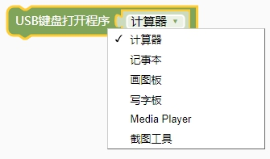
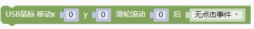
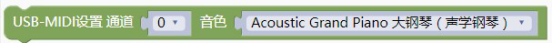
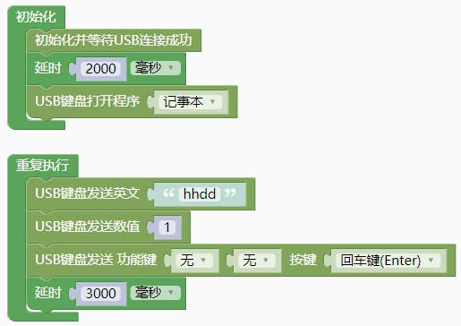
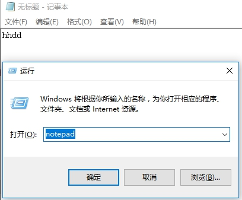
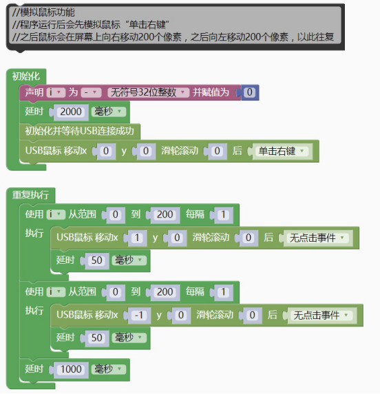
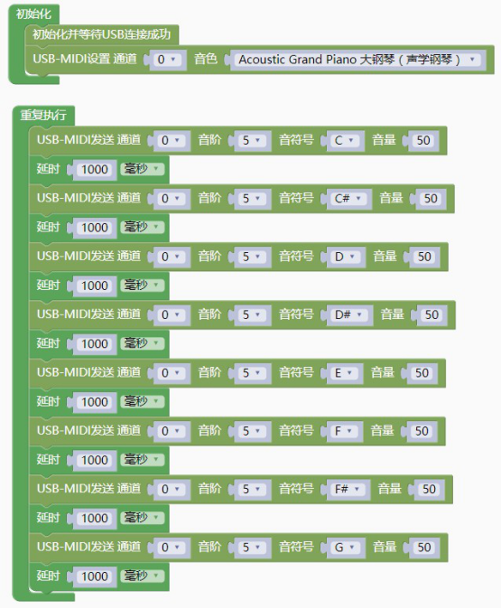

### USB通讯模块<!-- {docsify-ignore} -->

> CH32V 的USB 支持主机模式和从机模式。主机模式可以外接U 盘、鼠标、键盘等。从机模式可以设置为虚拟串口、HID、U 盘等设备。
>
> 因为USB 比较复杂，天问软件框架已经封装了 USB 底层驱动，简化了开发模式。有关USB 的详细资料，请查看专门的对应资料，本文不做过多赘述。
>

#### 1.初始化USB设备为鼠标键盘HID设备，并等待和主机连接成功。

 

```c++
usb_keymouse_init();
_configured = 0;
while (bDeviceState != CONFIGURED);
if (_configured == 0) {
    delay(2000);
    _configured = 1;
}
```

#### 2.USB键盘发送数值

 

```c++
keyBoard_Number(123);
```

#### 3.USB键盘发送文本

 

```c++
keyBoard_String("abcd");
```

#### 4.USB键盘打开指定程序

> 内部原理为通过发送键盘快捷键打Windows 系统自带的应用程序

 

```c++
keyBoard_Run("calc");
// calc 计算器
// notepad 记事本
// mspaint 画图板
// write 写字板
// dvdplay Media Player
// SnippingTool 截图工具
```

#### 5.USB键盘发送功能按键

 

```c++
keyBoard_Send(0,0,0,0,0,0,0);
```

> 按键值可以查看键盘码表，也可以对照图形化查看自动生产
>

#### 6.USB鼠标操作

 

```c++
Moue_Send(key,x,y,wheel);
//KEY 0：无按键按下，1：左键按下，2：右键按下，4：中间按下
```

#### 7.USB-MIDI设备设置通道和音色

 

```c++
Midi_Send(0x09,0xc0,0x0,0x0);
```

> 有关 MIDI 协议请查看相应资料。
>

#### 8.USB-MIDI设备设置通道、音阶、音符、音量

 

```c++
Midi_Send(0x09,0x90,0x0,0x32);
```

#### 9.USB-MIDI设备设置打击乐、音量

 

```c++
Midi_Send(0x09,0x90,0x0,0x32);
```

> 示例代码1

> 模拟USB 键盘打开记事本，自动输入文字。
>
> 注意本案例演示时，需要把输入法切换为英文状态。
>

 

```c++
#include <CH32V103.h>
#include "usb_keyboard.h"
boolean _configured;
int main(void)
{
    CH32_Init();
    usb_keymouse_init();
    _configured = 0;
    while (bDeviceState != CONFIGURED);
    if (_configured == 0) {
        delay(2000);
        _configured = 1;
    }
    delay(2000);
    keyBoard_Run("notepad");
    while(1){
        keyBoard_String("hhdd");
        keyBoard_Number(1);
        keyBoard_Send(0,40,0,0,0,0,0);
        delay(3000);
    }
    return 1;
}
```

 

> 示例代码2

> 模拟USB 鼠标操作
>

 

```c++
#include <CH32V103.h>
#include "usb_keyboard.h"
uint32_t i = 0;
//模拟鼠标功能
//程序运行后会先模拟鼠标“单击右键”
//之后鼠标会在屏幕上向右移动 200 个像素，之后向左移动 200 个像素，以此往复
boolean _configured;
int main(void)
{
    CH32_Init();
    usb_keymouse_init();
    _configured = 0;
    delay(2000);
    while (bDeviceState != CONFIGURED);
    if (_configured == 0) {
        delay(2000);
        _configured = 1;
    }
    Moue_Send(2,0,0,0);
    while(1){
        for (i = 0; i < 200; i = i + 1) {
            Moue_Send(0,1,0,0);
            delay(50);
        }
        for (i = 0; i < 200; i = i + 1) {
            Moue_Send(0,-1,0,0);
            delay(50);
        }
    	delay(1000);
    }
    return 1;
}
```

> 示例代码3

> 模拟 HID MIDI 设备发送 MIDI 音乐。
>
> 注意电脑上需要运行 MIDI 播放软件，才能正常演示。
>

 

```c++
#include <CH32V103.h>
#include "usb_midi.h"
boolean _configured;
int main(void)
{
    CH32_Init();
    usb_midi_init();
    _configured = 0;
    while (bDeviceState != CONFIGURED);
    if (_configured == 0) {
        delay(2000);
        _configured = 1;
    }
    Midi_Send(0x09,0xc0,0x0,0x0);
    while(1){
        Midi_Send(0x09,0x90,0x48,0x32);
        delay(1000);
        Midi_Send(0x09,0x90,0x49,0x32);
        delay(1000);
        Midi_Send(0x09,0x90,0x4a,0x32);
        delay(1000);
        Midi_Send(0x09,0x90,0x4b,0x32);
        delay(1000);
        Midi_Send(0x09,0x90,0x4c,0x32);
        delay(1000);
        Midi_Send(0x09,0x90,0x4d,0x32);
        delay(1000);
        Midi_Send(0x09,0x90,0x4e,0x32);
        delay(1000);
        Midi_Send(0x09,0x90,0x4f,0x32);
        delay(1000);
    }
    return 1;
} 
```
