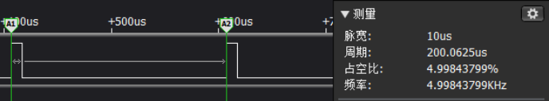
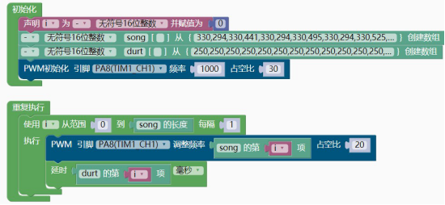

### PWM模块<!-- {docsify-ignore} -->

> CH32V 的高级定时器 TIM1 和通用定时器 TIM2/3/4 都支持 PWM 功能，天问的软件框架把PWM 功能单独的独立出来，支持基本的PWM 输出功能，方便快速使用。如需要更多的 PWM 高级功能，可以直接使用CH32V 的 SDK 开发。
>

> 引脚分布如下： 

- TIM1_CH1 PA8 

- TIM1_CH2 PA9 

- TIM1_CH3 PA10 

- TIM1_CH4 PA11

  

- TIM2_CH1 PA0 (PA15) 

- TIM2_CH2 PA1 (PB3) 

- TIM2_CH3 PA2 (PB10)

- TIM2_CH4 PA3 (PB11)

  

- TIM3_CH1 PA6 (PB4) (PC6) 

- TIM3_CH2 PA7 (PB5) (PC7) 

- TIM3_CH3 PB0	(PC8)

- TIM3_CH4 PB1	(PC9)

  

- TIM4_CH1 PB6 

- TIM4_CH2 PB7 

- TIM4_CH3 PB8 

- TIM4_CH4 PB9

> 注意同一组 PWM 频率一样，占空比可以不一样，注意复用功能组的选择，成对使用， 不能单独引脚设置。
>

#### 1.预定义PWM最大占空比值

 

```c++
#define PWM_DUTY_MAX 1000//PWM 最大占空比值
```

```c++
#ifndef PWM_DUTY_MAX
#define PWM_DUTY_MAX 100
#endif 
```

> 如果不设置默认为 100，占空比会根据这个值来计算的。


#### 2.设置PWM引脚、频率、占空比

 

```c++
PWM_Init(TIM2_CH1, PA0, 5000, 50);
```

> 这里需要注意占空比如果设置为 50，前面的最大占空比值为 100，则 PWM 波的占空比为 50%，如果前面的最大占空比值为 1000，则 PWM 波的占空比为 5%。
>

 


#### 3.单独调节占空比

 

```c++
PWM_Duty_Updata(TIM2_CH1, 0);
```


#### 4.单独调节PWM

 

```c++
PWM_Frequency_Updata(TIM2_CH1, 5000, 0);	
```

 （TWEN32）


> 因为占空比和频率关联，所以调节过频率后，要同时设置占空比。

> 示例代码1

> PWM 控制板载蜂鸣器演奏音乐
>

 

```c++
#include <CH32V103.h>
#include "CH32V_PWM.h"
uint16_t i = 0;
uint16_t song[]={330,294,330,441,330,294,330,495,330,294,330,525,495,39
3,330,294,330,441,330,294,330,495,393,294,248,330,294,330,441,330,294,3
30,495,330,294,330,525,495,393,294,330,221,294,330,221,196,221,262,248}
;
uint16_t durt[]={250,250,250,250,250,250,250,250,250,250,250,250,500,50
0, 250,250,250,250,250,250,250,250, 500,500,1000, 250,250,250,250,250,2
50,250,250, 250,250,250,250,500,500, 250,250,500,250,250,250,250,500,50
0,1000, 250,250,250,250,250,250,250,125,125, 750,250,1000, 250,250,25
0,250,250,250,500,500,1500, 250,250,250,250,250,250,250,125,125, 750,25
0,1000, 250,250,500,250,250,250,250,1500, 250,250,750,250,500,250,250,
750,250,500,250,250,500,250,250,250,250,500,500,1000, 250,250,875,125,
500,250,250,500,500,1000, 250,250,500,250,250,250,250,1500, 250,250,75
0,250,500,250,250, 500,250,250,500,250,250,500,250,250,250,250,250,250,
1500, 250,250,750,250,500,250,250, 500,250,250,1000,250,250,500,250,250
,250,250,2000};
int main(void)
{
    CH32_Init();
    PWM_Init(TIM1_CH1, PA8, 1000, 30);
    while(1){
        for (i = (0); i < (sizeof(song)/sizeof(song[0])); i = i + 1) {
            PWM_Frequency_Updata(TIM1_CH1, song[(int)(i)], 20);
            delay(durt[(int)(i)]);
        }
    }
    return 1;
}
```


