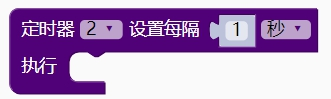
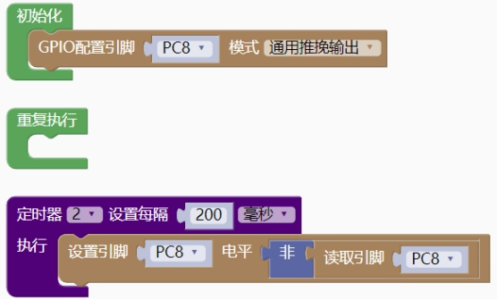

### 定时器模块<!-- {docsify-ignore} -->

> CH32V 有四个 16 位定时器 TIM1/2/3/4，其中 TIM1 属于高级定时器，包含很多高级功能，天问软件框架集成 TIM2/3/4 基本的定时功能，后续通过扩展库添加包括 TIM1 的输入捕获、输出比较、编码器等功能。

#### 1.定时器设置和回调函数

 

```c++
TIM_attachInterrupt(TIM2, 1000000, TIM_attachInterrupt_2);
```

```c++
void TIM_attachInterrupt_2() {
    
}
```

> 定时器 2，3，4 最大定时时间为 6553 毫秒。
>
> 使用本语句，初始化完成后，默认自动启动定时器。

#### 2.更新定时时间

 

```c++
TIM_Duty_Updata(TIM2, 1000000);
```

#### 3.关闭定时器

 

```c++
TIM_Disable(TIM2);
```

#### 4.启动定时器

 

```c++
TIM_Enable(TIM2);	
```

> 示例代码1

> 200 毫秒翻转 IO

 

```c++
#include <CH32V103.h>
#include "CH32V_TIM.h"
void TIM_attachInterrupt_2() {
	digitalWrite(PC8, !(digitalRead(PC8)));
}
int main(void)
{
    CH32_Init();
    pinMode(PC8, GPIO_Mode_Out_PP);
    TIM_attachInterrupt(TIM2, 200000, TIM_attachInterrupt_2);
    while(1){
        
    }
    return 1;
}
```

