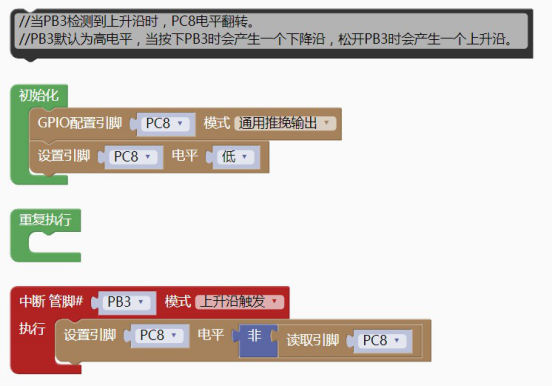

### 外部中断模块<!-- {docsify-ignore} -->

> CH32V103 系列内置快速可编程中断控制器（PFIC– Programmable Fast Interrupt Controller）， 最多支持 255 个中断向量。当前系统管理了 44 个外设中断通道和 5 个内核中断通道，其他保留。
>
> CH32V103 的所有 IO 口支持上升沿、下降沿、电平变化三种中断方式。

1. #### 中断管脚设置，触发模式设置，回调函数 

 

```c++
Pin_attachInterrupt(PB3,EXTI_Trigger_Rising,pin_attachInterrupt_fun_PB 3);
```

```c++
void pin_attachInterrupt_fun_PB3() {
    
}
```

> 示例代码1

> PB3 上升沿触发控制 LED

 

```c++
#include <CH32V103.h>
#include "CH32V_EXTI.h"
//当 PB3 检测到上升沿时，PC8 电平翻转。
//PB3 默认为高电平，当按下 PB3 时会产生一个下降沿，松开 PB3 时会产生一个上升沿。
void pin_attachInterrupt_fun_PB3() {
	digitalWrite(PC8, !(digitalRead(PC8)));
}
int main(void)
{
    CH32_Init();
    pinMode(PC8, GPIO_Mode_Out_PP);
    digitalWrite(PC8, 0);
    Pin_attachInterrupt(PB3,EXTI_Trigger_Rising,pin_attachInterrupt_fun_P
    B3);
    while(1){
        
    }
    return 1;
}
```

