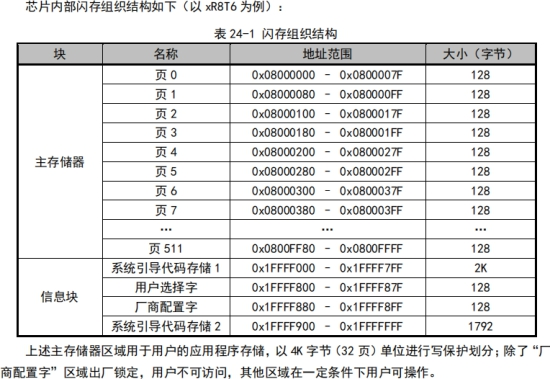
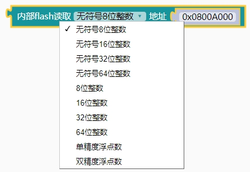
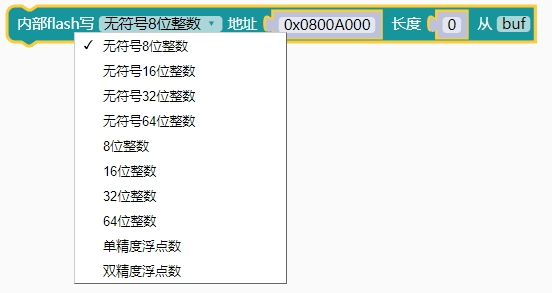
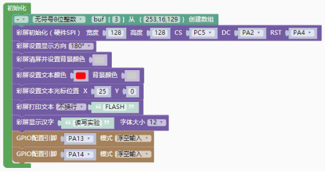
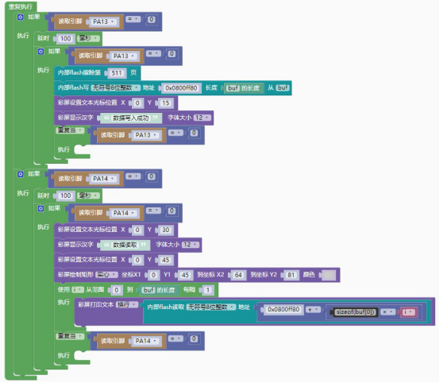

### Flash模块<!-- {docsify-ignore} -->

 

> 如上图所示，CH32V103 的闪存地址从 0x08000000 开始，一共 64K 字节数据，其中又把每 128 个字节分为一页，有 0-511（共 512）页, 天问 CH32V 开发板出厂前面已经内置 8K 的 bootloader，为了防止 bootload 被擦除，该 Flash 的前 8K 字节的数据不允许写入，如果需要写入，请自行修改 Flash 库。

> 闪存编程及安全性
>
> 1）2 种编程/擦除方式
>
> - 标准编程：此方式是默认编程方式（兼容方式）。这种模式下 CPU 以单次 2字节方式执行编程， 单次 1K 字节执行擦除及整片擦除操作。
>
> - 快速编程：此方式采用页操作方式（推荐）。经过特定序列解锁后，执行单次128 字节的编程及 128 字节擦除。
>
>
> 2）安全性-防止非法访问（读、写、擦）
>
> - 页写入保护
>
> - 读保护

> 读保护状态下：
>
> 1） 主存储器 0-31 页（4K 字节）自动写保护状态，不受 FLASH_WPR 寄存器控制；解除读保护状态，所有主存储页都由 FLASH_WPR 寄存器控制。
>
> 2） 系统引导代码区、SWD 模式、RAM 区域都不可对主存储器进行擦除或编程， 整片擦除除外。可擦除 或编程用户选择字区域。如果试图解除读保护（编程用户字），芯片将自动擦除整片用户区。
>
> 注：进行闪存的编程/擦除操作时，必须打开内部 RC 振荡器（HSI）。天问软件框架把 Flash 的底层操作封装好，方便快速使用。

1. #### FLASH按类型写数据

    

   > 内部Flash按地址写各类型数据，可写空间32K


2. #### FLASH读数据

 

```c++
int8_t read(uint32_t data_addr, uint8_t *buf, uint16_t num_bytes);
int8_t readChar(uint32_t data_addr);
uint8_t readUChar(uint32_t data_addr);
int16_t readShort(uint32_t data_addr);
uint16_t readUShort(uint32_t data_addr);
int32_t readInt(uint32_t data_addr);
uint32_t readUInt(uint32_t data_addr);
int64_t readLong64(uint32_t data_addr);
uint64_t readULong64(uint32_t data_addr);
float readFloat(uint32_t data_addr);
double readDouble(uint32_t data_addr);
```

> 支持多种数据格式的读取，注意地址范围，不要和bootloader 冲突。


3. #### FLASH写数据

 

```c++
FLASH_Status writeChar(uint32_t data_addr,char *Data,uint32_t count);
FLASH_Status writeUChar(uint32_t data_addr,uint8_t *Data,uint32_t count);
FLASH_Status writeShort(uint32_t data_addr,int16_t *Data,uint32_t count);
FLASH_Status writeUShort(uint32_t data_addr,uint16_t *Data,uint32_t count);
FLASH_Status writeInt(uint32_t data_addr,int32_t *Data,uint32_t count);
FLASH_Status writeUInt(uint32_t data_addr,uint32_t *Data,uint32_t count);
FLASH_Status writeLong64(uint32_t data_addr,int64_t *Data,uint32_t count);
FLASH_Status writeULong64(uint32_t data_addr,uint64_t *Data,uint32_t count);
FLASH_Status writeFloat(uint32_t data_addr,float *Data,uint32_t count);
FLASH_Status writeDouble(uint32_t data_addr,double *Data,uint32_t count);
```

> 支持多种数据格式的写入，注意地址范围，不要和bootloader 冲突。


4. #### FLASH按地址读数据

    

  

5. #### FLASH擦除指定页

 

```c++
FLASH_Status erase_page(uint32_t page);
```

 （CH32V003）

> 内部Flash擦除指定地址页


6. #### FLASH全部擦除

 

```c++
FLASH_Status FLASH_erase_page_all(void); //擦除 flash 全部数据
```


> 示例代码1

> 内部 flash 读写无符号 8 位整数

 

 

```c++
#include <CH32V103.h>
#include "myLib/CH32V_ST7735S.h"
#include "CH32V_FLASH.h"
uint8_t buf[3]={253,16,129};
unsigned char i;
//按下 KEY 键往 flash 写入数据，按下 KEY2 键读出数据
SPITFT spi_tft(128,128,PC5,PA2,PA4);
INTERNAL_FLASH flash;
int main(void)
{
    CH32_Init();
    spi_tft.init();
    spi_tft.set_direction(2);
    spi_tft.clear((0xCE79));
    spi_tft.set_text_color((0xF800),(0xCE79));
    spi_tft.set_cursor(25,0);
    spi_tft.print("FLASH");
    spi_tft.draw_hanzi_12("读写实验");
    pinMode(PA13, GPIO_Mode_IN_FLOATING);
    pinMode(PA14, GPIO_Mode_IN_FLOATING);
    while(1){
    if(digitalRead(PA13) == 0){
        delay(100);
        if(digitalRead(PA13) == 0){
            flash.erase_page(511);
            flash.writeUChar(0x0800ff80,buf,(sizeof(buf)/sizeof(buf[0])));
            spi_tft.set_cursor(0,15);
            spi_tft.draw_hanzi_12("数据写入成功");
            while (digitalRead(PA13) == 0) {
            }
        }
    }
    if(digitalRead(PA14) == 0){
    delay(100);
    if(digitalRead(PA14) == 0){
        spi_tft.set_cursor(0,30);
        spi_tft.draw_hanzi_12("数据读取");
        spi_tft.set_cursor(0,45);
        spi_tft.fill_rectangle(0,45,64,81,(0xCE79));
        for (i = (0); i < (sizeof(buf)/sizeof(buf[0])); i = i + 1) {
            spi_tft.println((flash.readUChar((0x0800ff80 + sizeof(buf[0])
            * i))));
            }
            while (digitalRead(PA14) == 0) {

            }
        }
    }
    return 1;
}
```

 