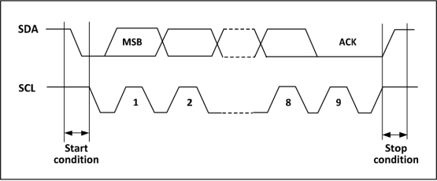

### I2C模块<!-- {docsify-ignore} -->

> I2C 总线是由Philips 公司开发的一种简单、双向二线制同步串行总线。它只需要两根线即可在连接于总线上的器件之间传送信息。

> 主器件用于启动总线传送数据，并产生时钟以开放传送的器件，此时任何被寻址的器件均被认为是从器件．在总线上主和从、发和收的关系不是恒定的，而取决于此时数据传送方向。如果主机要发送数据给从器件，则主机首先寻址从器件，然后主动发送数据至从器件， 最后由主机终止数据传送；如果主机要接收从器件的数据，首先由主器件寻址从器件．然后主机接收从器件发送的数据，最后由主机终止接收过程。在这种情况下．主机负责产生定时时钟和终止数据传送。

> I2C 是个半双工的总线，它同时只能运行在下列四种模式中之一：主设备发送模式、主设备接收 模式、从设备发送模式和从设备接收模式。I2C 模块默认工作在从模式，在产生起始条件后，会自动地切换到主模式，当仲裁丢失或者产生停止信号后，会切换到从模式。I2C 模块支持多主机功能。工作在主模式时，I2C 模块会主动发出数据和地址。数据和地址都以 8 位为单位进行传输，高位在前，低位在后，在起始事件后的是一个字节（7 位地址模式下）或两个字节（10 位地址模式下）地址，主机每发送 8 位数据或地址，从机需要回复一个应答 ACK，即把 SDA 总线拉低，如下图所示。

 

> 在嵌入式开发中经常用到硬件 I2C 和软件 I2C。硬件 I2C 的总线的信号处理由单片机硬件处理，不占用CPU；软件 I2C，则需要 CPU 来处理。

> 两则的区别为：
>
> - 硬件 I2C 引脚固定，路数少，速度高，支持主从两种模式。
>
> - 软件 I2C 所有IO 都可以，数量多，速度受限于 CPU，只支持主机。

> CH32V 包含 2 路硬件 I2C。支持多主多从模式，仅仅使用两根线（SDA 和 SCL）就能以 100KHz（标准）和 400KHz（快速）两种速度通讯。I2C 总线还兼容 SMBus 协议，不仅支持 I2C 的时序，还支持仲裁、定时和 DMA，拥有 CRC 校验功能。

> 天问软件框架中目前已经集成硬件 I2C 和软件主机 I2C 模块。

1. #### 硬件I2C初始化

    

   

2. #### 硬件I2C发送起始信号

    

   

3. #### 硬件I2C发送重复起始信号

    

   

4. #### 硬件I2C发送停止信号

    

   

5. #### 硬件I2C发送1个字节数据

    

   

6. #### 硬件I2C读取1个字节数据

    


7. #### 软件I2C初始化

 

```c++
void begin(uint8_t sdapin, uint8_t sclpin); //SOFTIIC 初始化
```

8. #### 软件I2C发送起始信号

 

```c++
uint8_t read(uint8_t last); //读函数
```

9. #### 软件I2C发送重复起始信号

 

```c++
bool restart(uint8_t addr); //重复起始信号
```

10. #### 软件I2C发送停止信号

 

```c++
bool start(uint8_t addr); //起始信号
```

11. #### 软件I2C发送1个字节数据

 

```c++
void stop(void); //停止信号
```

12. #### 软件I2C读取1个字节数据应答/非应答

 

```c++
bool write(uint8_t b); //写函数
```

