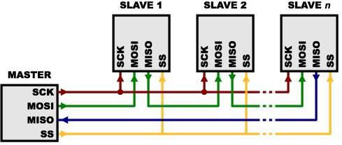

## SPI模块<!-- {docsify-ignore} -->

> SPI 是由摩托罗拉(Motorola)公司开发的全双工同步串行总线，是微处理控制单元(MCU)和外围设备之间进行通信的同步串行端口。主要应用在 EEPROM、Flash、实时时钟(RTC)、数模转换器(ADC)、网络控制器、MCU、数字信号处理器(DSP)以及数字信号解码器之间。SPI系统可直接与各个厂家生产的多种标准外围器件直接接口，一般使用 4 条线:串行时钟线SCK、主机输人/从机输出数据线 MISO、主机输出/从机输人数据线 MOSI 和低电平有效的从机选择线。



> 在嵌入式开发中经常用到硬件 SPI 和软件 SPI。硬件 SPI 的总线的信号处理由单片机硬件处理，不占用CPU；软件 SPI，则需要 CPU 来处理。

> 两则的区别为：
>
> - 硬件 SPI 引脚固定，速度高，支持主从两种模式。
>- 软件 SPI 所有IO 都可以，数量多，速度受限于 CPU，只支持主机。 CH32V 包含 2 路硬件 SPI。支持多主多从模式，最高速度为系统时钟的一半。天问软件框架中目前已经集成软件主机 SPI 模块，硬件 SPI 后续更新。

1. #### 硬件SPI初始化

    

   

2. #### 硬件SPI读写一个字节数据

    

   

3. #### 硬件SPI写一个字节数据

    

   

4. #### 硬件SPI读取一个字节数据

    

   

5. #### 硬件SPI禁止SPI总线

    

   

6. #### 硬件SPI设置通信速率

    

   

7. #### 硬件SPI设置通信模式

 

 （CH57X）


8. #### 软件SPI初始化

 

```c++
void begin(uint8_t sckpin, uint8_t mosipin, uint8_t misopin);	
```


9. #### 软件SPI写数据

 

```c++
void write_data(uint8_t data); //写函数
```


10. #### 软件SPI写数据同时返回读取数据

 

```c++
uint8_t read_data(); //读函数
```

