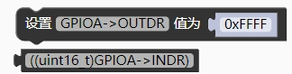
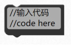
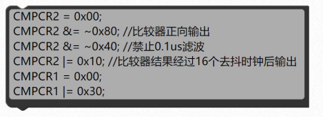

### 读写寄存器模块<!-- {docsify-ignore} -->

> 平台图形化模块只是提供了常用的功能，一些特殊外设和寄存器没有提供，如果还是想用图形化编程，可以使用如下模块，可以自己设置寄存器，也可以嵌入 C 语言代码或者直接嵌入汇编。

#### 1.读写寄存器

 

> 一些特殊寄存器，没做对应的图形块，可以用这个模块手动添加。

#### 2.宏定义

 

等效于

```c++
#define MYDEFINE PA0
```

#### 3.嵌入代码

 

示例 1：

嵌入C 语言代码。

 