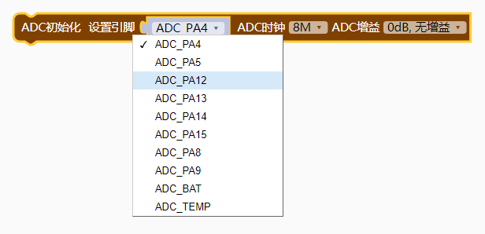
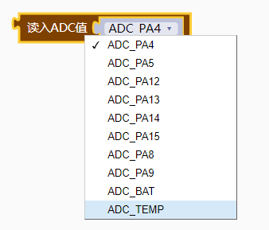

### ADC模块<!-- {docsify-ignore} -->

**ADC 简介**  

> 芯片提供一个 12 位逐次逼近型模拟数字转换器 ADC，提供多达 12 个通道，CH573 支持 10 个外部 信号源和 2 个内部信号源，CH571 仅支持 6 个外部信号源和 2 个内部信号源。


**主要特性**  

> - 12 位分辨率。 
> - 10 个外部电压采样通道、内部的温度检测通道、内部的电池电压检测通道。 
> - 单端输入模式和差分输入模式检测。 
> - 采样时钟频率可选。 
> - ADC 输入电压范围 0V～VIO33。 
> - l可选 PGA，提供增益调节选择。 
> - l可选输入缓冲器 BUF，支持高阻信号源。 
> - lCH573 支持 DMA 和定时间隔自动连续 ADC 采样，间隔可调。CH571 不支持。
>


**ADC 配置** 

**1、外部通道采样** 

> (1)、设置 R8_ADC_CFG 的 RB_ADC_POWER_ON 为 1 开启 ADC，通过 RB_ADC_CLK_DIV 选择采样频率，通 73 过 RB_ADC_BUF_EN 和 RB_ADC_PGA_GAIN 启用输入缓冲器及选择信号增益等； 
>
> (2)、设置 R8_ADC_CHANNEL 寄存器，选择外部或内部信号通道；
>
> (3)、设置 R8_ADC_CONVERT 寄存器，置位 RB_ADC_START，启动 ADC 转换； 
>
> (4)、查询等待 RB_ADC_START 自动清零或者等待 RB_ADC_IF_EOC 置 1，表示转换完成，可以读取 R16_ADC_DATA 获取 12 位 ADC 转换数据，时间足够时建议再次转换并丢弃首次 ADC 数据； 
>
> (5)、重复 2、3、4 步骤，可以继续采样另一通道或者下一组数据。 
>
> (6)、单次 ADC 转换周期：ADC 采样（4 个时钟）+ 切换 1 个时钟 + 转换时间（12 个时钟）≈ 17 个 Tadc，连续 ADC 时还要加上 1 个时间间隔，其中，Tadc = Tsys @ RB_ADC_CLK_DIV。 
>
> (7)、如果使用差分输入： 使能差分，选择 0#通道：实际是对 AIN0（正端）和 AIN2（负端）的电压进行差分转换； 使能差分，选择 1#通道：实际是对 AIN1（正端）和 AIN3（负端）的电压进行差分转换； ADC 转换后的结果，如果数据大于 0x800 表示差分正端的电压高于差分负端的电压；如果数据 小于 0x800 表示差分正端的电压低于差分负端的电压。以 PGA 增益选择 0dB 为例，理论可测电 压范围为-1.05V～1.05V，0x400 表示差分正端的电压低于差分负端的电压约 0.5 个 Vref。 


**2、温度传感器采样** 

> (1)、设置 R8_TEM_SENSOR 寄存器的 RB_TEM_SEN_PWR_ON 为 1 开启温度传感器，设置 R8_ADC_CHANNEL 为 15，选择温度传感器信号连接到 ADC 输入；
>
> (2)、设置 RB_ADC_POWER_ON 为 1 开启 ADC，设置 RB_ADC_DIFF_EN 为 1，设置 RB_ADC_CLK_DIV，设置 RB_ADC_BUF_EN 为 1，设置 RB_ADC_PGA_GAIN 为 11； 
>
> (3)、设置 R8_ADC_CONVERT 寄存器，置位 RB_ADC_START 为 1，启动 ADC 转换； 
>
> (4)、查询等待 RB_ADC_START 自动清零或者等待 RB_ADC_IF_EOC 置 1，读取 R16_ADC_DATA 获取 12 位 ADC 转换数据，精度要求较高时，建议重复 3 和 4 步骤多次，计算 ADC 数据的平均值； 
>
> (5)、根据电压与温度换算关系得到温度值，具体请参考评估板例子程序。 


**3、启用 DMA 自动连续 ADC** 

> (1)、参考非 DMA 方式设置 ADC 参数和选择通道等； 
>
> (2)、设置 R8_ADC_AUTO_CYCLE 选择连续 ADC 的周期； 
>
> (3)、设置寄存器 R16_ADC_DMA_BEG 为存储 ADC 数据缓冲区的首地址，设置寄存器 R16_ADC_DMA_END 为存储 ADC 数据缓冲区的结束地址（不含），并设置 R8_ADC_CTRL_DMA 的 RB_ADC_DMA_ENABLE 为 1， 使能 DMA 功能； 
>
> (4)、可选步骤，如果需要启用中断则设置相应的中断使能寄存器位，当 RB_ADC_IE_EOC=1 时将由 RB_ADC_IF_END_ADC 触发 ADC 完成中断，当 RB_ADC_IE_EOC=0 且 RB_ADC_IE_DMA_END=0 时将由 RB_ADC_IF_EOC 触发 ADC 完成中断； 
>
> (5)、将 RB_ADC_AUTO_EN 置 1 以开启自动连续 ADC； 
>
> (6)、每次 ADC 完成后，RB_ADC_IF_EOC 和 RB_ADC_IF_END_ADC 都会置 1，但 RB_ADC_IF_END_ADC 会在 DMA 取走数据时自动清零，所以，如果需要查询 ADC 完成状态，那么可以查询 RB_ADC_IF_EOC。


1. #### ADC初始化

 

```c
CH57x_ADC_Init(ADC_PA4,SampleFreq_8,ADC_PGA_0);//ADC初始化

//引脚参数范围：
ADC_PA4
ADC_PA5
ADC_PA12
ADC_PA13
ADC_PA14
ADC_PA15
ADC_PA8
ADC_PA9
ADC_BAT
ADC_TEMP

//ADC时钟范围：
SampleFreq_3_2 = 0,			// 3.2M 采样频率
SampleFreq_8,				// 8M 采样频率
SampleFreq_5_33,			// 5.33M 采样频率
SampleFreq_4,				// 4M 采样频率
    
//ADC增益
ADC_PGA_1_4 = 0,			// -12dB, 1/4倍
ADC_PGA_1_2,				// -6dB, 1/2倍
ADC_PGA_0,					// 0dB, 1倍，无增益
ADC_PGA_2,					// 6dB, 2倍
```


2. #### 读入ADC值

 

```c
ADC_Read(ADC_PA4)
```

