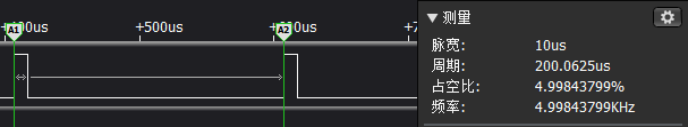
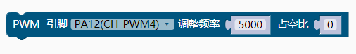

### PWM模块<!-- {docsify-ignore} -->

**PWM 控制器简介**  

> 除了定时器提供的 4 路 26 位 PWM 输出之外，系统还提供了 8 路 8 位 PWM 输出（PWM4～PWM11）， 占空比可调，PWM 周期固定可选 8 种周期，操作简单。

**PWM 配置**  

(1)、设置寄存器 R8_PWM_CLOCK_DIV，配置 PWM 的基准时钟频率； 

(2)、设置 PWM 输出极性配置寄存器 R8_PWM_POLAR，配置对应 PWMx 的输出极性； 

(3)、设置 PWM 配置控制寄存器 R8_PWM_CONFIG，设置 PWM 的模式、数据位宽、周期；

(4)、设置 PWM 输出使能寄存器 R8_PWM_OUT_EN，开启对应的 PWMx 输出使能； 

(5)、根据需要的占空比计算出数据，写入对应的数据保持寄存器 R8_PWMx_DATA； 

(6)、设置 PWM4-PWM11 中所需的 PWM 引脚方向为输出，可选地，设置相应 I/O 的驱动能力； 

(7)、根据需要更新 R8_PWMx_DATA 中的数据，更新输出占空比。 调整 R8_PWMx_DATA 寄存器可修改输出 PWM 的占空比，占空比计算公式： Ncyc = RB_PWM_CYCLE_SEL ? (2^n-1) : (2^n)  （其中 n=数据位宽），Ncyc 结果在 63～256 之间。 PWMx 输出有效电平的占空比 = R8_PWMx_DATA / Ncyc * 100%  PWMx 输出频率 Fpwmout = Fpwm / Ncyc = Fsys/R8_PWM_CLOCK_DIV / Ncyc  如果需要通过 PWM 产生直流信号，那么可以 PWMx 输出端使用 R/C 等电路滤波，建议用时间常数 远大于 4 / Fpwmout 的两级 RC，或时间常数远大于 100 / Fpwmout 的一级 RC。

1. #### 初始化设置PWM最大占空比值

 

```c
#define PWM_DUTY_MAX 1000//PWM最大占空比值
```

```c
#ifndef PWM_DUTY_MAX
#define PWM_DUTY_MAX 100
#endif 
```

> 如果不设置默认为 100，占空比会根据这个值来计算的。


2. #### 定时器PWM初始化

 

```c
TMR_PWM_Init(TMR0, PA9, 5000, 50);
```


3. #### 定时器PWM设置引脚、占空比

 

```c
TMR_PWM_Duty_Updata(TMR0, 0);
```


4. #### 定时器PWM设置引脚、频率、占空比

 

```c
TMR_PWM_Frequency_Updata(TMR0, 5000, 0);
```


5. #### PWM初始化

 

```c
PWM_Init(CH_PWM4, PA12, 5000, 50);
```

> 这里需要注意占空比如果设置为 50，前面的最大占空比值为 100，则 PWM 波的占空比为 50%，如果前面的最大占空比值为 1000，则 PWM 波的占空比为 5%。

 


6. #### PWM设置引脚、占空比

 

```c
PWM_Duty_Updata(CH_PWM4, 0);
```


7. #### pwm设置引脚、频率、占空比

 

```c
PWM_Frequency_Updata(CH_PWM4, 5000, 0);
```

> 因为占空比和频率关联，所以调节过频率后，要同时设置占空比。