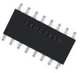
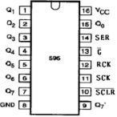
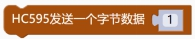
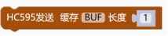

## 显示模块<!-- {docsify-ignore} -->

 

### 595 移位寄存器<!-- {docsify-ignore} -->

 

**硬件概述**

 

 

 

> ​	74HC595 是一个 8 位串行输入、并行输出的位移缓存器：并行输出为三态输出。在 SCK 的上升沿，串行数据由 SDL 输入到内部的 8 位位移缓存器，并由 Q7'输出，而并行输出则是在 LCK 的上升沿将在 8 位位移缓存器的数据存入到 8 位并行输出缓存器。当串行数据输入端 OE 的控制信号为低使能时，并行输出端的输出值等于并行输出缓存器所存储的值。

 

**引脚定义**

 

 

| 序号 | 符号   | 管脚名       | 功 能 描 述                                    |
| ------------------------ | ---------------- | ---------------------- | -------------------------------------------------------- |
| 1              | Q0--Q7 | 并行输出端             | 8 位并行数据输出                                         |
| 2              | Q7’    | 串行输出               | 串行数据输出                                             |
| 3              | /SCLR  | 复位端                 | 主复位（低电平有效）                                     |
| 4              | SCK    | 数据输入时钟线         | 移位寄存器时钟，上升沿移位                               |
| 5              | RCK    | 输出存储器锁存时钟线   | 锁存寄存器时钟，上升沿存储                               |
| 6              | /G     | 输出有效（低电平有效） | 输出使能端，为低电平使，输出选通；为高电平时，输出为 3态 |
| 7              | SER    | 串行数据输入           | 串行数据输入端                                           |
| 8              | VCC    | 电源                   | 供电管脚                                                 |
| 9              | GND    | 地                     | 信号接地和电源接地                                       |

**图形化模块**

 

1. #### HC595初始化

 

> 595 DS 引脚初始化，STCP 引脚初始化，SHCP 引脚初始化。

2. #### HC595 使能输出。

 

 

3. #### HC595 发送一个字节数据。

 

4. #### HC595 发送缓存 BUF 的长度。

 

 

