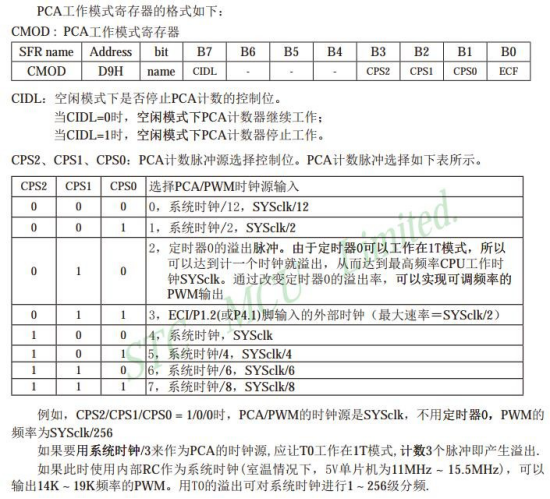
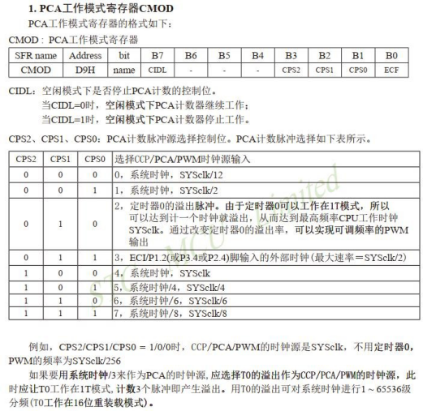
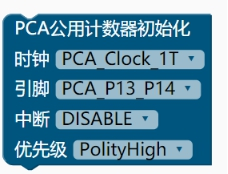
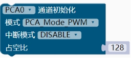
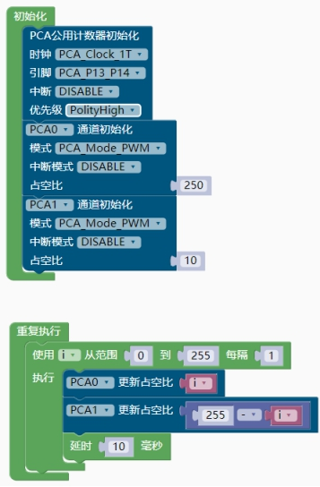

### PCA模块<!-- {docsify-ignore} -->

 

 

> STC12 系列单片机集成了 2 路或 4 路可编程计数器阵列(PCA)模块，可用于软件定时器、外 部 脉 冲 的 捕 捉 、 高 速 输 出 以 及 脉 宽 调 制 (PWM) 输 出 。

 

1. #### PCA 公用计数器初始化


 


2. #### PCA 通道初始化

 


3. #### PCA 更新占空比

 


> 示例1 ：PCA呼吸灯

 

> 示例代码1 ：PCA呼吸灯

```c
#define SYS_CLK 11059200L//设置定时器、串口频率参数

#include <STC12X.h> 
#include "lib/STC12_PCA.h" 
#include "lib/STC12_delay.h"
uint8 i;

void setup()

{

    PCA_InitTypeDef PCA_InitStructure;

    PCA_InitStructure.PCA_Clock = PCA_Clock_1T; // PCA_Clock_1T, PCA_Clock_2T, PCA_Clock_4T, PCA_Clock_6T, PCA_Clock_8T, PCA_Clock_12T, PCA_Clock_Timer0_OF,PCA_Clock_ECI

    PCA_InitStructure.PCA_IoUse = PCA_P13_P14; // PCA_P12_P11_P10_P37, PCA_P34_P35_P36_P37, PCA_P24_P25_P26_P27

    PCA_InitStructure.PCA_Interrupt_Mode = DISABLE; // ENABLE, DISABLE

    PCA_InitStructure.PCA_Polity = PolityHigh; // 优先级设置 PolityHigh,PolityLow

    PCA_InitStructure.PCA_RUN = DISABLE; // ENABLE, DISABLE

    PCA_Init(PCA_Counter, &PCA_InitStructure);

    PCA_InitStructure.PCA_Mode = PCA_Mode_PWM; // PCA_Mode_PWM, PCA_Mode_Capture, PCA_Mode_SoftTimer, PCA_Mode_HighPulseOutput

    PCA_InitStructure.PCA_PWM_Wide = PCA_PWM_8bit;

    PCA_InitStructure.PCA_Interrupt_Mode = DISABLE; // PCA_Rise_Active, PCA_Fall_Active, ENABLE, DISABLE

    PCA_InitStructure.PCA_Value = 250 << 8; // 对于 PWM,高 8 位为PWM 占空比

    PCA_Init(PCA0, &PCA_InitStructure);

    PCA_InitStructure.PCA_Mode = PCA_Mode_PWM; // PCA_Mode_PWM, PCA_Mode_Capture, PCA_Mode_SoftTimer, PCA_Mode_HighPulseOutput

    PCA_InitStructure.PCA_PWM_Wide = PCA_PWM_8bit;

    PCA_InitStructure.PCA_Interrupt_Mode = DISABLE; // PCA_Rise_Active, PCA_Fall_Active, ENABLE, DISABLE

    PCA_InitStructure.PCA_Value = 10 << 8; // 对于 PWM,高 8 位为 PWM 占空比

    PCA_Init(PCA1, &PCA_InitStructure);

    CR = 1; // 1: 允许 PCA 计数器计数，必须由软件清 0。
}

void loop()

{

    for (i = 0; i < 255; i = i + 1)
    {

        UpdatePwm(PCA0, i);

        UpdatePwm(PCA1, (255 - i));

        delay(10);
    }
}

```

