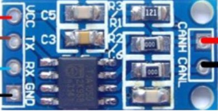
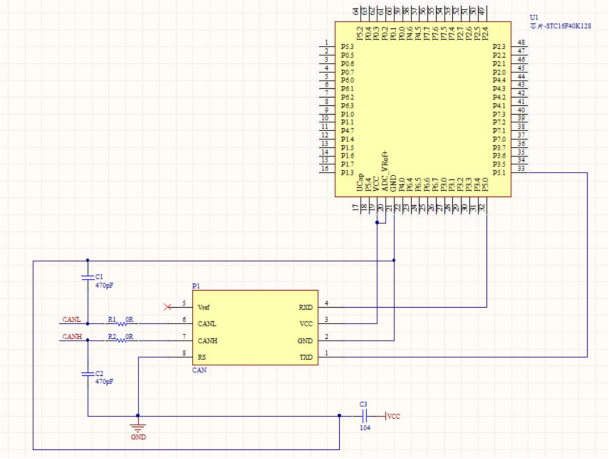
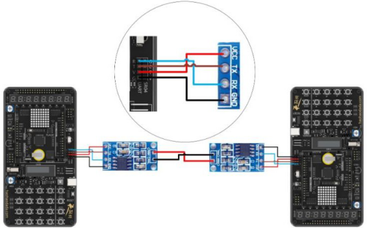
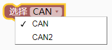
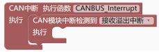
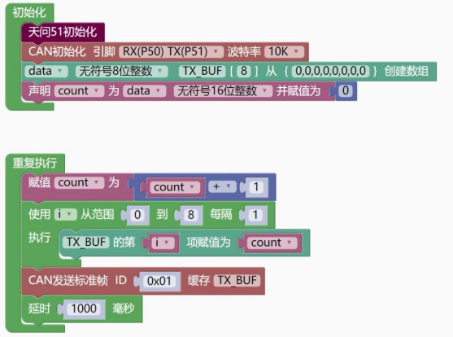
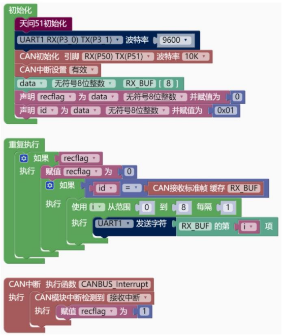

### CAN模块<!-- {docsify-ignore} -->

**硬件概述**

> CAN 是Controller Area Network 的缩写（以下称为CAN），是 ISO 国际标准化的[串行](https://baike.baidu.com/item/串行通信协议)[通信协议](https://baike.baidu.com/item/串行通信协议)。在汽车产业中，出于对安全性、舒适性、方便性、低功耗、低成本的要求，各种各样的电子[控制系统](https://baike.baidu.com/item/控制系统)被开发了出来。由于这些系统之间通信所用的数据类型及对可靠性的要求不尽相同，由多条总线构成的情况很多，线束的数量也随之增加。为适应“减少线束的数 量”、“通过多个 LAN，进行大量数据的高速通信”的需要，1986 年德国电气商[博世](https://baike.baidu.com/item/博世)公司开发出面向汽车的CAN 通信协议。此后，CAN 通过ISO11898 及 ISO11519 进行了标准化，在欧洲已是汽车网络的标准协议。
>
> 天问 51 开发板上采用外接 CAN 总线接口驱动（TJA1050）模块的方式进行 CAN 通信。
>
> STC16F或STC32G系列单片机内部集成CAN总线功能单元，支持CAN 2.0协议。


**主要功能如下**:

* 标准帧和扩展帧信息的接收和传送
* 64字节的接收FIFO
* 在标准和扩展格式中都有单/双验收滤波器
* 发送、接收的错误计数器
* 总线错误分析


**TJA1050 模块引脚定义**

 

| 序号| 符号| 管脚名| 功 能 描 述|
| -------------- | -------------- | ---------------- | --------------------- |
| 1   | VCC | 电源脚           | 供电                  |
| 2   | GND | 接地脚           | 供电                  |
| 3   | RX  | 接收脚           | 接收数据              |
| 4   | TX  | 发射脚           | 发送数据              |
| 5   | CANH| 信号脚           | 显信信号              |
| 6   | CANL| 信号脚           | 引信信号              |

**电路原理图**

 

**连接示意图**

 

 

**图形化模块**

 

1. #### CAN 初始化引脚，波特率设置。

 

 （STC32G）

 （STC32G）


2. #### CAN 中断设置。

 


3. #### CAN 发送标准帧 ID，缓存。

 

 （STC16）


4. #### CAN 接收标准帧，缓存。

 


5. #### CAN 发送扩展帧 ID，缓存。

 

 （STC16）


6. #### CAN 接收扩展帧，缓存。

 


7. #### CAN 中断执行函数。

 

 

**示例代码1**

> 采用标准帧发送，CAN 数据最大为 8 字节，如果需要发送大于 8 字节的数据，需要采用协议分段发送。
>

 

```c
#define _STC16
#define TSG1	15	//0~15 
#define TSG2	2 //0~7
#define BRP	59	//0~63

//24000000/((1+16+3)*60*2)=10KHz

//CAN 总线波特率=Fclk/((1+(TSG1+1)+(TSG2+1))*(BRP+1)*2)
#include <STC16F.h>

uint32 sys_clk = 24000000;//设置 PWM、定时器、串口、EEPROM 频率参数

#include "lib/twen_board.h"

#include "lib/CAN.h"

#include "lib/delay.h"


uint16 count = 0;

uint8 i;


uint8 TX_BUF[8]={0,0,0,0,0,0,0,0};

void setup()

{

    twen_board_init(); // 天问 51 初始化

    CANInit(CAN_RX_P50, CAN_TX_P51);
}

void loop()
{
    count = count + 1;
    for (i = 0; i < 8; i = i + 1)
    {
        TX_BUF[(int)(i)] = count;
    }
    CanSendMsg(0x01, TX_BUF);
    delay(1000);
}

void main(void)
{
    setup();
    while (1)
    {
        loop();
    }
}
```


 **示例代码2**

> 接收到数据通过串口打印

 

```c
#define _STC16
#define TSG1		15		//0~15 
#define TSG2		2 //0~7 
#define BRP	59	//0~63
//24000000/((1+16+3)*60*2)=10KHz
//CAN 总线波特率=Fclk/((1+(TSG1+1)+(TSG2+1))*(BRP+1)*2)


#include <STC16F.h>

uint32 sys_clk = 24000000;//设置 PWM、定时器、串口、EEPROM 频率参数

#include "lib/twen_board.h"

#include "lib/UART.h"

#include "lib/CAN.h"


uint8 recflag = 0;

uint8 id2 = 0x01;

uint8 i;


uint8 RX_BUF[8];

//CAN 中断处理函数
void CANBUS_Interrupt(void) interrupt 28
{

    uint8 isr;

    isr = CanReadReg(ISR);

    if ((isr & 0x08) == 0x08)

    {

        CANAR = 0x03;

        CANDR = 0x08;

        recflag = 1;
    }
}

void setup()

{

    twen_board_init(); // 天问 51 初始化

    uart_init(UART_1, UART1_RX_P30, UART1_TX_P31, 9600, TIM_1); // 初始化串口

    CANInit(CAN_RX_P50, CAN_TX_P51);

    CanWriteReg(IMR, 0xff); // 全部中断开启

    CANICR = 0x02; // CAN 中断使能

    EA = 1; // 打开总中断
}

void loop()

{

    if (recflag)
    {

        recflag = 0;

        if (id2 == CanReadMsg(RX_BUF))
        {

            for (i = 0; i < 8; i = i + 1)
            {

                uart_putchar(UART_1, RX_BUF[(int)(i)]); // 串口单个字符输出
            }
        }
    }
}

```

 