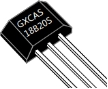
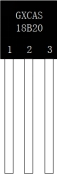
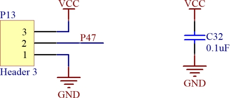
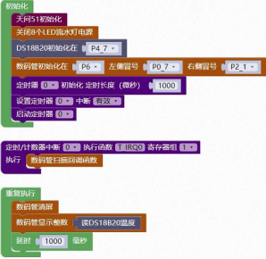

## 传感器模块<!-- {docsify-ignore} -->

 

### 18B20 模块<!-- {docsify-ignore} -->

 

**硬件概述**


 

 

> 18B20 数字温度计提供 9 到 12bit 分辨率的温度测量，可以通过可编程非易失性存储单元实现温度的下限和上限报警。18B20 采用单总线协议与上位机进行通信，只需要一根信号线和一根地线。它的温度测量范围为-55℃~+125℃。在-10℃~+70℃范围内的测试精度可 以达到± 0.4℃。此外它还可以工作在寄生模式下，直接通过信号线对芯片供电，从而不需要额外的供电电源。每个 18B20 都有一个全球唯一的 64 位序列号，可以将多个 18B20 串联在同一跟单总线上进行组网，只需要一个处理器就可以控制分布在大面积区域中的多颗18B20。这种组网方式特别适合 HVAC 环境控制，建筑、设备、粮情测温和工业测温以及过程监测控制等应用领域。

 

**引脚定义**

 

 

 

| 序号 | 符号 | 管脚名 | 功 能 描 述                                |
| -------------- | -------------- | ---------------- | ---------------------------------------------------- |
| 1    | GND  | 接地             | 信号接地和电源接地                                   |
| 2    | DQ   | 数据传输         | 数据输入输出管脚，当寄生供电模式下，该管脚给芯片供电 |
| 3    | VDD  | 电源             | 供电管脚，在寄生供电模式下 VDD 管脚必须连接到地      |


**电路原理图**


 

 

 

1. #### DS18B20初始化

 

> 初始化 18B20 的控制引脚


2. #### 读DS18B20温度

 

 


**示例代码 1**


> 设置 18B20 读取温度，并用数码管显示。
>


 


 **调用函数代码**

>  引入头文件

``` c 
#include "lib/ds18b20.h"
```


> 预定义 18B20 连接引脚，引脚预处理双向 IO


```c
#define DS18B20_DQ P4_7//18B20 的引脚

#define DS18B20_DQ_MODE {P4M1&=~0x80;P4M0&=~0x80;} //双向 IO 口

void ds18b20_init()//18B20 初始化函数，参数无
    
float ds18b20_read_temperature()//18B20 初始化函数，参数无
```


 **示例代码 1**

```c
#define DS18B20_DQ P4_7//18B20 的引脚
#define DS18B20_DQ_MODE {P4M1&=~0x80;P4M0&=~0x80;} //双向 IO 口
#include <STC8HX.h>
uint32 sys_clk = 24000000;
//系统时钟确认
#include "lib/hc595.h"
#include "lib/rgb.h"
#include "lib/delay.h"
#include "lib/nixietube.h"
#include "lib/led8.h"
#include "lib/ds18b20.h"//引入 18B20 头文件
void twen_board_init()
{
    hc595_init();
    hc595_disable();
    rgb_init();
    delay(100);
    rgb_show(0, 0, 0, 0); // 熄灭 RGB
    delay(100);
}
void Timer0Init(void) // 1000 微秒@24.000MHz
{
    TMOD |= 0x00; // 模式 0
    TL0 = 0x2f;   // 设定定时初值
    TH0 = 0xf8;   // 设定定时初值
}
void T_IRQ0(void) interrupt 1 using 1
{
    nix_scan_callback(); // 数码管扫描回调函数
}
void setup()
{
    twen_board_init();
    nix_init();     // 数码管初始化
    led8_disable(); // 关闭 8 个 LED 流水灯电源
    ds18b20_init(); // 18B20 初始化
    Timer0Init();
    EA = 1;  // 控制总中断
    ET0 = 1; // 控制定时器中断
    TR0 = 1; // 启动定时器
}
void loop()
{
    nix_display_clear();                           // 数码管清屏
    nix_display_num((ds18b20_read_temperature())); // 数码管显示温度值
    delay(1000);
}
void main(void)
{
    setup();
    while (1)
    {
        loop();
    }
}

```


