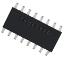
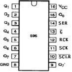
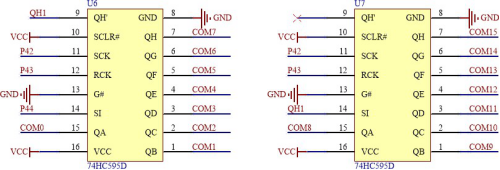
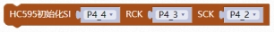
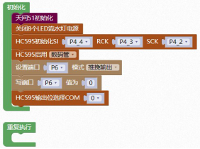
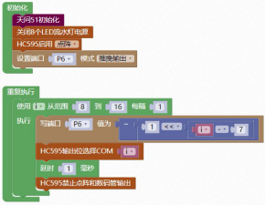

#### 595移位寄存器<!-- {docsify-ignore} -->

 **硬件概述**


 

 


> 74HC595 是一个 8 位串行输入、并行输出的位移缓存器：并行输出为三态输出。在 SCK 的上升沿，串行数据由 SDL 输入到内部的 8 位位移缓存器，并由 Q7'输出，而并行输出则是在 LCK 的上升沿将在 8 位位移缓存器的数据存入到 8 位并行输出缓存器。当串行数据输入端 OE 的控制信号为低使能时，并行输出端的输出值等于并行输出缓存器所存储的值。


**引脚定义**


 

| 序 号       | 符号             | 管脚名      | 功 能 描 述                                   |
| ----------- | ------------------ | ---------------------- | ---------------------------------------------- |
| 1 | Q0--Q7 | 并行输出端             | 8 位并行数据输出                                         |
| 2 | Q7   | 串行输出               | 串行数据输出                                             |
| 3 | /SCLR  | 复位端                 | 主复位（低电平有效）                                     |
| 4 | SCK   | 数据输入时钟线         | 移位寄存器时钟，上升沿移位                               |
| 5 | RCK    | 输出存储器锁存时钟线   | 锁存寄存器时钟，上升沿存储                               |
| 6 | /G     | 输出有效（低电平有效） | 输出使能端，为低电平使，输出选通；为高电平时，输出为 3态 |
| 7 | SER    | 串行数据输入           | 串行数据输入端                                           |
| 8 | VCC    | 电源                   | 供电管脚                                                 |
| 9 | GND   | 地                     | 信号接地和电源接地                                       |

 

**电路原理图**


 

 

COM0-COM7 对应数码管、COM8-COM15 对应点阵。

 

1. #### HC595初始化

 

> 595 SI 引脚初始化，RCK 引脚初始化，SCK 引脚初始化。


2. #### 595禁止点阵和数码管输出

 


3. #### 595启用数码管或点阵

  

 


4. #### 595 输出位选择COM 口

 


**示例代码1**

> 初始化配置 595 的引脚，设置P6 端口为推挽输出，595 启用数码管。选择COM0 为输出口，写P6 端口为 0。
>

 

 


**示例代码2**

> 初始化配置 595 的引脚，595 启用点阵。点阵显示点。

 


**调用函数代码**

>  引入头文件

```c
#include "lib/hc595.h"
```


> 预定义 595 连接引脚，SI 的引脚，RCK 的引脚，SCK 的引脚。

```c
#define HC595_DS P4_4//SI 的引脚
#define HC595_STCP P4_3//RCK 的引脚
#define HC595_SHCP P4_2//SCK 的引脚

void hc595_init()//595 初始化函数，参数无
    
void hc595_bit_select(uint8 index) //595 发送位选函数，参数：(0~15)位
    
void hc595_disable();//HC595 禁止点阵和数码管输出

void hc595_enable_nix()//595 使能数码管函数，参数: 数组地址，数据长度
   
void hc595_enable_matrix()// 595 使能点阵函数，参数: 数组地址，数据长度
```

 

**示例代码1**

```c
#define HC595_DS P4_4
#define HC595_DS_MODE {P4M1&=~0x10;P4M0|=0x10;}//P4_4 推挽输出
#define HC595_STCP P4_3
#define HC595_STCP_MODE {P4M1&=~0x08;P4M0|=0x08;}//P4_3 推挽输出
#define HC595_SHCP P4_2
#define HC595_SHCP_MODE {P4M1&=~0x04;P4M0|=0x04;}//P4_2 推挽输出
#include <STC8HX.h>
uint32 sys_clk = 24000000;
//系统时钟确认
#include "lib/hc595.h"
#include "lib/rgb.h"
#include "lib/delay.h"
#include "lib/led8.h"
void twen_board_init()
{
    P0M1=0x00;P0M0=0x00;//双向 IO 口
    P1M1=0x00;P1M0=0x00;//双向 IO 口
    P2M1=0x00;P2M0=0x00;//双向 IO 口
    P3M1=0x00;P3M0=0x00;//双向 IO 口
    P4M1=0x00;P4M0=0x00;//双向 IO 口
    P5M1=0x00;P5M0=0x00;//双向 IO 口
    P6M1=0x00;P6M0=0x00;//双向 IO 口
    P7M1=0x00;P7M0=0x00;//双向 IO 口
    hc595_init();//HC595 初始化
    hc595_disable();//HC595 禁止点阵和数码管输出
    rgb_init();//
    rgb_show(0,0,0,0);//关闭 RGB
    delay(10);
}
void setup()
{
    twen_board_init();//天问 51 初始化
    led8_disable();//关闭 8 个 LED 流水灯电源
    hc595_init();//HC595 初始化
    hc595_enable_nix();
    P6M1=0x00;P6M0=0xff;//推挽输出
    P6 = 0;
    hc595_bit_select(0);
}
void loop()
{
    
}
void main(void)
{
    setup();
    while(1){
    	loop();
    }
}

```


**示例代码2**

```c
#include <STC8HX.h>
uint32 sys_clk = 24000000;
//系统时钟确认
#include "lib/hc595.h"
#include "lib/rgb.h"
#include "lib/delay.h"
#include "lib/led8.h"
uint8 i;
void twen_board_init()
{
    P0M1=0x00;P0M0=0x00;//双向 IO 口
    P1M1=0x00;P1M0=0x00;//双向 IO 口
    P2M1=0x00;P2M0=0x00;//双向 IO 口
    P3M1=0x00;P3M0=0x00;//双向 IO 口
    P4M1=0x00;P4M0=0x00;//双向 IO 口
    P5M1=0x00;P5M0=0x00;//双向 IO 口
    P6M1=0x00;P6M0=0x00;//双向 IO 口
    P7M1=0x00;P7M0=0x00;//双向 IO 口
    hc595_init();//HC595 初始化
    hc595_disable();//HC595 禁止点阵和数码管输出
    rgb_init();//RGB 初始化
    delay(10);
    rgb_show(0,0,0,0);//关闭 RGB
    delay(10);
}
void setup()
{
    twen_board_init();//天问 51 初始化
    led8_disable();//关闭 8 个 LED 流水灯电源
    hc595_enable_matrix();
    P6M1=0x00;P6M0=0xff;//推挽输出
}
void loop()
{
    for (i = 8; i < 16; i = i + 1) {
        P6 = ~(1<<(i - 7));
        hc595_bit_select(i);
        delay(1);
        hc595_disable();//HC595 禁止点阵和数码管输出
    }
}
void main(void)
{
    setup();
    while(1){
    	loop();
    }
}
```


