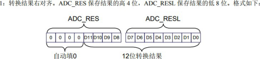
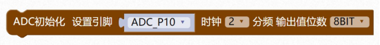
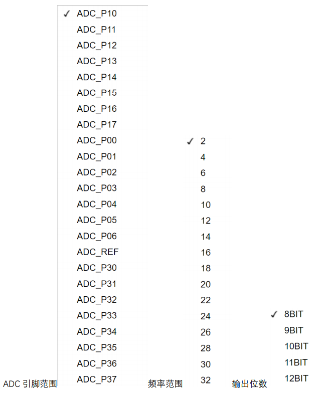

### ADC模块<!-- {docsify-ignore} -->

 

> ​		STC8H1K16 和 STC8H1K08 系列单片机内部集成了一个 10 位高速 A/D 转换器， STC8H3K64S4、STC8H3K64S2、STC8H8K64U 系列单片机内部集成了一个 12 位高速 A/D 转换器。ADC 的时钟频率为系统频率 2 分频再经过用户设置的分频系数进行再次分频（ADC 的时钟频率范围为 SYSclk/2/1～SYSclk/2/16）。
>
> ​		ADC 转换结果的数据格式有两种：左对齐和右对齐。可方便用户程序进行读取和引用。注意：ADC 的第 15 通道只能用于检测内部参考电压，参考电压值出厂时校准为 1.19V，由于制造误差以及测量误差，导致实际的内部参考电压相比 1.19V，大约有±1%的误差。如果用户需要知道每一颗芯片的准确内部参考电压值，可外接精准参考电压，然后利用 ADC 的第 15 通道进行测量标定。
>

 

> 天问 ADC 驱动库里默认采用右对齐数据格式。
>

 


1. #### ADC 初始化

> ADC 初始化设置引脚，频率，输出位数。
>


 

 

> 图形化模块默认转换结果为右对齐，输出值位数选项为如下的枚举变量：
>

```c
typedef enum	// 枚举 ADC 通道
{
	ADC_12BIT = 0, ADC_11BIT, ADC_10BIT, ADC_9BIT, ADC_8BIT,
}ADC_bit;
```

 

> 针对 12 位 ADC，选择
>
> 12BIT 则转换结果右移 0 位，输出 12 位；
>
> 11BIT 则转换结果右移 1 位，输出 11 位；
>
> 10BIT 则转换结果右移 2 位，输出 10 位；
>
> 9BIT 则转换结果右移 3 位，输出 9 位；
>
> 8BIT 则转换结果右移 4 位，输出 8 位；

 

> 针对 10 位 ADC，选择
>
> 12BIT 则转换结果右移 0 位，输出 10 位；
>
> 11BIT 则转换结果右移 1 位，输出 9 位；
>
> 10BIT 则转换结果右移 2 位，输出 8 位；
>
> 9BIT 则转换结果右移 3 位，输出 7 位；
>
> 8BIT 则转换结果右移 4 位，输出 6 位；

```c
#include <STC8HX.h>//引入头文件
uint32 sys_clk = 24000000;
//系统时钟确认
#include "lib/ADC.h"//引入头文件
adc_init(ADC_P10, ADC_SYSclk_DIV_2, ADC_8BIT);//ADC 初始化，三个参数 ADC 引
脚，时钟分频双数 2-32，输出值位数 12BIT 最大分率-12 位的 ADC 输出 12 位，10 位的
输出 10 位
```

 

 

2. #### 读取 ADC

 

```c
adc_read(ADC_P10)	
```

> 读取 ADC 采样值。
>

> 如果 10 位 AD，采样值范围为 0-1023；12 位 AD，采样值范围为 0-4095；
>

 

