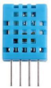
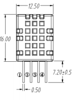
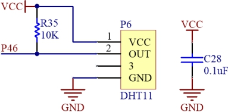
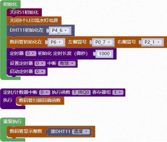
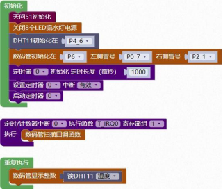

### DHT11 模块<!-- {docsify-ignore} -->

 

**硬件概述**

 

 

 

> ​	DHT11 [数字温湿度传感器](https://baike.baidu.com/item/数字温湿度传感器)，是一款含有已校准数字信号输出的温湿度复合传感器，它应用专用的数字模块采集技术和温湿度传感技术，确保产品具有极高的可靠性和卓越的长期稳定性。传感器包括一个电阻式感湿元件和一个 NTC 测温元件，并与一个高性能 8 位单片机相连接。因此该产品具有品质卓越、超快响应、抗干扰能力强、性价比极高等优点。每个DHT11 传感器都在极为精确的湿度校验室中进行校准。校准系数以程序的形式存在 OTP 内存中，传感器内部在检测信号的处理过程中要调用这些校准系数。单线制串行接口，使系统集成变得简易快捷。超小的体积、极低的功耗，使其成为该类应用中，在苛刻应用场合的最佳选择。产品为 4 针单排引脚封装，连接方便。
>

 

**引脚定义**

 

 


| 序号 | 符号 | 管脚名 | 功 能 描 述 |
| -------------- | -------------- | ---------------- | --------------------- |
| 1    | VDD  | 电源             | 供电管脚              |
| 2    | DATA | 数据传输         | 串行数据，单总线      |
| 3    | NC   | 悬空             | 无                    |
| 4    | GND  | 接地             | 信号接地和电源接地    |


**电路原理图**


 


1. #### 初始化 DHT11 的控制引脚

 


2. #### 设置读取温度

 

 

3. #### 设置读取湿度

 

 

**示例代码** 1

> 设置DHT11 读取温度，并用数码管显示。
>

 


**示例代码 2**

> 设置DHT11 读取湿度，并用数码管显示。
>

 

 

**调用函数代码**

> 引入头文件

```c
#include "lib/dht11.h"
```

> 预定义 DHT11 连接引脚，引脚预处理双向 IO

```c
#define DHT11_DQ P4_6//DHT11 的引脚
#define DHT11_DQ_MODE {P4M1&=~0x40;P4M0&=~0x40;}//双向 IO 口
uint8 dht11_init()//DHT11 初始化函数，参数无
uint8 dht11_read_humidity()//DHT11 读取湿度函数，参数无
float dht11_read_temp()//DHT11 读取温度函数，参数无
```

**示例代码 1**

```c
#define DHT11_DQ P4_6//DHT11 的引脚
#define DHT11_DQ_MODE {P4M1&=~0x40;P4M0&=~0x40;}//P4_6 双向 IO 口
#define NIXIETUBE_PORT P6
#define NIXIETUBE_PORT_MODE {P6M1=0x00;P6M0=0xff;}//推挽输出
#define NIXIETUBE_LEFT_COLON_PIN P0_7//左侧数码管冒号
#define NIXIETUBE_LEFT_COLON_PIN_MODE {P0M1&=~0x80;P0M0|=0x80;}//推挽输出
#define NIXIETUBE_RIGHT_COLON_PIN P2_1//右侧数码管冒号
#define NIXIETUBE_RIGHT_COLON_PIN_MODE {P2M1&=~0x02;P2M0|=0x02;}//推挽输出

#include <STC8HX.h>
uint32 sys_clk = 24000000;
// 系统时钟确认
#include "lib/hc595.h"
#include "lib/rgb.h"
#include "lib/delay.h"
#include "lib/led8.h"
#include "lib/dht11.h" //引入 DHT11 头文件
#include "lib/nixietube.h"
void twen_board_init()
{
    hc595_init(); // HC595 初始化

    hc595_disable(); // HC595 禁止点阵和数码管输出
    rgb_init();      // RGB 初始化
    delay(10);
    rgb_show(0, 0, 0, 0); // 关闭 RGB
    delay(10);
}
void Timer0Init(void) // 1000 微秒@24.000MHz
{
    TMOD |= 0x00; // 模式 0
    TL0 = 0x2f;   // 设定定时初值
    TH0 = 0xf8;   // 设定定时初值
}
void T_IRQ0(void) interrupt 1 using 1
{
    nix_scan_callback(); // 数码管扫描回调函数
}
void setup()
{
    twen_board_init(); // 天问 51 初始化
    led8_disable();    // 关闭 8 个 LED 流水灯电源

    dht11_init();
    nix_init(); // 数码管初始化
    Timer0Init();
    EA = 1;  // 控制总中断
    ET0 = 1; // 控制定时器中断
    TR0 = 1; // 启动定时器
}
void loop()
{
    nix_display_num((dht11_read_temp())); // 数码管显示 DHT11 温度
}
void main(void)
{
    setup();
    while (1)
    {
        loop();
    }
}
```

**示例代码 2**

```c
#define DHT11_DQ P4_6//DHT11 的引脚
#define DHT11_DQ_MODE {P4M1&=~0x40;P4M0&=~0x40;}//P4_6 双向 IO 口
#define NIXIETUBE_PORT P6
#define NIXIETUBE_PORT_MODE {P6M1=0x00;P6M0=0xff;}//推挽输出
#define NIXIETUBE_LEFT_COLON_PIN P0_7//左侧数码管冒号
#define NIXIETUBE_LEFT_COLON_PIN_MODE {P0M1&=~0x80;P0M0|=0x80;}//推挽输出
#define NIXIETUBE_RIGHT_COLON_PIN P2_1//右侧数码管冒号
#define NIXIETUBE_RIGHT_COLON_PIN_MODE {P2M1&=~0x02;P2M0|=0x02;}//推挽输出

#include <STC8HX.h>
uint32 sys_clk = 24000000;
// 系统时钟确认
#include "lib/hc595.h"
#include "lib/rgb.h"
#include "lib/delay.h"
#include "lib/led8.h"
#include "lib/dht11.h" //引入 DHT11 头文件
#include "lib/nixietube.h"
void twen_board_init()
{
    hc595_init();    // HC595 初始化
    hc595_disable(); // HC595 禁止点阵和数码管输出
    rgb_init();      // RGB 初始化
    delay(10);
    rgb_show(0, 0, 0, 0); // 关闭 RGB
    delay(10);
}
void Timer0Init(void) // 1000 微秒@24.000MHz
{
    TMOD |= 0x00; // 模式 0
    TL0 = 0x2f;   // 设定定时初值
    TH0 = 0xf8;   // 设定定时初值
}
void T_IRQ0(void) interrupt 1 using 1
{
    nix_scan_callback(); // 数码管扫描回调函数
}
void setup()
{

    twen_board_init(); // 天问 51 初始化
    led8_disable();    // 关闭 8 个 LED 流水灯电源
    dht11_init();
    nix_init(); // 数码管初始化
    Timer0Init();
    EA = 1;  // 控制总中断
    ET0 = 1; // 控制定时器中断
    TR0 = 1; // 启动定时器
}
void loop()
{
    nix_display_num((dht11_read_humidity())); // 数码管显示 DHT11 湿度
}
void main(void)
{
    setup();
    while (1)
    {
        loop();
    }
}
```

