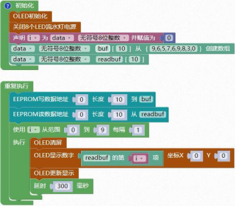

### EEPROM<!-- {docsify-ignore} -->

 

**概述**

> ​	STC8H 系列单片机内部集成了大容量的 EEPROM。利用 ISP/IAP 技术可将内部 Data Flash 当 EEPROM，擦写次数在 10 万次以上。 EEPROM 可分为若干个扇区，每个扇区包含 512 字节。使用时，建议同一次修改的数据放在同一个扇区，不是同一次修改的数据放在不同的扇区，不一定要用满。数据存储器的擦除操作是按扇区进行的。EEPROM 可用于保存一些需要在应用过程中修改并且掉电不丢失的参数数据。在用户程序中，可以对 EEPROM 进行字节读/字节编程/扇区擦除操作。在工作电压偏低时，建议不要进行 EEPROM 操作， 以免发送数据丢失的情况。
>

> ​	注意事项：包含 EEPROM 的程序需要用 STC-ISP 软件下载，程序下载完后要断电复位。
>

 

1. #### EEPROM 写值

 


2. #### EEPROM 读值

 


3. #### 读取 EEPROM 数据到buf 数组

 

> 读取 EEPROM 数据到buf 数组，buf 数组需要自己创建，数组名称和长度可以自己修改详见案例。
>


4. #### 把 buf 里的数据写入到 EEPROM

 


5. #### EEPROM 擦除指定扇区

 


**示例代码 1**

> 将 buf 的数据写入到 EEPROM 当中，然后再将写入的数据读取到 readbuf 当中，并且用 oled显示。
>

 

**调用函数代码**

> 引入头文件

```c
#include "lib/eeprom.h"
```

```c
void eeprom_sector_erase(uint16 EE_address)
// 擦除一个扇区函数
// 参数: EE_address:要擦除的 EEPROM 的扇区中的一个字节地址.

void eeprom_read(uint16 EE_address,uint8 *DataAddress,uint8 length)
// 读 N 个字节函数
// 参数: EE_address: 要读出的 EEPROM 的首地址 DataAddress: 要读出数据的指针.length: 要读出的长度
uint8 eeprom_write(uint16 EE_address,uint8 *DataAddress,uint8 length)
// 写 N 个字节函数
// 参数: EE_address: 要写入的 EEPROM 的首地址。DataAddress: 要写入数据的指针. length: 要写入的长度
```

**示例代码 1**

```c
#include <STC8HX.h>
uint32 sys_clk = 24000000;
//系统时钟确认
#include "lib/oled.h"
#include "lib/led8.h"
#include "lib/eeprom.h"//引入 EEPROM 头文件
#include "lib/delay.h"

uint8 i = 0;
uint8 buf[10]={9,6,5,7,6,9,8,3,0};//自定义数组
uint8 readbuf[10]; //自定义数组

void setup()
{
    oled_init();    // OLED 初始化
    led8_disable(); // 关闭 8 个 LED 流水灯电源
}
void loop()
{
    eeprom_write(0, buf, 10);    // EEPROM 写数据
    eeprom_read(0, readbuf, 10); // EEPROM 读数据
    for (i = 0; i < 9; i = i + (1))
    {
        oled_clear(); // OLED 清屏
        oled_show_num(0, 0, readbuf[(int)(i)]);
        oled_display(); // OLED 更新显示
        delay(300);
    }
}
void main(void)
{
    setup();

    while (1)
    {
        loop();
    }
}
```

