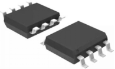
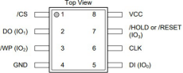
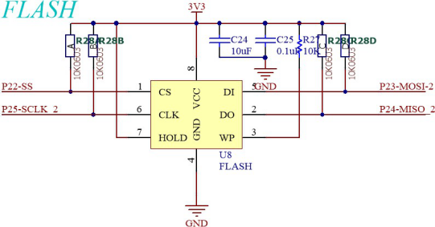
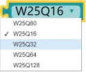
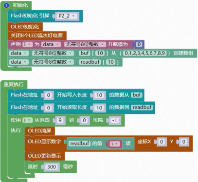

### FLASH 模块<!-- {docsify-ignore} -->

 

**硬件概述**

 

> ​	W25Q32JV 有 16384 个可编程页，每个页有 256 个字节。最多 256 字节可以一次被编程。页可以按 16 组(4KB 扇区擦除)、128 组擦除(32KB 块擦除)、256 组(64KB 块擦除)或整个芯片(芯片擦除)。W25Q32JV 已经分别有 1024 个可擦扇区和 64 个可擦块。小的 4KB 部门允许更大的需要数据和参数存储的应用程序的灵活性。
>

> ​	W25Q32JV 支持标准串行外设接口(SPI)和高性能双/四输出，以及双/四 I/O SPI：串行时钟，芯片选择，串行数据 I/O0 (DI)，I/O1 (DO)，I/O2，和 I/O3。SPI 时钟频率高达 133MHz支持允许等效时钟率 266MHz(133MHz x 2)用于双 I/O 和 532MHz (133MHz x 4)用于四次 I/O时，使用快速读双/四次 I / O 指令。这些传输速率可以超过标准的异步 8 位和 16 位并行Flash 记忆。
>

> ​	此外，该设备支持 JEDEC 标准制造商和设备 ID 和 SFDP 寄存器，一个 64 位唯一序列号和三个 256 字节安全寄存器。
>


**引脚定义**

 

| 序号 | 符号                                               | 管脚名 | 功 能 描 述          |
| -------------- | ------------------------------------------------------------ | ---------------- | ------------------------------ |
| 1    | /CS                                                | 输入             | 芯片选择输入                   |
| 2    | DO（IO1）                      | 输出             | 数据输出(数据输入输出 1)       |
| 3    | /WP(IO2)                       | 写保护           | 写入保护输入(数据输入输出 2)   |
| 4    | GND                                                | 接地             | 信号接地和电源接地             |
| 5    | DI(IO0)                        | 输入             | 数据输入(数据输入输出 0)       |
| 6    | CLK                                                | 时钟输入         | 串行时钟输入                   |
| 7    | /HOLD ORRESET(IO3) | 保持或复位       | 保持或复位输入(数据输入输出 3) |
| 8    | VCC                                                | 电源             | 供电管脚                       |


**电路原理图**


 

1. #### Flash初始化

 


2. #### Flash 读取芯片 ID

 


3. #### 选择芯片型号

芯片型号，配合读取芯片 ID 模块一起使用。

 


4. #### 读取 Flash 数据到buf

 


5. #### 把 buf 的数据写入到 Flash 中

 


6. #### Flash 全片擦除

 


7. #### Flash 擦除指定扇区

 


8. #### Flash 进入掉电模式

 


9. #### Flash 唤醒

 


**示例代码 1**

> 将 buf 的数据写入到 Flash 当中，然后再将写入的数据读取到 readbuf 当中，并且用 oled 显示。
>

 

 

**调用函数代码**

> 引入头文件

```c
#include "lib/w25qxx.h"
```

> 预定义 W25QXX 的片选信号灯连接引脚，引脚预处理输出

```c
#define W25QXX_CS P2_2//W25QXX 的片选信号
#define W25QXX_CS_MODE {P2M1&=~0x04;P2M0|=0x04;}//P2_2 推挽输出
```

```c
void w25qxx_init(); //w25qxx 初始化函数，参数无
uint16 w25qxx_read_id(); //读取芯片 ID 函数，参数无
void w25qxx_read(uint8* pBuffer,uint32 ReadAddr,uint16 NumByteToRead);
//在指定地址开始读取指定长度的数据，参数：数据地址，长度，读取数据
uint16 w25qxx_read_id()// 描述: 读取芯片 ID，参数无
void w25QXX_Erase_Chip()// 描述: 全片擦除，需等待很长时间，参数无
void w25qxx_erase_sector(uint32 Dst_Addr)
// 描述: 擦除一个扇区，参数: Dst_Addr:扇区地址(4K 一个扇区，2M FLASH 扇区最大为512)。
void w25qxx_power_down() // w25qxx 进入掉电模式.
void w25qxx_wake_up() // 描述: 唤醒 w25qxx.
void w25qxx_write_page(uint8* pBuffer,uint32 WriteAddr,uint16 NumByteToWrite)

// 在指定地址开始写入最大 256 字节的数据. 参数：数据地址，长度，读取数据
void w25qxx_write_nocheck(uint8* pBuffer,uint32 WriteAddr,uint16 NumByteToWr
ite) 
// 描述: 无检验写 spiflash.必须确保所写的地址范围内的数据全部为 0XFF.确保地址不越界。
// 参数: pBuffer:数据存储区; WriteAddr:开始写入的地址(24bit); NumByteToWrite:要写入的字节数(最大 65535) .
void w25qxx_write(uint8* pBuffer,uint32 WriteAddr,uint16 NumByteToWrite
// 在指定地址开始写入指定长度的数据，参数: pBuffer:数据存储区; WriteAddr:开始写入的地址(24bit); NumByteToWrite:要写入的字节数(最大 65535) 。
```

**示例代码 1**

```c
#define W25QXX_CS P2_2//W25QXX 的片选信号
#define W25QXX_CS_MODE {P2M1&=~0x04;P2M0|=0x04;}//P2_2 推挽输出
#include <STC8HX.h>
uint32 sys_clk = 24000000;
//系统时钟确认
#include "lib/w25qxx.h"//引入 w25qxx.h 头文件
#include "lib/oled.h"
#include "lib/led8.h"
#include "lib/delay.h"

uint8 i = 0;
uint8 buf[10]={0,1,2,3,4,5,6,7,8,9};//自定义数组
uint8 readbuf[10]; //自定义数组

void setup()
{
    w25qxx_init();  // w25qxx 初始化
    oled_init();    // OLED 初始化
    led8_disable(); // 关闭 8 个 LED 流水灯电源
}
void loop()
{
    w25qxx_write(buf, 0, 10);    // 在指定地址开始写入指定长度的数据
    w25qxx_read(readbuf, 0, 10); // 在指定地址开始读取指定长度的数据
    for (i = 9; i > 0; i = i + (-1))
    {
        oled_clear(); // OLED 清屏
        oled_show_num(0, 0, readbuf[(int)(i)]);
        oled_display(); // OLED 更新显示

        delay(300);
    }
}
void main(void)
{
    setup();
    while (1)
    {
        loop();
    }
}
```

