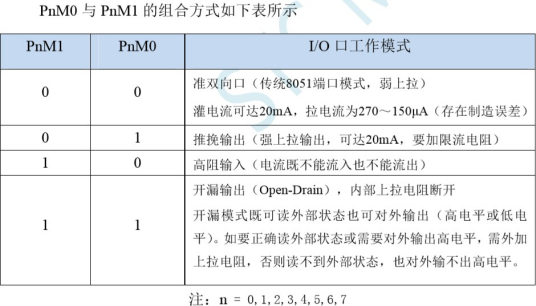
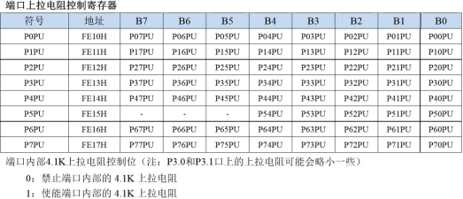
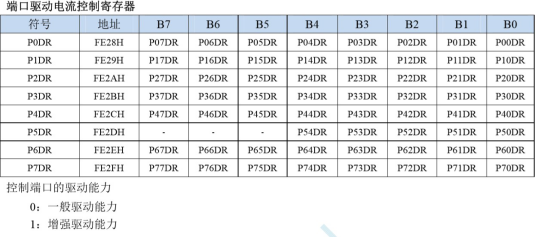
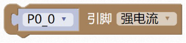

### GPIO模块<!-- {docsify-ignore} -->

 

传统 51 芯片，引脚默认配置为准双向 IO 可以直接读写就可以输入或输出，STC8H 系列单片机，引脚除P3.0 和P3.1 外默认配置为高阻输入，只能读入不能输出，需要设置才能切换为其他模式。

 

1. ####  写引脚的电平状态

 

```c
P0_0 = 1;
```

>  写引脚的电平状态，1 为高电平；0 为低电平。


2. #### 读引脚的电平状态

 

```c
P0_0; 
```

> 读引脚的电平状态，引脚电平如果为高电平，返回 1；低电平，返回 0。
>

 

 

3. #### 写端口的电平状态

 

```c
P0 = 0xff;
```

> 写端口的电平状态，用一个字节的 8 个位，对应端口的 8 个引脚。1 为高电平；0 为低电平。

> 上述程序为设置 P0 端口的所有引脚电平状态都为高。
>


4. #### 读端口的电平状态

 

```c
P0;
```

> 读端口的电平状态，返回一个字节，用一个字节的 8 个位，对应端口的 8 个引脚。引脚电平如果为高电平，返回 1；低电平，返回 0。

> 上述程序，如果 P0_0 引脚为高电平，其它引脚为低电平，则范围值等于 0x01。
>

 

5. #### 设置引脚工作模式


> 设置引脚工作模式：双向 IO 口、推挽输出、高阻输入、开漏输出。


 

>  主要为设置 PnM1 和PnM0 两个寄存器的值。
>

 

```c
P0M1&=~0x01;P0M0&=~0x01;//双向 IO 口
```


6. #### 设置端口工作模式

>  设置端口工作模式：双向 IO 口、推挽输出、高阻输入、开漏输出。

 

``` c
P0M1=0x00;P0M0=0x00;//双向 IO 口
```


7. #### 设置引脚是否启用内置上拉电阻

 设置引脚是否启用内置上拉电阻，主要设置PnPU 寄存器。

 


 

```c
P0PU|=0x01;//上拉电阻 4K	
```

 

8. #### 设置引脚电流

> 设置引脚电流大小，主要设置PnDR 寄存器。
>


 

 

```c
P0DR|=0x01;//强电流	
```