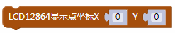

### LCD12864 显示模块<!-- {docsify-ignore} -->

 

**硬件概述**

 


 

 


> LCD12864 是一种具有 4 位/8 位并行、2 线或 3 线串行多种接口方式，内部含有国标一级、二级简体中文字库的点阵图形液晶显示模块；其显示分辨率为 128×64, 内置 8192 个 16*16 点汉字，和 128 个 16*8 点 ASCII 字符集。利用该模块灵活的接口方式和简单、方便的操作指令，可构成全中文人机交互图形界面。可以显示 8×4 行 16×16 点阵的汉字. 也可完成图形显示.低电压低功耗是其又一显著特点。由该模块构成的液晶显示方案与同类型的图形点阵液晶显示模块相比，不论硬件电路结构或显示程序都要简洁得多，且该模块的价格也略低于相同点阵的图形液晶模块。
>

>注意：新版LCD12864背光调节旋钮为下图所示位置。
>
> 


**引脚定义**

| 标号 | 符号 | 引脚说明 | 标号 | 符号 | 引脚说明     |
| -------------- | -------------- | ------------------ | -------------- | -------------- | ---------------------- |
| 1              | VSS            | 电源地             | 11             | D4             | 数据                   |
| 2              | VDD            | 电源正极           | 12             | D5             | 数据                   |
| 3              | VL             | 液晶显示偏压       | 13             | D6             | 数据                   |
| 4              | RS             | 数据/命令选择      | 14             | D7             | 数据                   |
| 5              | R/W            | 读/写选择          | 15             | PSD            | H:并口方式；L:串口方式 |
| 6              | E              | 使能信号           | 16             | NC             | 空脚                   |
| 7              | D0             | 数据               | 17             | /RESET         | 复位端                 |
| 8              | D1             | 数据               | 18             | VOUT           | LCD 驱动电压输出端     |
| 9              | D2             | 数据               | 19             | BLA            | 背光源正极             |
| 10             | D3             | 数据               | 20             | BLK            | 背光源负极             |


 

**电路原理图**


 


 

1. #### 初始化 LCD12864 的控制引脚

 


2. #### LCD12864 清屏

 


3. #### LCD12864 内置字库显示单个字符在第几行第几列

  


4. #### LCD12864 内置字库显示字符串在第几行第几列

  


5. #### LCD12864 内置字库显示数字在第几行第几列

  


6. #### LCD12864 内置字库显示小数在第几行第几列

 


7. #### LCD12864更新显示

  


8. #### LCD12864显示点

 


9. #### LCD12864清除点

 


10. #### LCD12864显示字符

 


11. #### LCD12864显示字符串

 


12. #### LCD12864显示数字

 


13. #### LCD12864显示小数

 


14. #### LCD12864显示汉字

 


15. #### LCD12864画线

 


16. #### LCD12864填充

 


17. #### LCD12864绘制矩形

 


18. #### LCD12864画圆

 


19. #### LCD12864绘制三角形

 


**示例代码 1**

> LCD12864 每隔 1s 在第 0 行第 0 列显示单个字符“a”，在第 1 行第 0 列显示字符串“天问 51”，
>
> 在第 2 行第 0 列显示数字 123。
>


 

 


**调用函数代码** 

> 引入头文件

 

```c
#include "lib/lcd12864.h"
```


> 预定义 LCD12864 连接引脚，引脚预处理输出

```c
#define LCD12864_RS P1_3
#define LCD12864_RS_OUT {P1M1&=~0x08;P1M0&=~0x08;} //双向 IO 口
#define LCD12864_RW P1_0
#define LCD12864_RW_OUT {P1M1&=~0x01;P1M0&=~0x01;} //双向 IO 口
#define LCD12864_E P1_1
#define LCD12864_E_OUT {P1M1&=~0x02;P1M0&=~0x02;} //双向 IO 口
#define LCD12864_RST P1_3
#define LCD12864_RST_OUT {P5M1&=~0x10;P5M0&=~0x10;} //双向 IO 口
#define LCD12864_Data P6
#define LCD12864_Data_OUT {P6M1=0x00;P6M0=0x00;} //双向 IO 口

void lcd12864_init()//LCD12864 初始化函数，参数无
    
void lcd12864_clear()//LCD12864 清屏函数，参数无
    
void lcd12864_show_char(uint8 X,uint8 Y,uint8 sig)
//LCD12864 显示一个字符,参数 X 显示在第几行,参数 Y 显示在第几列,参数 sig 要显示的字符
    
void lcd12864_show_string(uint8 X, uint8 Y, uint8 *str)
//LCD12864 显示字符串,参数 X 显示在第几行,参数 Y 显示在第几列,参数 str 要显示的字符串

void lcd12864_show_num(uint8 x,uint8 y,int num)
//LCD12864 显示数字,参数 x 显示在第几行,参数 y 显示在第几列,参数 num 显示的数字
```

 

**示例代码 1**

```c
#define LCD12864_RS P1_3
#define LCD12864_RS_OUT {P1M1&=~0x08;P1M0&=~0x08;} //双向 IO 口
#define LCD12864_RW P1_0
#define LCD12864_RW_OUT {P1M1&=~0x01;P1M0&=~0x01;} //双向 IO 口
#define LCD12864_E P1_1
#define LCD12864_E_OUT {P1M1&=~0x02;P1M0&=~0x02;} //双向 IO 口
#define LCD12864_RST P1_3
#define LCD12864_RST_OUT {P5M1&=~0x10;P5M0&=~0x10;} //双向 IO 口
#define LCD12864_Data P6
#define LCD12864_Data_OUT {P6M1=0x00;P6M0=0x00;} //双向 IO 口

#include <STC8HX.h>

uint32 sys_clk = 24000000;
//系统时钟确认

#include "lib/hc595.h"
#include "lib/rgb.h"
#include "lib/delay.h"
#include "lib/led8.h"
#include "lib/lcd12864.h"


void twen_board_init()
{
    hc595_init();
    hc595_disable();
    rgb_init();
    delay(100);
    rgb_show(0, 0, 0, 0); //熄灭 RGB
    delay(100);
}
void setup()
{
    twen_board_init();
    led8_disable();   //关闭 8 个 LED 流水灯电源
    lcd12864_init();  //LCD12864 初始化
    lcd12864_clear(); //LCD12864 清屏
}
void loop()
{
    lcd12864_show_char(0, 0, 'a');
    lcd12864_show_string(1, 0, "天问 51");
    lcd12864_show_num(2, 0, 123);
    delay(1000);
    lcd12864_clear(); //LCD12864 清屏
    delay(1000);
}
void main(void)
{
    setup();
    while (1)
    {
        loop();
    }
}
```

 

 
