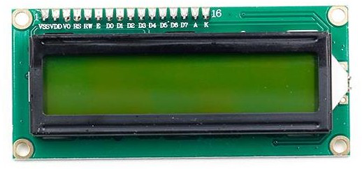
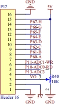
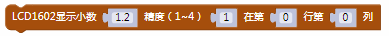
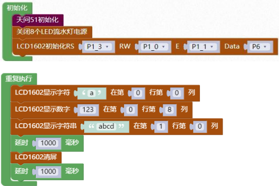

### LCD1602 显示模块<!-- {docsify-ignore} -->

 

**硬件概述**

 

 

> 1602A 字符型液晶显示模块是专门用于显示字母、数字、符号等的点阵型液晶显示模块。分 4 位和 8 位数据传输方式。提供 5×7 点阵＋游标的显示模式。提供显示数据缓冲区DDRAM、字符发生器 CGROM 和字符发生器CGRAM，可以使用 CGRAM 来存储自己定义的最多 8 个 5×8 点阵的图形字符的字模数据。提供了丰富的指令设置：清显示；游标回原点；显示开/关;游标开/关;显示字符闪烁;游标移位;显示移位等。

 

 

**引脚定义**

| 标号 | 符号 | 引脚说明 | 标号 | 符号 | 引脚说明 |
| -------------- | -------------- | ------------------ | -------------- | -------------- | ------------------ |
| 1              | VSS            | 电源地             | 9              | D2             | 数据               |
| 2              | VDD            | 电源正极           | 10             | D3             | 数据               |
| 3              | VL             | 液晶显示偏压       | 11             | D4             | 数据               |
| 4              | RS             | 数据/命令选择      | 12             | D5             | 数据               |
| 5              | R/W            | 读/写选择          | 13             | D6             | 数据               |
| 6              | E              | 使能信号           | 14             | D7             | 数据               |
| 7              | D0             | 数据               | 15             | BLA            | 背光源正极         |
| 8              | D1             | 数据               | 16             | BLK            | 背光源负极         |


 

**电路原理图**


 

 


 

1. #### 初始化 LCD1602 的控制引脚

 


2. #### LCD1602 清屏

 


3. #### LCD1602 显示单个字符在第几行第几列

 

 

4. #### LCD1602 显示字符串在第几行第几列

 

 

5. #### LCD1602 显示数字在第几行第几列

 

 

6. #### LCD1602 显示小数在第几行第几列

 


**示例代码 1**

> LCD1602 每隔 1 秒显示单个字符“a”在第 0 行第 0 列，显示字符串在第 1 行第 0 列，显示数
>
> 字在第 0 行第 8 列。
>


 

 

 **调用函数代码**

>  引入头文件

```c
#include "lib/lcd1602.h"
```


> 预定义 LCD1602 连接引脚，引脚预处理输出

```c
#define LCD1602_RS P1_3
#define LCD1602_RS_OUT {P1M1&=~0x08;P1M0|=0x08;}//推挽输出
#define LCD1602_RW P1_0
#define LCD1602_RW_OUT {P1M1&=~0x01;P1M0|=0x01;}//推挽输出
#define LCD1602_E P1_1
#define LCD1602_E_OUT {P1M1&=~0x02;P1M0|=0x02;}//推挽输出
#define LCD1602_Data P6
#define LCD1602_Data_OUT {P6M1=0x00;P6M0=0xff;}//推挽输出

void lcd1602_init()//LCD1602 初始化函数，参数无
void lcd1602_show_char(uint8 x, uint8 y, char c)
//LCD1602 显示一个字符,参数 x 显示在第几行,参数 y 显示在第几列,参数 c 显示的字符
    
void lcd1602_show_string(uint8 x, uint8 y, uint8 *str)
//LCD1602 显示字符串,参数 x 显示在第几行,参数 y 显示在第几列,参数 str 显示的字符串
    
void lcd1602_show_num(uint8 x,uint8 y,int num)
//LCD1602 显示数字,参数 x 显示在第几行,参数 y 显示在第几列,参数 num 显示的数字
    
void lcd1602_clear();//LCD1602 清屏函数，参数无

```


 

**示例代码 1**

```c
#define LCD1602_RS P1_3
#define LCD1602_RS_OUT {P1M1&=~0x08;P1M0|=0x08;}//推挽输出
#define LCD1602_RW P1_0
#define LCD1602_RW_OUT {P1M1&=~0x01;P1M0|=0x01;}//推挽输出
#define LCD1602_E P1_1
#define LCD1602_E_OUT {P1M1&=~0x02;P1M0|=0x02;}//推挽输出
#define LCD1602_Data P6
#define LCD1602_Data_OUT {P6M1=0x00;P6M0=0xff;}//推挽输出
#include <STC8HX.h>
uint32 sys_clk = 24000000;
//系统时钟确认

#include "lib/hc595.h"
#include "lib/rgb.h"
#include "lib/delay.h"
#include "lib/led8.h"
#include "lib/lcd1602.h"

void twen_board_init()
{
    hc595_init();
    hc595_disable();
    rgb_init();
    delay(100);
    rgb_show(0, 0, 0, 0); //熄灭 RGB
    delay(100);
}
void setup()
{
    twen_board_init();
    led8_disable(); //关闭 8 个 LED 流水灯电源
    lcd1602_init(); //LCD1602 初始化
}
void loop()
{
    lcd1602_show_char(0, 0, 'a');
    lcd1602_show_num(8, 0, 123);
    lcd1602_show_string(0, 1, "abcd");
    delay(1000);
    lcd1602_clear(); //LCD1602 清屏
    delay(1000);
}
void main(void)
{
    setup();
    while (1)
    {
        loop();
    }
}
```

 

 

 

 
