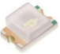
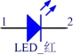
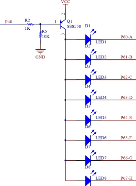
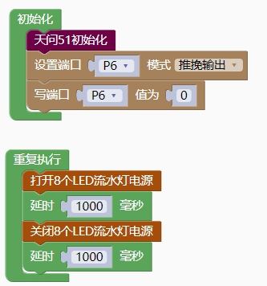
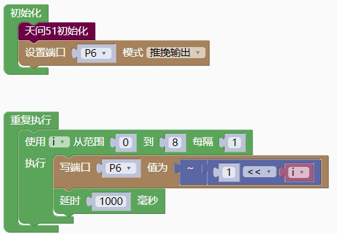

## 显示模块<!-- {docsify-ignore} -->

### LED 流水灯<!-- {docsify-ignore} -->

> 硬件概述


 

 

> 发光二极管是一种常用的发光器件，通过[电子](https://baike.baidu.com/item/电子/143051)与[空穴](https://baike.baidu.com/item/空穴/3517781)复合释放能量发光，它在照明领域应用广泛。发光二极管可高效地将电能转化为[光能](https://baike.baidu.com/item/光能/227630)，在现代社会具有广泛的用途，如照明、平板显示、医疗器件等。
>
> 这种电子元件早在 1962 年出现，早期只能发出低光度的红光，之后发展出其他[单色光](https://baike.baidu.com/item/单色光)的版本，时至今日能发出的光已遍及可见光、[红外线](https://baike.baidu.com/item/红外线)及[紫外线](https://baike.baidu.com/item/紫外线)，光度也提高到相当的光度。而用途也由初时作为[指示灯](https://baike.baidu.com/item/指示灯)、显示板等；随着技术的不断进步，发光二极管已被广泛地应用于显示器和照明。
>

 

**引脚定义**

 


 


| 序号  | 符号  | 管脚名 |  功 能 描 述   |
| :---: | :---: | :----: | :------------: |
| **1** | **1** |  正极  |  电源正极输入  |
| **2** | **2** |  负极  | 输出到电源负极 |


**电路原理图**

 

 

 

1. #### 打开8个LED流水灯电源

 

> 根据硬件原理图可知，R5 电阻下拉，流水灯电源默认为打开状态。
>

 

 

2. #### 关闭8个LED流水灯电源

 


**示例代码1**

> 通过P40 LED 流水灯电源控制引脚控制 8 个 LED 同时闪烁。
>

 

 

**示例代码2**

> 打开八个 LED 流水灯电源，P6 端口设置为推挽输出，设置 P6 端口的每一个引脚轮流为低电平，每隔 1000ms 右移，循环 8 次。
>

 


**调用函数代码**

>  引入头文件	
>

 

```c
#include "lib/led8.h"
```

```c
void led8_enable()//LED 使能函数，参数无
```


 **示例代码1**


```c
#include <STC8HX.h>
uint32 sys_clk = 24000000;
//系统时钟确认
#include "lib/hc595.h"
#include "lib/rgb.h"
#include "lib/delay.h"
#include "lib/led8.h"
void twen_board_init()
{
    P0M1=0x00;P0M0=0x00;//双向 IO 口
    P1M1=0x00;P1M0=0x00;//双向 IO 口
    P2M1=0x00;P2M0=0x00;//双向 IO 口
    P3M1=0x00;P3M0=0x00;//双向 IO 口
    P4M1=0x00;P4M0=0x00;//双向 IO 口
    P5M1=0x00;P5M0=0x00;//双向 IO 口
    P6M1=0x00;P6M0=0x00;//双向 IO 口
    P7M1=0x00;P7M0=0x00;//双向 IO 口
    hc595_init();//HC595 初始化
    hc595_disable();//HC595 禁止点阵和数码管输出
    rgb_init();//RGB 初始化
    delay(10);
    rgb_show(0,0,0,0);//关闭 RGB
    delay(10);
}
void setup()
{
    twen_board_init();//天问 51 初始化
    P6M1=0x00;P6M0=0xff;//推挽输出
    P6 = 0;
}
void loop()
{
	led8_enable();//打开 8 个 LED 流水灯电源
	delay(1000);
    led8_disable();//关闭 8 个 LED 流水灯电源
	delay(1000);
}
void main(void)
{
    setup();
    while(1){
    	loop();
    }
}
```

 

**示例代码2**

```c
#include <STC8HX.h>
uint32 sys_clk = 24000000;
//系统时钟确认
#include "lib/hc595.h"
#include "lib/rgb.h"
#include "lib/delay.h"
uint8 i;
void twen_board_init()
{
    P0M1=0x00;P0M0=0x00;//双向 IO 口
    P1M1=0x00;P1M0=0x00;//双向 IO 口
    P2M1=0x00;P2M0=0x00;//双向 IO 口
    P3M1=0x00;P3M0=0x00;//双向 IO 口
    P4M1=0x00;P4M0=0x00;//双向 IO 口
    P5M1=0x00;P5M0=0x00;//双向 IO 口
    P6M1=0x00;P6M0=0x00;//双向 IO 口
    P7M1=0x00;P7M0=0x00;//双向 IO 口
    hc595_init();//HC595 初始化
    hc595_disable();//HC595 禁止点阵和数码管输出
    rgb_init();//RGB 初始化
    delay(10);
    rgb_show(0,0,0,0);//关闭 RGB
    delay(10);
}
void setup()
{
    twen_board_init();//天问 51 初始化
    P6M1=0x00;P6M0=0xff;//推挽输出
}
void loop()
{
    for (i = 0; i < 8; i = i + 1) {
        P6 = ~(1<<i);
        delay(1000);
    }
}
void main(void)
{
    setup();
    while(1){
    	loop();
    }
}

```

 