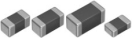
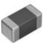
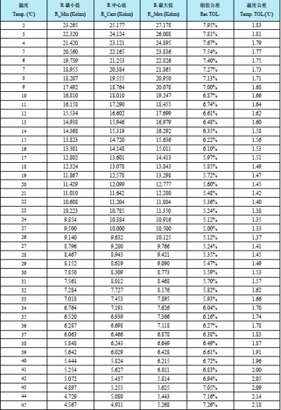
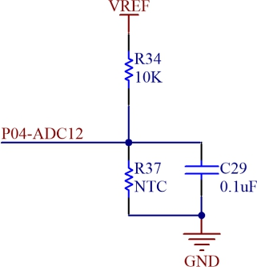
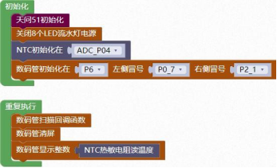

### NTC 模块<!-- {docsify-ignore} -->

 

**硬件概述**

 

 

 

> ​	热敏[电阻](https://baike.baidu.com/item/电阻)器是敏感元件的一类，按照温度系[数](https://baike.baidu.com/item/数)不同分为[正温度系数热敏电阻](https://baike.baidu.com/item/正温度系数热敏电阻)器（PTC） 和[负温度系数热敏电阻](https://baike.baidu.com/item/负温度系数热敏电阻)器（NTC）。[热敏电阻器](https://baike.baidu.com/item/热敏电阻器/2520561)的典型特点是对温度敏感，不同的温度下表现出不同的电[阻值](https://baike.baidu.com/item/阻值)。[正温度系数热敏电阻](https://baike.baidu.com/item/正温度系数热敏电阻)器（PTC）在温度越高时电阻值越大，[负温度系数](https://baike.baidu.com/item/负温度系数热敏电阻)[热敏电阻](https://baike.baidu.com/item/负温度系数热敏电阻)器（NTC）在温度越高时电阻值越低，它们同属于[半导体](https://baike.baidu.com/item/半导体)[器件](https://baike.baidu.com/item/器件)。
>

> ​	热敏电阻将长期处于不动作[状态](https://baike.baidu.com/item/状态)；当环境温度和[电流](https://baike.baidu.com/item/电流)处于 c 区时，热敏电阻的散热[功率](https://baike.baidu.com/item/功率)与发热功率接近，因而可能动作也可能不动作。热敏电阻在[环境温度](https://baike.baidu.com/item/环境温度)相同时，[动作时间](https://baike.baidu.com/item/动作时间)随着电流的增加而急剧缩短；热敏电阻在环境温度相对较高时具有更短的动作时间和较小的维持电流及[动作电流](https://baike.baidu.com/item/动作电流)。
>

 

**引脚定义**

 

②

①

 

| 序号 | 符号 | 管脚名 | 功 能 描 述 |
| -------------- | -------------- | ---------------- | --------------------- |
| 1    | ①    | 端电极           | 焊接固定              |
| 2    | ②    | 端电极           | 焊接固定              |

 

**温度与电阻值对照表**

 

 

 

**电路原理图**


 


1. #### 初始化 NTC 的控制引脚

 


2. #### 读取 NTC 温度

 

 

**示例代码 1**

> 设置 NTC 读取温度，并用数码管显示。
>


 

 

**调用函数代码**

> 引入头文件

```c
#include "lib/ntc.h"
```

> 预定义 RGB 灯连接引脚

```c
#define NTC_ADC_PIN ADC_P04

void ntc_init()//NTC 初始化函数，参数无
    
float ntc_read_temp()//NTC 读取温度函数，参数无
```

**示例代码 1**

```c
#define NTC_ADC_PIN ADC_P04//NTC 的引脚
#define NIXIETUBE_PORT P6
#define NIXIETUBE_PORT_MODE {P6M1=0x00;P6M0=0xff;}//推挽输出
#define NIXIETUBE_LEFT_COLON_PIN P0_7//左侧数码管冒号
#define NIXIETUBE_LEFT_COLON_PIN_MODE {P0M1&=~0x80;P0M0|=0x80;}//推挽输出
#define NIXIETUBE_RIGHT_COLON_PIN P2_1//右侧数码管冒号
#define NIXIETUBE_RIGHT_COLON_PIN_MODE {P2M1&=~0x02;P2M0|=0x02;}//推挽输出

#include <STC8HX.h>
uint32 sys_clk = 24000000;
//系统时钟确认
#include "lib/hc595.h"
#include "lib/rgb.h"
#include "lib/delay.h"
#include "lib/led8.h"
#include "lib/ntc.h" //引用 ntc 头文件
#include "lib/nixietube.h"
void twen_board_init()
{
    hc595_init();    // HC595 初始化
    hc595_disable(); // HC595 禁止点阵和数码管输出
    rgb_init();      // RGB 初始化
    delay(10);
    rgb_show(0, 0, 0, 0); // 关闭 RGB
    delay(10);
}
void setup()
{
    twen_board_init();                          // 天问 51 初始化
    led8_disable();                             // 关闭 8 个 LED 流水灯电源
    ntc_init();                                 // NTC 热敏电阻测量初始化
    nix_init();                                 // 数码管初始化
}
void loop()
{
    nix_scan_callback();                // 数码管扫描回调函数
    nix_display_clear();                // 数码管清屏
    nix_display_num((ntc_read_temp())); // 数码管显示 ntc 温度
}
void main(void)
{
    setup();
    while (1)
    {
        loop();
    }
}
```

