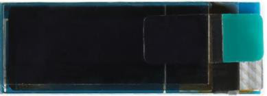
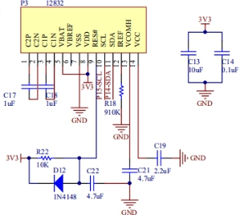
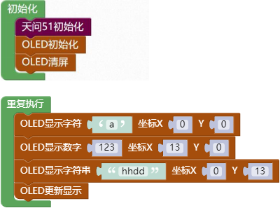
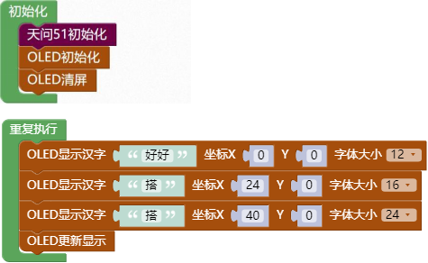
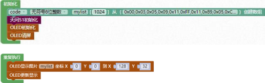

### OLED 显示模块<!-- {docsify-ignore} -->

 

**硬件概述**


 

 


> OLED，即有机发光二极管（Organic Light-Emitting Diode），又称为有机电激光显示 (Organic Electroluminesence Display，OELD)。OLED 同时具备自发光，不需背光源、对比度高、厚度薄、视角广、反应速度快、可用于挠曲性面板、使用温度范围广、构造及制程较简单等优异之特性。模块具有一下特点：
>
> (1) 尺寸小，显示尺寸为 0.91 寸,屏幕尺寸 30mm*11.5mm。
>
> (2) 高分辨率，分辨率为 128*32。
>
> (3) 使用 IIC 通信，只需 2 根线即可控制OLED。
>

 

 

**引脚定义**

 

| 标号 | 符号 | 引脚说明       |
| -------------- | -------------- | ------------------------ |
| 1              | C2P            | 电容 2 正极              |
| 2              | C2N            | 电容 2 负极              |
| 3              | C1P            | 电容 1 正极              |
| 4              | C1N            | 电容 1 负极              |
| 5              | VBAT           | DC/DC 转换电路电源       |
| 6              | VBREF          | 保留引脚                 |
| 7              | VSS            | 电源地                   |
| 8              | VDD            | 电源正极                 |
| 9              | RES#           | 控制器和驱动器的电源复位 |
| 10             | SCL            | IIC 的时钟脚             |
| 11             | SDA            | IIC 的数据脚             |
| 12             | IREF           | 电流参考亮度调整         |
| 13             | VCOMH          | 电压输出 COM 高电平      |
| 14             | VCC            | OLE 面板电源             |


 

**电路原理图**

 

 

 


 

1. #### 初始化 OLED

 

 

2. #### OLED关闭显示

 

 

3. #### OLED打开显示

  

4. #### OLED更新显示

 

 

5. #### OLED清屏

 

 

6. #### OLED显示坐标点

 

> OLED 在坐标 X,Y 显示一个像素点


7. #### OLED清除坐标点

 

> OLED 在坐标 X,Y 清除像素点
>


8. #### OLED在坐标显示字符

 

> OLED 在坐标 X,Y 显示一个字符
>
> 

9. #### OLED在坐标显示字符串

 

OLED 在坐标 X,Y 显示一个字符串


10. #### OLED显示数字


 

> OLED 在坐标 X,Y 显示一个数值


11. #### OLED显示小数


> OLED 在坐标 X,Y 显示一个小数

 


12. #### OLED 显示汉字

 

> OLED 在坐标 X,Y 显示一个指定字体大小的汉字


13. #### OLED显示图片

 

> OLED 在一个范围内显示图片
>


14. #### OLED画线

 


15. #### OLED填充

 


16. #### OLED绘制矩形

 


17. #### OLED画圆

 


18. #### OLED绘制三角形

 


19. #### OLED显示图片

 


**示例代码 1**

> OLED 显示字符“a”在坐标(0,0)，显示数字“123”在坐标(13,0)，显示字符串在坐标(0,13)。
>


 

 


示例代码 2

> OLED 显示 12*12 字体大小的汉字“好好”在坐标(0,0)，显示 16*16 字体大小的汉字“搭”在坐标(24,0)，显示 24*24 字体大小的汉字“搭”在坐标(40,0)。
>




 

**示例代码 3**

> OLED 显示转换过的 BMP 图片。
>

 

 

 

**调用函数代码**

>  引入头文件
>

```c
#include "lib/oled.h"

void oled_init()//OLED 初始化函数，参数无
    
void oled_display_off()//关闭 OLED 函数，参数无
    
void oled_display()//OLED 更新显示函数，参数无
    
void oled_clear()//OLED 清屏函数，参数无
    
void oled_set_pixel(uint8 x, uint8 y,uint8 pixel)
//OLED 设置点,参数 x,y 为要显示的坐标,参数 pixel 写 1 该点亮，写 0 灭
    
void oled_show_char(int8 x,int8 y,uint8 chr)
//OLED 显示单个字符(字符高 8 宽 5),参数 x,y 为要显示的坐标,参数 y 为显示的字符
    
void oled_show_string(int8 x,int8 y,uint8 *chr)
//OLED 在指定位置显示字符串(字符高 8，间距 8),参数 x,y 为要显示的坐标,参数 chr 为//显示的字符串
    
void oled_show_font12(const uint8* hz,int x,int y)
//OLED 在指定位置显示 12x12 汉字,参数 hz 为要显示的汉字，参数 x,y 为要显示的坐标
    
void oled_show_font16(const uint8* hz,int x,int y)
//OLED 在指定位置显示 16x16 汉字,参数 hz 为要显示的汉字，参数 x,y 为要显示的坐标
    
void oled_show_font24(const uint8* hz,int x,int y)
//OLED 在指定位置显示 24x24 汉字,参数 hz 为要显示的汉字，参数 x,y 为要显示的坐标
    
void oled_show_bmp(uint8 x0, uint8 y0,uint8 x1, uint8 y1,uint8* BMP)
//显示转换过的 BMP 图片，参数 x0,y0 为起点坐标，参数 x1,y1 为终点坐标，参数 BMP
//为要显示的图片
```

 

**示例代码 1**

```c
#include <STC8HX.h>

uint32 sys_clk = 24000000;

//系统时钟确认
#include "lib/hc595.h"

#include "lib/rgb.h"

#include "lib/delay.h"

#include "lib/oled.h"


void twen_board_init()
{
    hc595_init();
    hc595_disable();
    rgb_init();
    delay(100);
    rgb_show(0, 0, 0, 0); //熄灭 RGB
    delay(100);
}
void setup()
{
    twen_board_init();
    oled_init();  //OLED 初始化
    oled_clear(); //OLED 清屏
}
void loop()
{
    oled_show_char(0, 0, 'a');
    oled_show_num(13, 0, 123);
    oled_show_string(0, 13, "hhdd");
    oled_display(); //OLED 更新显示
}
void main(void)
{
    setup();
    while (1)
    {
        loop();
    }
}
```


**示例代码 2**

```c
#include <STC8HX.h>
uint32 sys_clk = 24000000;
//系统时钟确认
#include "lib/hc595.h"
#include "lib/rgb.h"
#include "lib/delay.h"
#include "lib/oled.h"
void twen_board_init()
{
    hc595_init();
    hc595_disable();
    rgb_init();
    delay(100);
    rgb_show(0, 0, 0, 0); //熄灭 RGB
    delay(100);
}
void setup()
{
    twen_board_init();
    oled_init();  //OLED 初始化
    oled_clear(); //OLED 清屏
}
void loop()
{
    oled_show_font12("好好", 0, 0);
    oled_show_font16("搭", 24, 0);
    oled_show_font24("搭", 40, 0);
    oled_display(); //OLED 更新显示
}
void main(void)
{
    setup();
    while (1)
    {
        loop();
    }
}
```


**示例代码 3**

```c
#include <STC8HX.h>
uint32 sys_clk = 24000000;
//系统时钟确认

#include "lib/hc595.h"
#include "lib/rgb.h"
#include "lib/delay.h"
#include "lib/oled.h"

code uint8 mylist[1024]={
0x00,0x03,0x05,0x09,0x11,0xFF,0x11,0x89,0x05,0xC3,0x00,0xE0,0x00,0xF0,0x00,0xF8,0x00,0x00,0x00,0x00,0x00,0x00,0x00,0x44,0x28,0xFF,0x11,0xAA,0x44,0x00,0x00,0x00,0x00,0x00,0x00,0x00,0x00,0x00,0x00,0x00,0x00,0x00,0x00,0x00,0x00,0x00,0x00,0x00,0x00,0x00,0x00,0x00,0x00,0x00,0x00,0x00,0x00,0x00,0x00,0x00,0x00,0x00,0x00,0x00,0x00,0x00,0x00,0x00,0x00,0x00,0x00,0x00,0x00,0x00,0x00,0x00,0x00,0x00,0x00,0x00,0x00,0x00,0x00,0x00,0x00,0x00,0x00,0x00,0x00,0x00,0x83,0x01,0x38,0x44,0x82,0x92,0x92,0x74,0x01,0x83,0x00,0x00,0x00,0x00,0x00,0x00,0x00,0x7C,0x44,0xFF,0x01,0x7D,0x7D,0x7D,0x01,0x7D,0x7D,0x7D,0x7D,0x01,0x7D,0x7D,0x7D,0x7D,0x7D,0x01,0xFF,0x00,0x00,0x00,0x00,0x00,0x00,0x01,0x00,0x01,0x00,0x01,0x00,0x01,0x00,0x01,0x00,0x01,0x00,0x00,0x00,0x00,0x00,0x00,0x00,0x00,0x00,0x01,0x01,0x00,0x00,0x00,0x00,0x00,0x00,0x00,0x00,0x00,0x00,0x00,0x00,0x00,0x00,0x00,0x00,0x00,0x00,0x00,0x00,0x00,0x00,0x00,0x00,0x00,0x00,0x00,0x00,0x00,0x00,0x00,0x00,0x00,0x00,0x00,0x00,0x00,0x00,0x00,0x00,0x00,0x00,0x00,0x00,0x00,0x00,0x00,0x00,0x00,0x00,0x00,0x00,0x00,0x00,0x00,0x00,0x00,0x00,0x00,0x00,0x00,0x00,0x00,0x01,0x01,0x00,0x00,0x00,0x00,0x00,0x00,0x01,0x01,0x00,0x00,0x00,0x00,0x00,0x00,0x00,0x00,0x00,0x01,0x01,0x01,0x01,0x01,0x01,0x01,0x01,0x01,0x01,0x01,0x01,0x01,0x01,0x01,0x01,0x01,0x01,0x00,0x00,0x00,0x00,0x00,0x00,0x00,0x00,0x00,0x00,0x00,0x00,0x00,0x00,0x00,0x00,0x00,0x00,0x00,0x00,0x00,0x00,0x00,0x00,0x00,0x00,0x00,0x00,0x00,0x3F,0x3F,0x03,0x03,0xF3,0x13,0x11,0x11,0x11,0x11,0x11,0x11,0x01,0xF1,0x11,0x61,0x81,0x01,0x01,0x01,0x81,0x61,0x11,0xF1,0x01,0x01,0x01,0x01,0x41,0x41,0xF1,0x01,0x01,0x01,0x01,0x01,0xC1,0x21,0x11,0x11,0x11,0x11,0x21,0xC1,0x01,0x01,0x01,0x01,0x41,0x41,0xF1,0x01,0x01,0x01,0x01,0x01,0x01,0x01,0x01,0x01,0x01,0x11,0x11,0x11,0x11,0x11,0xD3,0x33,0x03,0x03,0x3F,0x3F,0x00,0x00,0x00,0x00,0x00,0x00,0x00,0x00,0x00,0x00,0x00,0x00,0x00,0x00,0x00,0x00,0x00,0x00,0x00,0x00,0x00,0x00,0x00,0x00,0x00,0x00,0x00,0x00,0x00,0x00,0x00,0x00,0x00,0x00,0x00,0x00,0x00,0x00,0x00,0x00,0x00,0x00,0x00,0x00,0x00,0x00,0x00,0x00,0x00,0x00,0x00,0x00,0x00,0x00,0x00,0x00,0xE0,0xE0,0x00,0x00,0x7F,0x01,0x01,0x01,0x01,0x01,0x01,0x00,0x00,0x7F,0x00,0x00,0x01,0x06,0x18,0x06,0x01,0x00,0x00,0x7F,0x00,0x00,0x00,0x00,0x40,0x40,0x7F,0x40,0x40,0x00,0x00,0x00,0x1F,0x20,0x40,0x40,0x40,0x40,0x20,0x1F,0x00,0x00,0x00,0x00,0x40,0x40,0x7F,0x40,0x40,0x00,0x00,0x00,0x00,0x60,0x00,0x00,0x00,0x00,0x40,0x30,0x0C,0x03,0x00,0x00,0x00,0x00,0xE0,0xE0,0x00,0x00,0x00,0x00,0x00,0x00,0x00,0x00,0x00,0x00,0x00,0x00,0x00,0x00,0x00,0x00,0x00,0x00,0x00,0x00,0x00,0x00,0x00,0x00,0x00,0x00,0x00,0x00,0x00,0x00,0x00,0x00,0x00,0x00,0x00,0x00,0x00,0x00,0x00,0x00,0x00,0x00,0x00,0x00,0x00,0x00,0x00,0x00,0x00,0x00,0x00,0x00,0x00,0x00,0x00,0x00,0x07,0x07,0x06,0x06,0x06,0x06,0x04,0x04,0x04,0x84,0x44,0x44,0x44,0x84,0x04,0x04,0x84,0x44,0x44,0x44,0x84,0x04,0x04,0x04,0x84,0xC4,0x04,0x04,0x04,0x04,0x84,0x44,0x44,0x44,0x84,0x04,0x04,0x04,0x04,0x04,0x84,0x44,0x44,0x44,0x84,0x04,0x04,0x04,0x04,0x04,0x84,0x44,0x44,0x44,0x84,0x04,0x04,0x84,0x44,0x44,0x44,0x84,0x04,0x04,0x04,0x04,0x06,0x06,0x06,0x06,0x07,0x07,0x00,0x00,0x00,0x00,0x00,0x00,0x00,0x00,0x00,0x00,0x00,0x00,0x00,0x00,0x00,0x00,0x00,0x00,0x00,0x00,0x00,0x00,0x00,0x00,0x00,0x00,0x00,0x00,0x00,0x00,0x00,0x00,0x00,0x00,0x00,0x00,0x00,0x00,0x00,0x00,0x00,0x00,0x00,0x00,0x00,0x00,0x00,0x00,0x00,0x00,0x00,0x00,0x00,0x00,0x00,0x00,0x00,0x00,0x00,0x00,0x00,0x00,0x00,0x00,0x00,0x10,0x18,0x14,0x12,0x11,0x00,0x00,0x0F,0x10,0x10,0x10,0x0F,0x00,0x00,0x00,0x10,0x1F,0x10,0x00,0x00,0x00,0x08,0x10,0x12,0x12,0x0D,0x00,0x00,0x18,0x00,0x00,0x0D,0x12,0x12,0x12,0x0D,0x00,0x00,0x18,0x00,0x00,0x10,0x18,0x14,0x12,0x11,0x00,0x00,0x10,0x18,0x14,0x12,0x11,0x00,0x00,0x00,0x00,0x00,0x00,0x00,0x00,0x00,0x00,0x00,0x00,0x00,0x00,0x00,0x00,0x00,0x00,0x00,0x00,0x00,0x00,0x00,0x00,0x00,0x00,0x00,0x00,0x00,0x00,0x00,0x00,0x00,0x00,0x00,0x00,0x00,0x00,0x00,0x00,0x00,0x00,0x00,0x00,0x00,0x00,0x00,0x00,0x00,0x00,0x00,0x00,0x00,0x00,0x00,0x00,0x00,0x00,0x00,0x00,0x00,0x00,0x00,0x00,0x00,0x00,0x00,0x00,0x00,0x00,0x00,0x00,0x00,0x00,0x00,0x00,0x00,0x00,0x00,0x00,0x00,0x00,0x00,0x00,0x00,0x00,0x00,0x00,0x00,0x00,0x00,0x00,0x00,0x00,0x00,0x00,0x00,0x00,0x80,0x80,0x80,0x80,0x80,0x80,0x80,0x80,0x00,0x00,0x00,0x00,0x00,0x00,0x00,0x00,0x00,0x00,0x00,0x00,0x00,0x00,0x00,0x00,0x00,0x00,0x00,0x00,0x00,0x00,0x00,0x00,0x00,0x00,0x00,0x00,0x00,0x00,0x00,0x00,0x00,0x00,0x00,0x00,0x00,0x00,0x00,0x00,0x00,0x00,0x00,0x00,0x00,0x00,0x00,0x00,0x00,0x00,0x00,0x00,0x00,0x00,0x00,0x00,0x00,0x00,0x00,0x00,0x00,0x7F,0x03,0x0C,0x30,0x0C,0x03,0x7F,0x00,0x00,0x38,0x54,0x54,0x58,0x00,0x00,0x7C,0x04,0x04,0x78,0x00,0x00,0x3C,0x40,0x40,0x7C,0x00,0x00,0x00,0x00,0x00,0x00,0x00,0x00,0x00,0x00,0x00,0x00,0x00,0x00,0x00,0x00,0x00,0x00,0x00,0x00,0x00,0x00,0x00,0x00,0x00,0x00,0x00,0x00,0x00,0x00,0x00,0x00,0x00,0x00,0xFF,0xAA,0xAA,0xAA,0x28,0x08,0x00,0xFF,0x00,0x00,0x00,0x00,0x00,0x00,0x00,0x00,0x00,0x00,0x00,0x00,0x00,0x00,0x00,0x00,0x00,0x00,0x00,0x00,0x00,0x00,0x00,0x00,0x00,0x00,0x00,0x00,0x00,0x00,0x00,0x00,0x00,0x00,0x00,0x00,0x00,0x7F,0x03,0x0C,0x30,0x0C,0x03,0x7F,0x00,0x00,0x26,0x49,0x49,0x49,0x32,0x00,0x00,0x7F,0x02,0x04,0x08,0x10,0x7F,0x00,
};
void twen_board_init()
{
    hc595_init();
    hc595_disable();
    rgb_init();
    delay(100);
    rgb_show(0,0,0,0);//熄灭 RGB
    delay(100);
}
void setup()
{
    twen_board_init();
    oled_init();//OLED 初始化
    oled_clear();//OLED 清屏
}
void loop()
{
    oled_show_bmp(0,0,128,32,mylist);
    oled_display();//OLED 更新显示
}
void main(void)
{
    setup();
    while(1){
    	loop();
    }
}
```

