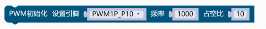
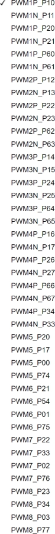
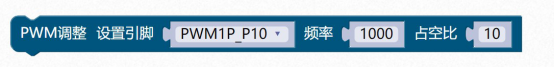

### PWM模块<!-- {docsify-ignore} -->

 

> ​		STC8H 系列的单片机内部集成了 8 通道 16 位高级PWM 定时器，分成两组周期可不同的 PWM，分别命名为 PWMA 和PWMB（之前的数据手册曾命名为 PWM1 和PWM2，但容易与芯片管脚名称混淆，故更改为 PWMA 和 PWMB），可分别单独设置。第一组 PWM/PWMA可配置成 4 组互补/对称/死区控制的 PWM 或捕捉外部信号，第二组 PWM/PWMB 可配置成4 路 PWM 输出或捕捉外部信号。
>
> ​		第一组 PWM/PWMA 的时钟频率可以是系统时钟经过寄存器 PWMA_PSCRH 和 PWMA_PSCRL 进行分频后的时钟， 分频值可以是 1\~65535 之间的任意值。第二组 PWM/PWMB 的时钟频率可以是系统时钟经过寄存器 PWMB_PSCRH 和 PWMB_PSCRL 进行分频后的时钟，分频值可以是 1~65535 之间的任意值。两组 PWM 的时钟频率可分别独立设置。
>
> ​		第一组 PWM 定时器/PWMA 有 4 个通道（PWM1P/PWM1N、PWM2P/PWM2N、PWM3P/PWM3N、PWM4P/PWM4N），每个通道都可独立实现 PWM 输出（可设置带死区的 互补对称PWM 输出）、捕获和比较功能；第二组 PWM 定时器/PWMB 有 4 个通道（PWM5、 PWM6、PWM7、PWM8），每个通道也可独立实现 PWM 输出、捕获和比较功能。两组 PWM 定时器唯一的区别是第一组可输出带死区的互补对称PWM，而第二组只能输出单端的 PWM，其他功能完全相同。下面关于高级PWM 定时器的介绍只以第一组为例进行说明。
>
> ​		当 使 用 第 一 组 PWM 定 时 器 输 出 PWM 波 形 时 ， 可 单 独 使 能PWM1P/PWM2P/PWM3P/PWM4P 输出，也可单独使能 PWM1N/PWM2N/PWM3N/PWM4N输出。例如：若单独使能了 PWM1P 输出，则PWM1N 就不能再独立输出，除非 PWM1P 和PWM1N 组成一组互补对称输出。PWMA 的 4 路输出是可分别独立设置的，例如：可单独使能 PWM1P 和 PWM2N 输出，也可单独使能 PWM2N 和 PWM3N 输出。若需要使用第一组PWM 定时器进行捕获功能或者测量脉宽时，输入信号只能从每路的正端输入，即只有PWM1P/PWM2P/PWM3P/PWM4P 才有捕获功能和测量脉宽功能。
>
> ​		两组高级PWM 定时器对外部信号进行捕获时，可选择上升沿捕获或者下降沿捕获。如果需要同时捕获上升沿和下降沿，则可将输入信号同时接入到两路 PWM，使能其中一路捕获上升沿，另外一路捕获下降沿即可。
>


> 图形化模块只提供了常用的 PWM 功能，至于输入捕获这些高级功能，需要用代码实现。
>

 

1. #### PWM初始化


 

> 初始化设置引脚 PWM 频率和占空比
>

```c
#include <STC8HX.h>//引入头文件
uint32 sys_clk = 24000000;
//系统时钟确认
#include "lib/PWM.h"//引入头文件
pwm_init(PWM1P_P10, 1000, 10);//pwm 初始化三个参数分别是引脚、频率、占空比
10/PWM_DUTY_MAX
```

> 引脚可以通过下拉菜单选择
>

 

 

> 这里需要注意占空比，系统配置里有一个 PWM 最大占空比的模块，我们设置的占空比为和这个最大占空比的比值。
>

 

2. #### PWM 调整占空比值

 

```c
pwm_duty(PWM1P_P10, 200);//pwm 调整三个参数分别是引脚、频率、占空比200/PWM_DUTY_MAX 
```

> PWM 调整占空比值，一般用在程序运行过程中需要动态改变占空比输出时。
>

 

3. #### PWM 调整频率和占空比


 

```c
pwm_freq_duty(PWM1P_P10, 1000, 10);//pwm 调整三个参数分别是引脚、频率、占空比 10/PWM_DUTY_MAX

```

> PWM 调整频率和占空比，一般用在程序运行过程中需要动态改变频率和占空比输出时。
>

 