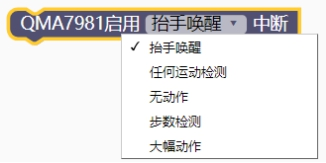

### QMA7981 加速度模块<!-- {docsify-ignore} -->

 

**硬件概述**

 

 


> ​	QMA7981 是一个单芯片三轴加速度传感器，14-Bit ADC 采样精度，内置常用运动算法，提供标准 I2C/SPI 接口，支持低功耗模式，广泛应用与手机、运动手表等设备。
>

 

**引脚定义**

 

 

 

| 序号 | 符号 | 功 能 描 述 |
| ------------------------ | -------------- | --------------------- |
| 1                        | AD0            | I2C 地址设置引脚      |
| 2                        | SDX            | 传输数据              |
| 3                        | VDDIO          | 数字电路电源          |
| 4                        | RESV1          | 保留                  |
| 5                        | INT1           | 中断引脚              |
| 6                        | INT2           | 中断引脚              |
| 7                        | VDD            | 电源                  |
| 8                        | GNDIO          | 数字电路地            |
| 9                        | GND            | 地                    |
| 10                       | SENB           | 通讯协议选择          |
| 11                       | RESV2          | 保留                  |
| 12                       | SCL            | 时钟信号              |


**电路原理图**


 

 

1. #### QMA7981 初始化

 


2. #### QMA7981 刷新数据

 

 

3. #### QMA7981 读 X/Y/Z 轴加速度

 


4. #### QMA7981 获取步数

 

 

5. #### QMA7981 启用运动检测算法中断

 


6. #### QMA7981 读中断

 

 

7. #### QMA7981 判断中断类型

 


**示例代码 1**

> 在数码管上显示X 轴加速度
>

 

 

**示例代码 2**

> 在数码管上显示步数
>

 

 

**示例代码 3**

> 运动手表，抬手唤醒功能。
>

 

 

 

>  //引入头文件

```c
#include "lib/qma7981.h"
```

```c
//使能抬手唤醒中断
#define QMA7981_HAND_UP_DOWN
//使能任何运动检测中断
#define QMA7981_ANY_MOTION
//使能无动作中断
#define QMA7981_NO_MOTION
//使能步数检测中断
#define QMA7981_STEP_INT
//使能重大中断（用户位置变化而产生的运动）
#define QMA7981_SIGNIFICANT_MOTION
uint8 qma7981_init();//加速度初始化
void qma7981_set_range(uint8 range);//设置加速度范围 QMA7981_RANGE_2G/4G/8G/16G/32G.
void qma7981_read_acc(int32 *accData);//读加速度三轴值
uint32 qma7981_read_stepcounter();//获取步数
unsigned char qma7981_irq_hdlr();//读中断
void qma7981_raise_config(uint8 wake_sum, uint8 diff, uint16 p
```

**示例代码 1**

> 在数码管上显示X 轴加速度

```c
#define NIXIETUBE_PORT P6
#define NIXIETUBE_PORT_MODE {P6M1=0x00;P6M0=0xff;}//推挽输出
#define NIXIETUBE_LEFT_COLON_PIN P0_7//左侧数码管冒号
#define NIXIETUBE_LEFT_COLON_PIN_MODE {P0M1&=~0x80;P0M0|=0x80;}//推挽输出
#define NIXIETUBE_RIGHT_COLON_PIN P2_1//右侧数码管冒号
#define NIXIETUBE_RIGHT_COLON_PIN_MODE {P2M1&=~0x02;P2M0|=0x02;}//推挽输出

#include <STC8HX.h>
uint32 sys_clk = 24000000;
// 系统时钟确认
#include "lib/hc595.h"
#include "lib/rgb.h"
#include "lib/delay.h"
#include "lib/led8.h"
#include "lib/nixietube.h"
#include "lib/qma7981.h"
uint16 msecond = 0;
int32 _accData[3];
void twen_board_init()
{
    P0M1 = 0x00;
    P0M0 = 0x00; // 双向 IO 口
    P1M1 = 0x00;
    P1M0 = 0x00; // 双向 IO 口
    P2M1 = 0x00;
    P2M0 = 0x00; // 双向 IO 口
    P3M1 = 0x00;
    P3M0 = 0x00; // 双向 IO 口
    P4M1 = 0x00;
    P4M0 = 0x00; // 双向 IO 口
    P5M1 = 0x00;
    P5M0 = 0x00; // 双向 IO 口
    P6M1 = 0x00;
    P6M0 = 0x00; // 双向 IO 口
    P7M1 = 0x00;
    P7M0 = 0x00;     // 双向 IO 口
    hc595_init();    // HC595 初始化
    hc595_disable(); // HC595 禁止点阵和数码管输出
    rgb_init();      // RGB 初始化
    delay(10);
    rgb_show(0, 0, 0, 0); // 关闭 RGB
    delay(10);
}
void Timer0Init(void) // 1000 微秒@24.000MHz
{
    TMOD |= 0x00;                                 // 模式 0
    TL0 = 0x2f;                                   // 设定定时初值
    TH0 = 0xf8;                                   // 设定定时初值
}
void T_IRQ0(void) interrupt 1 using 1
{
    msecond = msecond + 1;
    nix_scan_callback(); // 数码管扫描回调函数
}
void setup()
{
    /*****本案例程序说明**************************/
    // 本案例演示加速度传感器的使用，
    // X 轴加速度显示在数码管上
    /*********************************************/
    twen_board_init(); // 天问 51 初始化
    led8_disable();    // 关闭 8 个 LED 流水灯电源
    nix_init();        // 数码管初始化
    qma7981_init();
    Timer0Init();
    EA = 1;  // 控制总中断
    ET0 = 1; // 控制定时器中断
    TR0 = 1; // 启动定时器
}
void loop()
{
    if (msecond >= 1000)
    {
        msecond = 0;
        qma7981_read_acc(_accData);     // QMA7981 读三轴加速度加速度值
        nix_display_clear();            // 数码管清屏
        nix_display_num((_accData[0])); // 数码管显示整数
    }
}
void main(void)
{
    setup();
    while (1)
    {
        loop();
    }
}
```

**示例代码 2** 

> 在数码管上显示步数

```c
#define NIXIETUBE_PORT P6
#define NIXIETUBE_PORT_MODE {P6M1=0x00;P6M0=0xff;}//推挽输出
#define NIXIETUBE_LEFT_COLON_PIN P0_7//左侧数码管冒号
#define NIXIETUBE_LEFT_COLON_PIN_MODE {P0M1&=~0x80;P0M0|=0x80;}//推挽输出
#define NIXIETUBE_RIGHT_COLON_PIN P2_1//右侧数码管冒号
#define NIXIETUBE_RIGHT_COLON_PIN_MODE {P2M1&=~0x02;P2M0|=0x02;}//推挽输出
#define QMA7981_STEPCOUNTER 1
    
#include <STC8HX.h>
uint32 sys_clk = 24000000;
// 系统时钟确认
#include "lib/hc595.h"
#include "lib/rgb.h"
#include "lib/delay.h"
#include "lib/led8.h"
#include "lib/nixietube.h"
#include "lib/qma7981.h"
uint16 msecond = 0;
int32 _accData[3];
void twen_board_init()
{
    P0M1 = 0x00;
    P0M0 = 0x00; // 双向 IO 口
    P1M1 = 0x00;
    P1M0 = 0x00; // 双向 IO 口
    P2M1 = 0x00;
    P2M0 = 0x00; // 双向 IO 口
    P3M1 = 0x00;
    P3M0 = 0x00; // 双向 IO 口
    P4M1 = 0x00;
    P4M0 = 0x00; // 双向 IO 口
    P5M1 = 0x00;
    P5M0 = 0x00; // 双向 IO 口
    P6M1 = 0x00;
    P6M0 = 0x00; // 双向 IO 口
    P7M1 = 0x00;
    P7M0 = 0x00;     // 双向 IO 口
    hc595_init();    // HC595 初始化
    hc595_disable(); // HC595 禁止点阵和数码管输出
    rgb_init();      // RGB 初始化
    delay(10);
    rgb_show(0, 0, 0, 0); // 关闭 RGB
    delay(10);
}

void Timer0Init(void) // 1000 微秒@24.000MHz
{
    TMOD |= 0x00; // 模式 0
    TL0 = 0x2f;   // 设定定时初值
    TH0 = 0xf8;   // 设定定时初值
}
void T_IRQ0(void) interrupt 1 using 1
{
    msecond = msecond + 1;
    nix_scan_callback(); // 数码管扫描回调函数
}
void setup()
{
    twen_board_init(); // 天问 51 初始化
    led8_disable();    // 关闭 8 个 LED 流水灯电源
    nix_init();        // 数码管初始化
    qma7981_init();
    Timer0Init();
    EA = 1;  // 控制总中断
    ET0 = 1; // 控制定时器中断
    TR0 = 1; // 启动定时器
}
void loop()
{
    if (msecond >= 1000)
    {
        msecond = 0;
        qma7981_read_acc(_accData);                    // QMA7981 读三轴加速度加速度值
        nix_display_clear();                           // 数码管清屏
        nix_display_num((qma7981_read_stepcounter())); // 数码管显示整数
    }
}
void main(void)
{
    setup();
    while (1)
    {
        loop();
    }
}
```

 **示例代码 3** 

> 运动手表，抬手唤醒功能。

```c
#define QMA7981_HAND_UP_DOWN
#define NIXIETUBE_PORT P6
#define NIXIETUBE_PORT_MODE {P6M1=0x00;P6M0=0xff;}//推挽输出
#define NIXIETUBE_LEFT_COLON_PIN P0_7//左侧数码管冒号
#define NIXIETUBE_LEFT_COLON_PIN_MODE {P0M1&=~0x80;P0M0|=0x80;}//推挽输出
#define NIXIETUBE_RIGHT_COLON_PIN P2_1//右侧数码管冒号
#define NIXIETUBE_RIGHT_COLON_PIN_MODE {P2M1&=~0x02;P2M0|=0x02;}//推挽输出

#include <STC8HX.h>
uint32 sys_clk = 24000000;
//系统时钟确认
#include "lib/qma7981.h"
#include "lib/hc595.h"
#include "lib/rgb.h"
#include "lib/delay.h"
#include "lib/led8.h"
#include "lib/nixietube.h"
#include "lib/pcf8563.h"
#include "lib/oled.h"

uint8 flag = 0;
uint8 status = 0;
struct pcf8563_Time _mytime;
void _E6_98_BE_E7_A4_BAOLED();
void twen_board_init()
{
    P0M1 = 0x00;
    P0M0 = 0x00; // 双向 IO 口
    P1M1 = 0x00;
    P1M0 = 0x00; // 双向 IO 口
    P2M1 = 0x00;
    P2M0 = 0x00; // 双向 IO 口
    P3M1 = 0x00;
    P3M0 = 0x00; // 双向 IO 口
    P4M1 = 0x00;
    P4M0 = 0x00; // 双向 IO 口
    P5M1 = 0x00;
    P5M0 = 0x00; // 双向 IO 口
    P6M1 = 0x00;
    P6M0 = 0x00; // 双向 IO 口
    P7M1 = 0x00;
    P7M0 = 0x00;     // 双向 IO 口
    hc595_init();    // HC595 初始化
    hc595_disable(); // HC595 禁止点阵和数码管输出
    rgb_init();      // RGB 初始化
    delay(10);
    rgb_show(0, 0, 0, 0); // 关闭 RGB

    delay(10);
}
void Timer0Init(void) // 1000 微秒@24.000MHz
{
    TMOD |= 0x00; // 模式 0
    TL0 = 0x2f;   // 设定定时初值
    TH0 = 0xf8;   // 设定定时初值
}
/*描述该功能...
 */
void _E6_98_BE_E7_A4_BAOLED()
{
    oled_clear(); // OLED 清屏
    oled_show_num(12, 4, _mytime.year);
    oled_show_font16("年", 42, 0);
    oled_show_num(58, 4, _mytime.month);
    oled_show_font16("月", 74, 0);
    oled_show_num(90, 4, _mytime.day);
    oled_show_font16("日", 106, 0);
    oled_show_num(20, 22, _mytime.hour);
    oled_show_font12("时", 36, 20);
    oled_show_num(50, 22, _mytime.minute);
    oled_show_font12("分", 66, 20);
    oled_show_num(80, 22, _mytime.second);
    oled_show_font12("秒", 96, 20);
    oled_display(); // OLED 更新显示
}
void T_IRQ0(void) interrupt 1 using 1
{
    nix_scan_callback(); // 数码管扫描回调函数
}
void INT3(void) interrupt 11 using 1
{
    AUXINTIF &= ~0x20;
    P4_1 = 0;
    flag = 1;
}
void setup()
{
    /*****本案例程序说明**************************/
    // 本程序通过加速度传感器的抬手中断，通过外部中断 3 唤醒天问 51
    // 抬手竖起天问 51 可以显示时间，放下休眠

    /*********************************************/
    qma7981_init();
    twen_board_init(); // 天问 51 初始化
    led8_disable();    // 关闭 8 个 LED 流水灯电源
    INTCLKO |= 0x20;
    EA = 1;
    P4M1 &= ~0x02;
    P4M0 |= 0x02; // 推挽输出
    P4_1 = 0;
    nix_init();     // 数码管初始化
    pcf8563_init(); // RTC 初始化
    Timer0Init();
    EA = 1;              // 控制总中断
    ET0 = 1;             // 控制定时器中断
    TR0 = 1;             // 启动定时器
    oled_init();         // OLED 初始化
    nix_display_clear(); // 数码管清屏
    oled_clear();        // OLED 清屏
    oled_display();      // OLED 更新显示
    PCON = 0x02;
}
void loop()
{
    if (flag == 1)
    {
        flag = 0;
        // 读中断，清除中断标志位
        status = qma7981_irq_hdlr();
    }
    if (7 == status)
    {
        pcf8563_read_rtc(&_mytime);
        nix_display_time2(_mytime.hour, _mytime.minute, _mytime.second); // 数码管显示时间
        _E6_98_BE_E7_A4_BAOLED();
        P4_1 = 0;
    }
    else if (6 == status)
    {
        nix_display_clear(); // 数码管清屏
        oled_clear();        // OLED 清屏
        oled_display();      // OLED 更新显示
        PCON = 0x02;
    }
}
void main(void)

{
    setup();
    while (1)
    {
        loop();
    }
}

```

