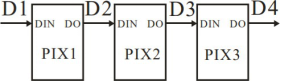

### RGB 彩灯模块<!-- {docsify-ignore} -->

 

**硬件概述**

 

 

 


> WS2812 是一个集控制电路与发光电路于一体的智能外控 LED 光源。其外型与一个5050LED 灯珠相同，每个元件即为一个像素点。像素点内部包含了智能数字接口数据锁存信号整形放大驱动电路，还包含有高精度的内部 振荡器和可编程定电流控制部分，有效保证了像素点光的颜色高度一致。 数据协议采用单线归零码的通讯方式，像素点在上电复位以后，DIN 端接受从控制器传输过来的数据，首先送过来的 24bit 数据被第一个像素点提取后，送到像素点内部的数据锁存器，剩余的数据经过内部整形处理电路整 形放大后通过 DO 端口开始转发输出给下一个级联的像素点，每经过一个像素点的传输，信号减少 24bit。像素点 采用自动整形转发技术，使得该像素点的级联个数不受信号传送的限制，仅受限信号传输速度要求。
>


 

**引脚定义**

 

 


 

 

**串接方式**


 

 

 

**电路原理图**


 

 


1. ####  RGB初始化

 

>  初始化 RGB 的控制引脚和总共RGB 灯数量
>


2. #### 设置第几个灯显示指定RGB 颜色值

 


3. #### 设置第几个灯显示下拉框内常用颜色和亮度

 


**示例代码 1**

> 设置 1 个 RGB 灯，设置灯的 RGB 颜色为红色，亮度为 50。
>

 

 

 

 

**示例代码 2**

> 设置 5 个 RGB 灯，依次设置 5 个灯为指定的RGB 颜色。
>


 

 

**调用函数代码**

> 引入头文件

```c
#include "lib/rgb.h"
```


> 预定义 RGB 灯连接引脚，RGB 灯的数量，引脚预处理输出

```c
#define RGB_PIN P4_5//RGB 灯的引脚

#define RGB_NUMLEDS 5 //RGB 灯的个数

#define RGB_PIN_MODE {P4M1&=~0x20;P4M0|=0x20;}//推挽输出
//=====================================================================

void rgb_init()//RGB 初始化函数，参数无
    
void rgb_show(uint8 num, uint8 r, uint8 g, uint8 b)
//RGB 显示函数，参数 num 第几个 RGB,参数 r 红色值，参数 g 绿色值，参数 b 蓝色值
```


**示例代码** 1

```c
#define RGB_PIN P4_5//RGB 灯的引脚

#define RGB_NUMLEDS 5 //RGB 灯的个数

#define RGB_PIN_MODE {P4M1&=~0x20;P4M0|=0x20;}//推挽输出

#include <STC8HX.h>
uint32 sys_clk = 24000000;

//系统时钟确认
#include "lib/rgb.h"//引入 RGB 头文件

void setup()
{
    rgb_init(); //RGB 初始化函数
}
void loop()
{
    rgb_show(0, 30, 0, 0);   //第 0 个灯显示 RGB
    rgb_show(1, 0, 40, 0);   //第 1 个灯显示 RGB
    rgb_show(2, 0, 0, 50);   //第 2 个灯显示 RGB
    rgb_show(3, 50, 50, 0);  //第 3 个灯显示 RGB
    rgb_show(4, 0, 50, 255); //第 4 个灯显示 RGB
}
void main(void)
{
    setup();
    while (1)
    {
        loop();
    }
}
```

 

 

 

 
