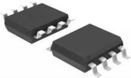
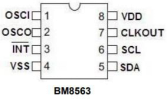
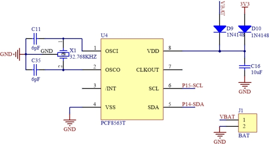
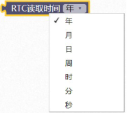
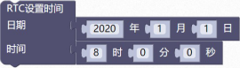
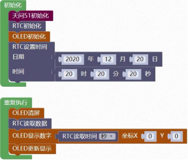
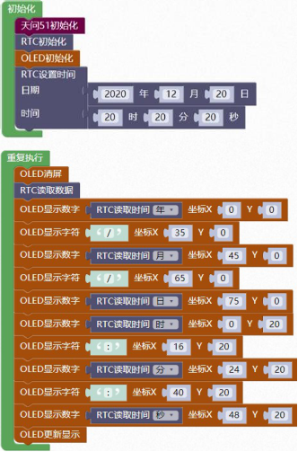

### RTC 实时时钟<!-- {docsify-ignore} -->

 

**硬件概述**

 

> ​	BM8563 是一款低功耗 CMOS 实时时钟/日历芯片，它提供一个可编程的时钟输出，一个中断输出和一个掉电检测器，所有的地址和数据都通过 I2C 总线接口串行传递。最大总线速度为 400Kbits/s，每次读写数据后，内嵌的字地址寄存器会自动递增。
>

 

**引脚定义**

 

| 序号 | 符号   | 管脚名 | 功 能 描 述 |
| ------------------------ | ---------------- | ---------------- | --------------------- |
| 1              | OSCI   | 输入             | 振荡器输入            |
| 2              | OSCO   | 输出             | 振荡器输出            |
| 3              | /INT   | 中断输出         | 中断开漏输出          |
| 4              | VSS    | 地               | 信号接地和电源接地    |
| 5              | SDA    | 串行数据 I/O     | 串行数据 I/O（开漏）  |
| 6              | SCL    | 串行时钟输入     | 串行时钟输入          |
| 7              | CLKOUT | 时钟输出         | 时钟开漏输出          |
| 8 | VDD | 正电源 | 供电管脚 |


**电路原理图**

 

 

1. #### RTC 初始化

 


2. #### RTC 读取数据。

 


3. #### RTC 读取时间

 

> RTC 读取时间选取，可选择年、月、日、周、时、分、秒。
>


4. #### RTC 设置时间和日期

 

 

5. #### RTC 设置时间

 


**示例代码 1**

> 初始化 OLED 和RTC，设置好日期和时间。用 OLED 显示读取到的秒。
>

 

 

**示例代码 2**

> 初始化 OLED 和RTC，设置好日期和时间。用 OLED 显示读取到的日期和时间。
>



 **调用函数代码**

> 引入头文件

```c
#include "lib/pcf8563.h"
```

```c
void pcf8563_init(); //RTC 初始化
void pcf8563_read_rtc(struct pcf8563_Time *tim);// 设置时间
void pcf8563_write_rtc(struct pcf8563_Time *tim);// 读取时间
```

**示例代码 1**

```c
#include <STC8HX.h>
uint32 sys_clk = 24000000;
//系统时钟确认
#include "lib/hc595.h"
#include "lib/rgb.h"
#include "lib/delay.h"
#include "lib/oled.h"
#include "lib/pcf8563.h"//引入 pcf8563 头文件

struct pcf8563_Time _mytime;
void twen_board_init()
{
    hc595_init();    // HC595 初始化
    hc595_disable(); // HC595 禁止点阵和数码管输出
    rgb_init();      // RGB 初始化
    delay(10);
    rgb_show(0, 0, 0, 0); // 关闭 RGB
    delay(10);
}
void setup()
{
    twen_board_init(); // 天问 51 初始化
    oled_init();       // OLED 初始化
    pcf8563_init();    // RTC 初始化

    _mytime.year = 2020;
    _mytime.month = 12;
    _mytime.day = 20;
    _mytime.hour = 20;
    _mytime.minute = 20;
    _mytime.second = 20;
    pcf8563_write_rtc(&_mytime); // RTC 设置时间
}
void loop()
{
    oled_clear(); // OLED 清屏
    pcf8563_read_rtc(&_mytime);
    oled_show_num(0, 0, _mytime.second);
    oled_display(); // OLED 更新显示
}
void main(void)
{
    setup();
    while (1)
    {
        loop();
    }
}
```

**示例代码 2**

```c
#include <STC8HX.h>
uint32 sys_clk = 24000000;
//系统时钟确认
#include "lib/hc595.h"
#include "lib/rgb.h"
#include "lib/delay.h"
#include "lib/oled.h"
#include "lib/pcf8563.h"

struct pcf8563_Time _mytime;
void twen_board_init()
{
    hc595_init();    // HC595 初始化
    hc595_disable(); // HC595 禁止点阵和数码管输出
    rgb_init();      // RGB 初始化
    delay(10);
    rgb_show(0, 0, 0, 0); // 关闭 RGB
    delay(10);
}

void setup()
{
    twen_board_init(); // 天问 51 初始化
    oled_init();       // OLED 初始化
    pcf8563_init();    // RTC 初始化
    _mytime.year = 2020;
    _mytime.month = 12;
    _mytime.day = 20;
    _mytime.hour = 20;
    _mytime.minute = 20;
    _mytime.second = 20;
    pcf8563_write_rtc(&_mytime); // RTC 设置时间
}
void loop()
{
    oled_clear(); // OLED 清屏
    pcf8563_read_rtc(&_mytime);
    oled_show_num(0, 0, _mytime.year);
    oled_show_char(35, 0, '/');
    oled_show_num(45, 0, _mytime.month);

    oled_show_char(65, 0, '/');
    oled_show_num(75, 0, _mytime.day);
    oled_show_num(0, 20, _mytime.hour);
    oled_show_char(16, 20, ':');
    oled_show_num(24, 20, _mytime.minute);
    oled_show_char(40, 20, ':');
    oled_show_num(48, 20, _mytime.second);
    oled_display(); // OLED 更新显示
}
void main(void)
{
    setup();
    while (1)
    {
        loop();
    }
}
```

