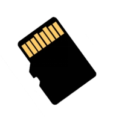
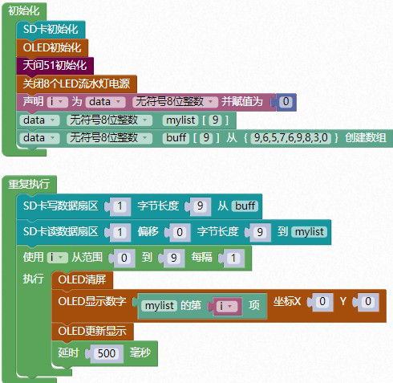

### SD 储存卡<!-- {docsify-ignore} -->

 

**硬件概述**

 

> ​	SD 存储卡( Secure Digital Memory Card)是一种基于[半导体](https://baike.baidu.com/item/半导体/385669)[快闪存储器](https://baike.baidu.com/item/快闪存储器/587131)的新一代高速存储设备。SD 存储卡的技术是从 [MMC 卡](https://baike.baidu.com/item/MMC卡/232017)( MultiMedia Card 格式上发展而来，在兼容 SD 存储卡基础上发展了 [SDIO](https://baike.baidu.com/item/SDIO/777699)( SD Input/ Output)卡，此兼容性包括机械，电子，电力，信号和软件，通常将 SD、SDIO 卡俗称 SD 存储卡。
>

> ​	SD 卡具有高记忆容量、快速数据传输率、极大的移动灵活性以及很好的安全性，它被广泛地应用于便携式装置上，例如[数码相机](https://baike.baidu.com/item/数码相机/277472)、平板电脑和多媒体播放器等。
>

> 目前一般都用 Micro SD Card 替代 SD 卡，原名Trans-flash Card（TF 卡），因为体积小巧。
>


1. #### SD 卡初始化

 


2. #### 从 SD 卡中的第几个扇区，偏移量是多少，读取多少个字节到 buff 中

 


3. #### 从 buff 中，写入字节长度，到第几个扇区

 


**示例代码 1**

> 将 buff 中的 9 个字节数据写入到 SD 卡的第一个扇区当中，然后再将 SD 卡的第一个扇区中读取 9 个字节长度的数据到 mylist 的这个数组中。用 OLED 来显示读取到的 9 个数据。
>

 

 

**示例代码 1**

```c
#include <STC8HX.h>
uint32 sys_clk = 24000000;
//系统时钟确认
#include "lib/pff.h"//引入文件系统头文件
#include "lib/oled.h"
#include "lib/hc595.h"
#include "lib/rgb.h"
#include "lib/delay.h"
#include "lib/led8.h"

uint8 i = 0;
uint8 buff[9]={9,6,5,7,6,9,8,3,0};//自定义数组

void twen_board_init()
{
    hc595_init();    // HC595 初始化
    hc595_disable(); // HC595 禁止点阵和数码管输出
    rgb_init();      // RGB 初始化
    delay(10);
    rgb_show(0, 0, 0, 0); // 关闭 RGB
    delay(10);
}
uint8 mylist[9]; // 自定义数组
void setup()

{
    disk_initialize();
    oled_init();       // OLED 初始化
    twen_board_init(); // 天问 51 初始化
    led8_disable();    // 关闭 8 个 LED 流水灯电源
}
void loop()
{
    disk_writep(0, 1);           // 0 代表启动完成扇区写入，1 代表写入扇区 1
    disk_writep(buff, 9);        // buff 为写入的数据地址，9 代表写入的字节数 9
    disk_writep(0, 0);           // 0，0 代表写入完成
    disk_readp(mylist, 1, 0, 9); // 读取第一个扇区的 9 个字节数据，缓存到 mylist 的数组当中
    for (i = 0; i < 9; i = i + (1))
    {
        oled_clear();                          // OLED 清屏
        oled_show_num(0, 0, mylist[(int)(i)]); // OLED 显示 mylist 数组内容
        oled_display();                        // OLED 更新显示
        delay(500);
    }
}
void main(void)

{
    setup();
    while (1)
    {
        loop();
    }
}
```

